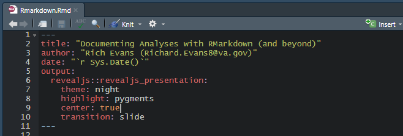
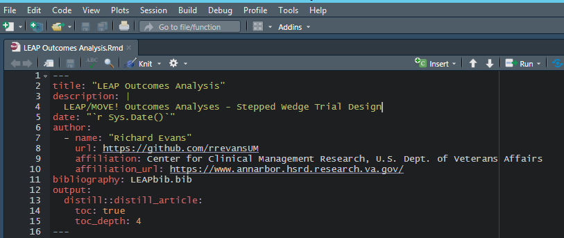
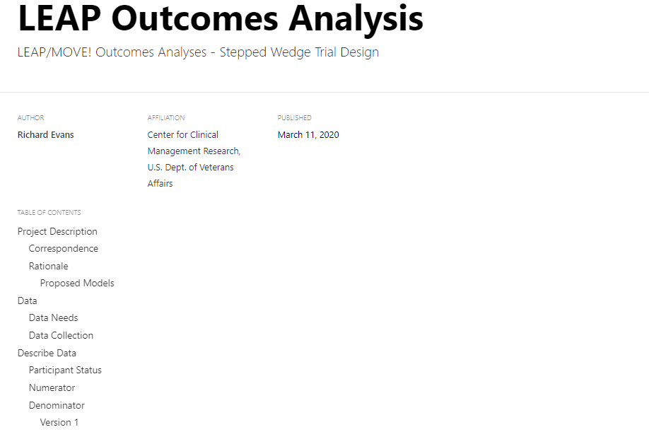
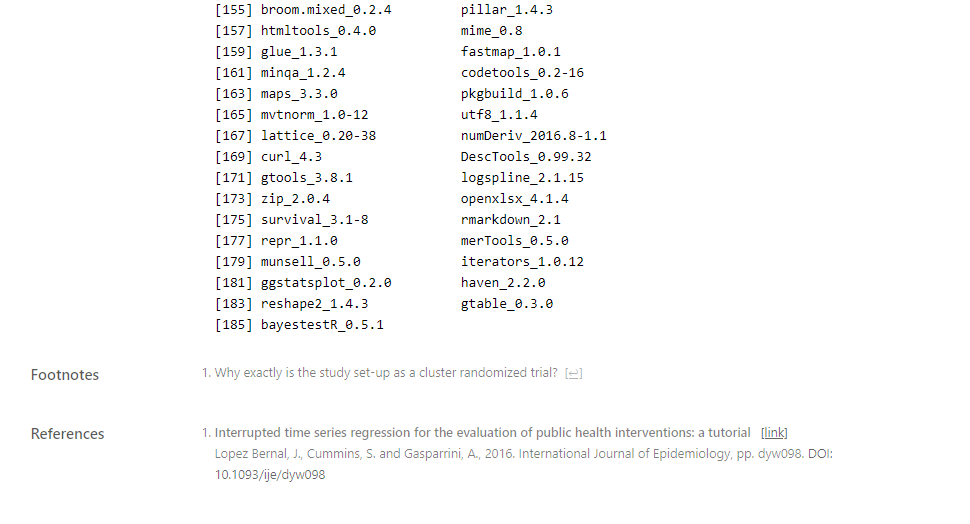
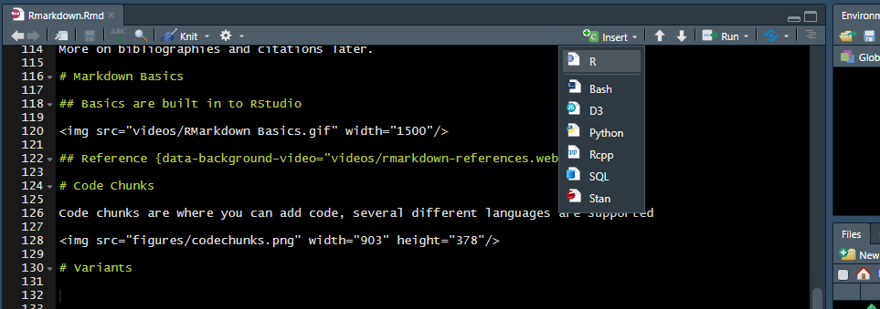
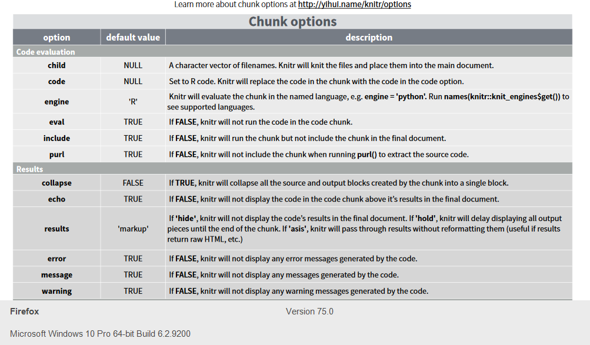
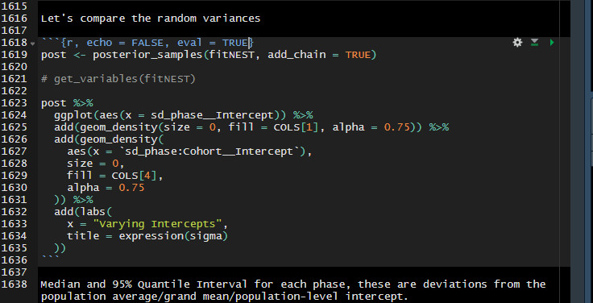
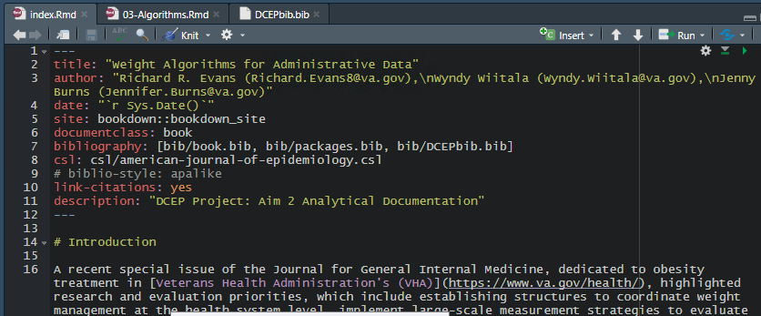

```{r setup, include = FALSE}
library(knitr)
library(tidyverse)
library(magrittr)

options(max.print = "200")
opts_chunk$set(echo    = TRUE,
	             cache   = FALSE,
               prompt  = FALSE,
               tidy    = FALSE,
               comment = NA,
               message = FALSE,
               warning = FALSE)
opts_knit$set(width = 80)

options(knitr.table.format = "html")

bootstrap_options <- c("striped", "hover", "condensed")

tableStyle <- function(t,
                       boot_opt = bootstrap_options, 
                       full_width = TRUE) {
  
  t %>%
    mutate_if(is.numeric, round, digits = 2) %>%
    knitr::kable() %>%
    kableExtra::kable_styling(
      bootstrap_options = boot_opt,
      full_width = full_width
    )
}

COLS <- c("#2E364F", "#2D5D7C", "#F3F0E2", "#EF5939")
```

## U.S. Dept. of Veterans Affairs

<center>

</center>

* Center for Clinical Management Research
* Quantitative Methods Seminar Series

## Structure

1. Markdown and RMarkdown
2. Installation & Setup
3. Markdown Basics
    + Help
    + Code Chunks
4. Variants
5. Extras, Tips & Tricks

# Markdown & RMarkdown

## What is Markdown?

<center>

</center>

<section style="text-align: left;">

<font color="#EF5939">Markdown</font> is a text-to-HTML conversion tool for web writers. <font color="#EF5939">Markdown</font> allows you to write using an easy-to-read, easy-to-write plain text format, then convert it to structurally valid XHTML (or HTML).

* <font color="#EF5939">Markdown</font> is two things:  
    1. a plain text formatting syntax; and   
    2. a software tool, written in <font color="#F3F0E2">Perl</font>, that converts the plain text formatting to HTML.  

You do <font color="#DC0000">not</font> need to know any <font color="#F3F0E2">Perl</font>.

</section>

## RMarkdown is...


Just an extension of <font color="#E44652">Markdown</font> so that you can write <font color="#2D5D7C">R</font> code "chunks" seamlessly together with text and graphics.

## There's also STATA Markdown!

https://www.stata.com/features/overview/markdown/

Here's one great example: https://data.princeton.edu/stata/markdown/markstat.htm

# Installation & Setup

## Already Installed in RStudio {data-background-video="videos/installation-and-setup.webm"}

## Setup

<section style="text-align: left;">

* There are three different flavors of RMarkdown docs  
    1. <font color="#EE7155">HTML</font>
    2. <font color="#E5F1F6">PDF</font>
    3. <font color="#7DC9E7">MS word</font>

<font color="#EE7155">HTML</font> is the easiest, as markdown is natively converted to HTML. PDF is difficult without a proper <font color="#13A699">pandoc</font> installation, of which our servers currently don't have (VHAANNAPPHSRD2, VHAANNAPPHSRD3).  

And <font color="#7DC9E7">MS word</font> should be fine on our servers, except that when you "knit" to <font color="#7DC9E7">word</font>, you will probably run into formatting issues.

</section>

## YAML

>"YAML Ain't Markup Language - [YAML Syntax](https://docs.ansible.com/ansible/latest/reference_appendices/YAMLSyntax.html)"



## YAML (cont.)

You can do a **lot** with YAML, but you won't end up using 98% of it's functionality when writing RMarkdown docs. I usually use it for citations and tables of contents:



More on bibliographies and citations later.

## YAML Result (front matter)



## YAML Result (citations)



# Markdown Basics

## Basics are built in to RStudio {data-background-video="videos/RMarkdown Basics.webm"}

## Reference {data-background-video="videos/rmarkdown-references.webm"}

## Table of Contents and Section Headers

Place `toc: true` in the YAML header.

Any new section header `#`, `##`, or `##...` will be added to the **toc**

# Code Chunks

Code chunks are where you can add code; several different languages are supported,



## Keyboard Shortcut

```{css, echo = FALSE}
kbd {
    background-color: #eee;
    border-radius: 3px;
    border: 1px solid #b4b4b4;
    box-shadow: 0 1px 1px rgba(0, 0, 0, .2), 0 2px 0 0 rgba(255, 255, 255, .7) inset;
    color: #333;
    display: inline-block;
    font-size: .85em;
    font-weight: 700;
    line-height: 1;
    padding: 2px 4px;
    white-space: nowrap;
}
```

<kbd>&nbsp;ALT&nbsp;</kbd>+<kbd>&nbsp;CTRL&nbsp;</kbd>+<kbd>&nbsp;I&nbsp;</kbd>

````
```{r}`r ''`

1 + 1

```
````

```{r}
1 + 1
```

## Chunk Options

There are dozens of options for display, execution, figure sizing, and saving of figures and output.



## Hiding Code

People don't always need to know how the sausage is made, so you can use any combination of `echo`, `eval` or `include` in your code chunks to hide code.



## Long Running Processes

Also, useful for when you want to include a long running process without the gritty details, such as a <font color="#B2001D">Stan</font> or <font color="#55E603">brms</font> program.

````
```{r, echo = TRUE, eval = FALSE}`r ''`

library(brms)
library(brmstools)
library(Rcpp)
library(tidybayes)

fitNEST <- brm(
  wt_dx_pct ~ nclasses2 + LEAP_time + (1 | phase/Cohort),
  data = ash_phases,
  prior = priors,
  chains = 3,
  iter = 3000,
  warmup = 500,
  cores = 3
)

```
````

## Process masking {data-background-video="videos/brms-example.webm"}

## Master Setup chunk

<section style="text-align: left;">

So that you don't have to repeat yourself, it helps to have a *setup* code chunk at the "top" of the program, before any code is executed.

````
```{r setup, include = FALSE}`r ''`

library(knitr)
library(tidyverse)
library(magrittr)

options(max.print = "200")
opts_chunk$set(echo    = TRUE,  
	             cache   = FALSE, # cache long-running processes  
               prompt  = FALSE, # sometimes a function "asks" user to proceed  
               tidy    = FALSE, # tidy code, can mess up your code chunks  
               comment = NA,  
               message = FALSE, # only if you already know of any issues  
               warning = FALSE) # only if you already know of any issues  
opts_knit$set(width = 80) # 80 chars - google R code style guide  

options(knitr.table.format = "html") # for knitr::kable() tables  

```
````

</section>

# Math

## LaTeX

<section style="text-align: left;">

*Almost* anything $\LaTeX$ can do, you can do with <font color="#2D5D7C">RMarkdown</font>  

Either in-line, placing $LaTeX$ syntax between two `$ $` symbols `$\tilde H$` (result = $\tilde H$).  

Or on a separate, centered, line between four $ symbols,  

`$$`  
`\Theta^{(r+1)} = `  
`\Theta^r - `  
`\delta (\tilde H^{(r)})^{-1} \Delta (L(\Theta^{(r)}))`  
`$$`  

$$
\Theta^{(r+1)} = \Theta^r - \delta (\tilde H^{(r)})^{-1} \Delta (L(\Theta^{(r)}))
$$

</section>

# Variations

## Built-in Themes

All can be changed through the YAML header

```{r, echo = TRUE, eval = FALSE}
---
title: "Test"
output:
  html_document:
    theme: united
    highlight: tango
---
```

[So many to choose from](https://bookdown.org/yihui/rmarkdown/html-document.html#appearance-and-style)

## theme: darkly {data-background-video="videos/theme-darkly.webm"}

## Packaged Themes

* [rmdformats](https://github.com/juba/rmdformats)
* [prettydoc](https://github.com/yixuan/prettydoc)
* [tufte](https://rstudio.github.io/tufte/)
* [markdowntemplates](https://github.com/hrbrmstr/markdowntemplates)
* [distill](https://rstudio.github.io/distill/)

And probably many more ...

## Bookdown

For when documents get lengthy, or you just want to write a book.

```{r, echo = TRUE, eval = FALSE}
install.packages("bookdown")
```

## Bookdown Setup {data-background-video="videos/bookdown.webm"}

## Bookdown File Structure

```{r}
fs::dir_tree(path = "test book/", recurse = TRUE)
```

## Publishing {data-background-video="videos/bookdown-publish.webm"}

# Extras, Tips & Tricks

## HTML

It helps to know some HTML for customization. For instance, when centering figures,

```HTML
<center>

</center>
```

<center>

</center>

## HTML (cont.)

Text coloring

```HTML
<font color="#13A699">pandoc</font>
```

<font color="#13A699">pandoc</font>

## Align Left

<section style="text-align: left;">

```HTML
<section style="text-align: left;">

Aligning Text to the Left

</section>
```

Aligning Text to the Left

</section>

## Align Right

<section style="text-align: right;">

```HTML
<section style="text-align: right;">

Or to the Right

</section>
```

Or to the Right

</section>

## HTML (cont.)

The website [W3schools.com](https://www.w3schools.com/) contains everything you would need should you wish to fiddle with the HTML components of your <font color="#EF5939">Markdown</font> doc.

## Cascading Style Sheets (CSS)

Earlier when I tried to show the keyboard short-cut for inserting `Code Chunks`, I wanted the "keys" to look like a "keyboard"

```HTML
<kbd>&nbsp;ALT&nbsp;</kbd>+<kbd>&nbsp;CTRL&nbsp;</kbd>+<kbd>&nbsp;I&nbsp;</kbd>
```

<kbd>&nbsp;ALT&nbsp;</kbd>+<kbd>&nbsp;CTRL&nbsp;</kbd>+<kbd>&nbsp;I&nbsp;</kbd>

```HTML
kbd {
    background-color: #eee;
    border-radius: 3px;
    border: 1px solid #b4b4b4;
    box-shadow: 0 1px 1px rgba(0, 0, 0, .2), 0 2px 0 0 rgba(255, 255, 255, .7) inset;
    color: #333;
    display: inline-block;
    font-size: .85em;
    font-weight: 700;
    line-height: 1;
    padding: 2px 4px;
    white-space: nowrap;
}
```

The above css object, `kbd`, gives the basic appearance of keys.

## CSS (cont.)

In <font color="#EF5939">Markdown</font> documents you could either create a new `css/style.css` file into your project directory, or, as I've done in these slides, added a `css` code chunk.

## Bibliographies

Can be frustrating to set-up. The basic steps are:

1. Create a .bib file
    + Export from <font color="#A81717">Zotero</font>, <font color="#915EEA">EndNote</font>, <font color="#B01F2B">Mendeley</font>, ...
2. Place .bib file into project directory `bib/project.bib`
3. Use the Viewer in <font color="#2066B8">R</font> to `View` the `.bib` file
4. Look up the citation in `.bib`
    + Looks like @article{breland_obesity_2017 ...
5. Enter `[@breland_obesity_2017]` somewhere
6. Enter `# References` as the *last* item in your <font color="#EF5939">RMarkdown</font>.

## Bib Files

```{r}
fs::dir_tree(path = "test book/", recurse = TRUE)
```

## YAML (again)


## Bib Result


## Citation Style Language (CSL)

You may not like the default citation style but it's pretty easy to change by downloading a new CSL file from [https://github.com/citation-style-language/styles](https://github.com/citation-style-language/styles)



# Resources

## Get the book!


## Book is also online

[The Definitive Guide to RMarkdown](https://bookdown.org/yihui/rmarkdown/)
