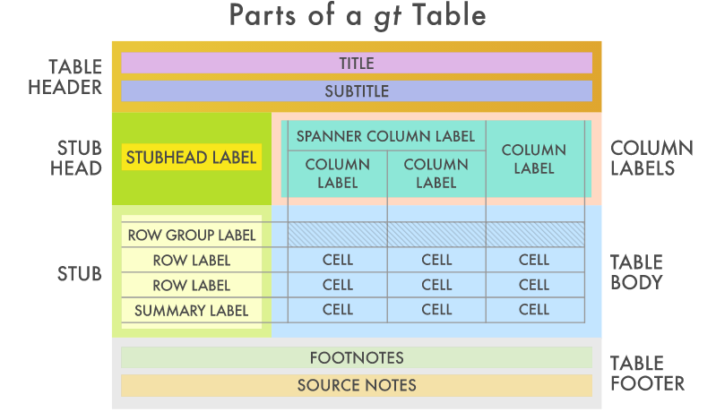

```{r setup, include = FALSE}
library(knitr)
library(rmdformats)
library(tidyverse)

options(max.print = "80")
opts_chunk$set(echo    = TRUE,
	             cache   = FALSE,
               prompt  = FALSE,
               tidy    = FALSE,
               comment = NA,
               message = FALSE,
               warning = FALSE)
opts_knit$set(width = 80)

bootstrap_options <- c("striped", "hover", "condensed")

options(knitr.table.format = "html")

tableStyle <- function(t,
                       boot_opt = bootstrap_options, 
                       full_width = TRUE,
                       digits = 2) {
  
  t %>%
    mutate_if(is.numeric, round, digits = digits) %>%
    knitr::kable() %>%
    kableExtra::kable_styling(
      bootstrap_options = boot_opt,
      full_width = full_width
    )
}

scrollTable <- function(t,
                        boot_opt = bootstrap_options,
                        full_width = TRUE,
                        width = "600px", height = "400px",
                        digits = 2) {
  t %>%
    mutate_if(is.numeric, round, digits = digits) %>%
    knitr::kable() %>%
    kableExtra::kable_styling(
      bootstrap_options = bootstrap_options,
      full_width = full_width
    ) %>%
    kableExtra::scroll_box(width = width, height = height)
}

multTable <- function(df, rc, ...) {
  group_vars <- rlang::enquos(...)
  
  t_exp <- expr(
    df %>%
      tabyl(!!! group_vars) %>%
      adorn_percentages(denominator = !! rc) %>%
      adorn_pct_formatting() %>%
      adorn_ns()
  )
  rlang::eval_tidy(t_exp)
}

COLS <- c("#F57B51", "#FDF6F0", "#FBBC58", "#095D6A")
theme_set(theme_gray())
```

# Rationale

In this tutorial I will go through *so* many ways to make tables in R, Rstudio, and RMarkdown, and yet, it probably will not be exhaustive. Methods in this tutorial:

* Multipurpose
    + [arsenal](https://cran.r-project.org/web/packages/arsenal/index.html)
    + [tableone](https://cran.r-project.org/web/packages/tableone/vignettes/introduction.html)
    + [gt](https://gt.rstudio.com/articles/intro-creating-gt-tables.html)
    + [gtsummary](http://www.danieldsjoberg.com/gtsummary/)
    + [flextable](https://davidgohel.github.io/flextable/articles/offcran/examples.html)
    + [ttt](https://cran.r-project.org/web/packages/ttt/vignettes/ttt-intro.html)
* Model Summary Tables
    + gtsummary
    + [jtools](https://cran.r-project.org/web/packages/jtools/vignettes/summ.html)
    + [sjPlot](https://cran.r-project.org/web/packages/sjPlot/vignettes/tab_model_estimates.html)
    + [finalfit](https://cran.r-project.org/web/packages/finalfit/vignettes/finalfit.html)
* DIY

I'll be making use of some data from one of Dr. Erika Sears' Studies, sans any identifiable data, of course.

The first step in this document is to explain the data we'll be using, and setting it up for analysis, skip down to the tables section.

# Data

## Source

A retrospective cohort study of Veterans undergoing Carpal Tunnel Release (CTR) procedures from January 1, 2010 to December 31, 2016.  

## Cohort Inclusion

* Veteran has a primary care physician within the Veterans Administration  
* First CTR (not re-do CTR)  

## Exclusion

*	Concurrent procedures  
*	Last PCP visit to CTR > 7 years (outliers)  

## Study Variables

* Explanatory
    + Patient-level
        +	Age at index CTS (Consider non-linear relationship)
        +	Sex
        +	Race
        +	Ethnicity
        +	Charlson Comorbidity Index
        +	Diabetes
        + VA Priority Group (if service connected)
        + Patient Distance to PCP Facility
        +	Processes (VA vs. Community) - All as separate models
            + Steroid Injection
            +	Non Specific Therapy/Orthosis
            +	Specific Therapy
            + NSTES + STM
            +	Use of diagnostic studies (EMG, Imaging)
            + CTR
            + Overall Number of Community Encounters
    + Facility-Level Covariates
        + VA only vs. VA+Community (Proportion mixed at Facility-Level)
        + PCP clinic type
        + Access to Multiple Providers in same facility (requires adjustments)
            + PCP and Surgical Specialist
            + PCP and therapy
* Outcome
    + Time from last PCP visit to index CTR

# Set-up

## Packages/library Loading

```{r}
library(tidyverse) # data manipulation/tidying functions
library(magrittr)  # add() for plots, alternatively use `+`
library(janitor)   # custom tabyl functions
```

## Load Data

```{r}
sears <- readRDS("data/SurgicalCohort_AnalyticData.rds")
```

41,912 rows, 150 columns

# Process Data

```{r}
scale2 <- function(x) {
  (x - mean(x, na.rm = TRUE)) / (2 * sd(x, na.rm = TRUE))
}

# dput(grep("Comm", colnames(sears), value = TRUE))
comms <- c("CommDiagnostic",
           "CommEDS",
           "CommImaging",
           "CommSteroid",
           "CommNSTES",
           "CommSTM",
           "CommCTR")

sears <- sears %>%
  filter(PCPtoCTRDiffDays <= 365 * 7) %>%
  mutate(
    #--- Imaging Encounters ---#
    
    vaImaging = factor(ifelse(
      CommImaging == 1,
      "0 Imaging Encounters",
      as.character(EncImaging)
    )),
    CommImaging = factor(
      CommImaging,
      0:1,
      c("0 Imaging Encounters", ">= 1 Imaging Encounter")
    ),
    ImagingAny = factor(ifelse(
      vaImaging == ">= 1 Imaging Encounter"
        | CommImaging == ">= 1 Imaging Encounter",
      ">= 1 Imaging Encounter",
      "0 Imaging Encounters"
    )),
    
    #--- EDS Encounters ---#
    
    vaEDS = factor(ifelse(
      CommEDS == 1,
      "0 EDS Clinic Encounters",
      as.character(EncEDSclinic)
    )),
    CommEDS = factor(
      CommEDS,
      0:1,
      c("0 EDS Clinic Encounters", ">= 1 EDS Clinic Encounter")
    ),
    EDSAny = factor(ifelse(
      vaEDS == ">= 1 EDS Clinic Encounter"
        | CommEDS == ">= 1 EDS Clinic Encounter",
      ">= 1 EDS Clinic Encounter",
      "0 EDS Clinic Encounters"
    )),
    
    #--- Any Diagnostic (EDS or Imaging) Encounter ---#
    
    vaDiagnostic = factor(ifelse(
      vaImaging == ">= 1 Imaging Encounter" 
        | vaEDS == ">= 1 EDS Clinic Encounter",
      ">= 1 Diagnostic Encounter",
      "0 Diagnostic Encounters"
    )),
    CommDiagnostic = factor(
      CommDiagnostic,
      0:1,
      c("0 Diagnostic Encounters", ">= 1 Diagnostic Encounter")
    ),
    DiagnosticAny = factor(ifelse(
      vaDiagnostic == ">= 1 Diagnostic Encounter"
        | CommDiagnostic == ">= 1 Diagnostic Encounter",
      ">= 1 Diagnostic Encounter",
      "0 Diagnostic Encounters"
    )),
    
    #--- Steroid Receipt ---#
    
    vaSteroid = factor(ifelse(
      CommSteroid == 1,
      "0 Steroid Injections",
      as.character(SteroidInject)
    )),
    CommSteroid = factor(
      CommSteroid,
      0:1,
      c("0 Steroid Injections", ">= 1 Steroid Injections")
    ),
    SteroidAny = factor(ifelse(
      vaSteroid == ">= 1 Steroid Injections"
        | CommSteroid == ">= 1 Steroid Injections",
      ">= 1 Steroid Injections",
      "0 Steroid Injections"
    )),
    
    #--- NSTES/Splint Encounters ---#
    
    vaNSTES = factor(ifelse(
      CommNSTES == 1,
      "No Splint use",
      as.character(Splints)
    )),
    CommNSTES = factor(
      CommNSTES,
      0:1,
      c("No Splint use", ">= 1 Splints used")
    ),
    NSTESAny = factor(ifelse(
      vaNSTES == ">= 1 Splints used"
        | CommNSTES == ">= 1 Splints used",
      ">= 1 Splints used",
      "No Splint use"
    )),
    
    #--- STM Encounters ---#
    
    vaSTM = factor(ifelse(
      CommSTM == 1,
      "0 Therapeutic Modalities",
      as.character(SpecTherapyMod)
    )),
    CommSTM = factor(
      CommSTM,
      0:1,
      c("0 Therapeutic Modalities", ">= 1 Therapeutic Modalities")
    ),
    STMAny = factor(ifelse(
      vaSTM == ">= 1 Therapeutic Modalities"
        | CommSTM == ">= 1 Therapeutic Modalities",
      ">= 1 Therapeutic Modalities",
      "0 Therapeutic Modalities"
    )),
    
    #--- Combination of NSTES or STM - Therapeutics ---#
    
    vaTherapy = factor(ifelse(
      vaSTM == ">= 1 Therapeutic Modalities"
        | vaNSTES == ">= 1 Splints used",
      ">= 1 NSTES or STM",
      "Neither NSTES or STM"
    )),
    CommTherapy = factor(ifelse(
      CommSTM == ">= 1 Therapeutic Modalities"
        | CommNSTES == ">= 1 Splints used",
      ">= 1 NSTES or STM",
      "Neither NSTES or STM"
    )),
    TherapyAny = factor(ifelse(
      vaTherapy == ">= 1 NSTES or STM"
        | CommTherapy == ">= 1 NSTES or STM",
      ">= 1 NSTES or STM",
      "Neither NSTES or STM"
    )),
    
    #--- Count Community Encounters ---#
    
    CommCNT = rowSums(.[comms[-1]]),
    CommCTS = ifelse(CommCNT == 0, 0, 1),
    
    CommCTS = factor(CommCTS, 0:1, c("VA Only", "VA+Community")),
    CommCTR = factor(CommCTR, 0:1, c("VA Only", "Community")),
    age_std = scale2(AgeAtIndexCTS),
    charlson_std = scale2(charlsonCTS)
  ) %>%
  select(
    PatientICN,
    
    #--- Demographics & Characteristics---#
    
    AgeAtIndexCTS, age_std,
    Sex,
    Race,
    Eth_cat,
    charlsonCTS, charlson_std, charlsoncts_cat,
    Diabetes,
    VApriorityGrp,
    
    #--- Community Care Variables / Processes ---#
    
    vaSteroid,    CommSteroid,    SteroidAny,
    vaNSTES,      CommNSTES,      NSTESAny,
    vaSTM,        CommSTM,        STMAny,
    vaTherapy,    CommTherapy,    TherapyAny,
    vaDiagnostic, CommDiagnostic, DiagnosticAny,
    vaImaging,    CommImaging,    ImagingAny,
    vaEDS,        CommEDS,        EDSAny,
    CommCTS, 
    CommCTR,
    CommCNT,
    
    #--- Facility-Level Variables ---#
    
    Sta3n_ge50PCP,
    PCPcomplexity,
    dist_to_PCP_10,
    PCPandTherapy,
    PCPandSurg,
    
    #--- Outcome ---#
    
    PCPtoCTRDiffDays
  ) %>%
  rename(
    Sta3n = Sta3n_ge50PCP,
    charlsonCTS_cat = charlsoncts_cat # because it annoys me
  )

#---  Compute Proportion of Mixed Care (CommCTS), by Sta3n ---#

props <- sears %>%
  group_by(Sta3n, CommCTS) %>% 
  summarize(n = n()) %>%
  ungroup() %>%
  pivot_wider(names_from = CommCTS, values_from = n) %>%
  mutate(
    prop_mixedcare = `VA+Community` / (`VA Only` + `VA+Community`)
  ) %>%
  select(Sta3n, prop_mixedcare)

sears <- sears %>% left_join(props, by = "Sta3n")
```

# Tables {#tables}

## Arsenal

[Arsenal](https://cran.r-project.org/web/packages/arsenal/vignettes/tableby.html) requires you to have your dataframe setup with the variables as columns and the observations in rows, which is pretty common across most packages.

```{r}
tab_vars <- sears %>%
  select(
    AgeAtIndexCTS,
    Sex,
    Race,
    Eth_cat,
    charlsonCTS,
    charlsonCTS_cat,
    Diabetes,
    VApriorityGrp,
    dist_to_PCP_10,
    CommCTS
  )

tbl_df(head(tab_vars))
```

```{r, results = "asis"}
# install.packages("arsenal")
library(arsenal)

tab1 <- tableby(CommCTS ~ ., data = tab_vars)
summary(tab1)
```

If you want the table to play nice with RMarkdown you have place `results = 'asis'` into the code chunk options.

````
```{r, results = "asis"}`r ''`

library(arsenal)

tab1 <- tableby(CommCTS ~ ., data = tab_vars)
summary(tab1)

```
````

Arsenal has an overwhelming amount of options for customization, here's some examples from the vignette:

1. Summarize without a group/by variable
2. Display footnotes indicating which "test" was used
3. Summarize an ordered factor
4. Summarize a survival variable
5. Summarize date variables
6. Summarize multiple variables without typing them out
7. Subset the dataset used in the analysis
8. Create combinations of variables on the fly
9. Transform variables on the fly
10. Subsetting (change the ordering of the variables, delete a variable, sort by p-value, filter by p-value)
11. Merge two tableby objects together
12. Add a title to the table
13. Modify how missing values are displayed
14. Modify the number of digits used
15. Create a user-defined summary statistic
16. Use case-weights for creating summary statistics
17. Create your own p-value and add it to the table
18. For two-level categorical variables or one-line numeric variables, simplify the output.
19. Use tableby within an Sweave document
20. Export tableby object to a .CSV file
21. Write tableby object to a separate Word or HTML file
22. Use tableby in R Shiny
23. Use tableby in bookdown
24. Adjust tableby for multiple p-values
25. Tabulate multiple endpoints
26. Tabulate data by a non-test group (strata)

And that's just for the `tableby` function! It even has a function to approximate SAS's `PROC FREQ` when using the `TABLE /list` option.

Exporting to .csv or .doc(x) is one of the more useful functions of the package and it's pretty easy to do,

```{r, echo = TRUE, eval = FALSE}
write2word(
  tab1, 
  "/results/arsenal_table.doc", 
  title = "Arsenal Table in MS Word"
)
```

```{r, echo = FALSE, eval = TRUE}
detach('package:arsenal')
```

## tableone

I use to use the `tableone` package but it's fallen out of favor in recent years, as it's output is kind of ugly and there isn't much in the way of customization. That said, it's pretty easy to use and exporting into MS Word through simple copy and paste formats fairly nicely, without many headaches.

Data setup is almost the same as `arsenal` except you have to specify **every** variable you want to put into the table, separating them by continuous and categorical variables, and optionally, if you wish to separate them your continuous variables into "normal" and "non-normal", you can do that too.

```{r}
# install.packages("tableone")
library(tableone)

# dput(colnames(tab_vars))

cont <- c("AgeAtIndexCTS", "dist_to_PCP_10")
cate <- c("Sex", "Race", "Eth_cat", "charlsonCTS_cat", 
          "Diabetes", "VApriorityGrp")
strata <- "CommCTS"

tab1 <- CreateTableOne(
  vars = c(cont, cate, strata), 
  strata = strata, 
  data = tab_vars, 
  factorVars = cate
)

print(tab1, nonnormal = cont[2])
```

The workflow for exporting a table created via `tableone` is to first export to MS Excel, then to MS Word, via the "power" of copy & paste. I'll quote from the `tableone` vignette,

> Use the quote = TRUE argument to show the quotes and noSpaces = TRUE to remove spaces used to align text in the R console (the latter is optional). Now you can just copy and paste the whole thing to an Excel spread sheet. After pasting, click the small pasting icon to choose Use Text Import Wizard ..., in the dialogue you can just click finish to fit the values in the appropriate cells. Then you can edit or re-align things as you like. I usualy center-align the group summaries, and right-align the p-values.

for example ...

```{r}
print(
  tab1, 
  nonnormal = cont[2], 
  quote = TRUE, 
  noSpaces = TRUE
)
```

How fun.

```{r, echo = FALSE, eval = TRUE}
detach('package:tableone')
```

## gt

`gt` is brand-new, designed to function like `ggplot2` but for making display tables instead of plots.



By itself it is not designed for displaying the typical "table 1" as seen in biomedical journals. That's what the next package is for ...

It's still pretty useful:

```{r}
# install.packages("gt")
library(gt)

VAgrp <- sears %>%
  janitor::tabyl(VApriorityGrp) %>%
  janitor::adorn_pct_formatting() %>%
  gt()

# Create two additional footnotes, using the
# `columns` and `where` arguments of `data_cells()`
VAgrp <- VAgrp %>%
  tab_footnote(
    footnote = "Is it though?",
    locations = cells_body(
      columns = vars(VApriorityGrp),
      rows = 5)
  ) %>%
  tab_source_note(
    source_note = "VA Priority Group Information: https://www.va.gov/health-care/eligibility/priority-groups/"
  )

# Show the gt Table
VAgrp
```

## gtsummary

As mentioned above, `gtsummary` is built on top of `gt` for display of journal-quality tables. And, it's one of the easiest to use since it uses `tidyverse` principles.

```{r}
# install.packages("gtsummary")
library(gtsummary)

tab1 <- tab_vars %>%
  tbl_summary(
    by = CommCTS, # split table by group
    missing = "no" # don't list missing data separately
  ) %>%
  add_n() %>% # add column with total number of non-missing observations
  add_p() %>% # test if there's difference between groups
  bold_labels()

tab1
```

`gtsummary` does not allow for multiple-comparisons adjustment, you'll have to do it manually.

```{r, echo = FALSE, eval = TRUE}
detach('package:gtsummary')
detach('package:gt')
```

## flextable

`flextable` is used by some other packages for making tables so I'll introduce it here and though it isn't specifically for making a "table 1". It can do one cool new trick and that's conditional coloring of specific cells.

```{r}
sum_tab <- tab_vars %>%
  group_by(CommCTS) %>%
  select_if(is.numeric) %>%
  pivot_longer(
    cols = c("AgeAtIndexCTS", "charlsonCTS", "dist_to_PCP_10"), 
    names_to = "Variable", 
    values_to = "value"
  ) %>%
  na.omit() %>%
  group_by(CommCTS, Variable) %>%
  summarize(
    n      = n(),
    mean   = mean(value),
    sd     = sd(value),
    min    = min(value),
    Q1     = fivenum(value)[2],
    median = median(value),
    Q3     = fivenum(value)[4],
    max    = max(value)
  ) %>%
  mutate_if(is.numeric, round, 2)

sum_tab %>%
  arrange(Variable, CommCTS)
```

```{r}
# install.packages("flextable")
library(flextable)

ft <- flextable(sum_tab)
ft <- color(ft, i = ~ max > 90, j = ~ max, color = "red")
ft <- bg(ft,    i = ~ min <= 0, j = "median", bg = "#EFEF99")
ft
```

```{r, echo = FALSE, eval = TRUE}
detach('package:flextable')
rm(ft)
```

## ttt

> `ttt` stands for "The Table Tool" (or, if you prefer "Tables! Tables! Tables!").

This one may be the newest on this list. The author claims the approach used in development of the package was to simplify the coding interface when producing tables, I personally find the `formula` interface "limiting". Here's a few simple examples,

```{r}
library(ttt)

ttt(
  PCPtoCTRDiffDays ~ Diabetes | CommCTS, 
  data = sears, 
  lab = "Just Messin' around", 
  render = median
)
```

If something more specific is required, you must build a `render` function,

```{r}
rndr.meansd <- function(x) {
  table1::signif_pad(
    c(Mean = mean(x), SD = sd(x)), 
    digits = 3
  )
}

ttt(
  PCPtoCTRDiffDays ~ Diabetes | CommCTS, 
  data = sears, 
  lab = "Just Messin' around", 
  render = rndr.meansd,
  expand.along = "columns"
)
```

I would only use `ttt` for simple crosstabs of variables with low cardinality.

## jtools

`jtools` is mostly for modelling and tidy output of those results, in both table and plot formats. Warning: the example model build here will be overly simplified and probably misspecified.

```{r}
# install.packages("jtools")
library(jtools)
library(kableExtra) # helps for RMarkdown output!

mod <- glm(
  PCPtoCTRDiffDays ~ CommCTS + AgeAtIndexCTS + Diabetes,
  data = sears,
  family = Gamma(link = "log")
)

summ(mod, confint = TRUE)
```

It even allows the user to center and scale continuous variables on the fly,

```{r}
summ(mod, center = TRUE, scale = TRUE, n.sd = 2, confint = TRUE)
```

The function `export_summs` is what you'll want to use to export results for dissemination to others.

```{r}
export_summs(
  mod,
  scale = TRUE,
  error_format = "[{conf.low}, {conf.high}]"
)
```

Watch out for the hidden dependency when using `export_summs`, you'll want to run `install.packages("huxtable")`

And I'm not doing it here but the following code shows you how to export to MS Word

```{r, echo = TRUE, eval = FALSE}
export_summs(
  mod,
  scale = TRUE,
  error_format = "[{conf.low}, {conf.high}]",
  to.file = "docx", 
  file.name = "results/Gamma_model.docx"
)
```

And here are some of the plots

```{r}
plot_summs(mod)
```

More hidden dependencies! `install.packages(c("ggstance", "broom.mixed"))`

scaled with 80% confidence intervals overlaid

```{r}
plot_summs(mod, scale = TRUE, inner_ci_level = 0.8)
```

```{r, echo = FALSE, eval = TRUE}
detach('package:jtools')
```

## sj-family

The `sj` family of functions is becoming my favorite for it's flexibility across multiple frameworks of modeling, including Bayesian models and survey building tasks. The packages we'll use here are `sjmisc`, `sjlabelled`, and `sjPlot`.

```{r}
# install.packages(c("sjplot", "sjmisc", "sjlabelled"))
library(sjlabelled)
library(sjmisc)
library(sjPlot)

sjPlot::tab_model(mod)
```

Notice that `tab_model` will try to "fix" the outcome/dependent variable name - "PC Pto CTR Diff Days" - it got some of it right. There's an argument to turn this option off.

If instead the model we built incorporated a varying intercept for each `Sta3n`, `sjPlot` can handle that as well,

```{r}
library(lme4)

mod2 <- glmer(
  PCPtoCTRDiffDays ~ CommCTS + AgeAtIndexCTS + Diabetes + (1 | Sta3n),
  data = sears %>% filter(!(Sta3n == "358")),
  family = Gamma(link = "log")
)

tab_model(mod2)
```

This model had convergence issues, but that's not really something we care about here.

You can even place models side-by-side, for comparison purposes

```{r}
tab_model(mod, mod2)
```

As usual, there are many ways to change the overall appearance of the output, refer to the vignettes for details.

```{r, echo = FALSE, eval = TRUE}
detach('package:sjPlot')
detach('package:sjmisc')
detach('package:sjlabelled')
```

## finalfit

This ones been floating around for years and it can be pretty cool for showing both model summaries and table 1 summaries. The syntax is similar to `tableone`.

```{r}
# install.packages("finalfit")
library(finalfit)

# Table 1 - Patient demographics by variable of interest ----
explanatory <- c(cont, cate)
dependent <- strata

tab_vars %>%
  summary_factorlist(
    dependent, 
    explanatory,
    p = TRUE, 
    add_dependent_label = TRUE
  ) %>%
  knitr::kable(
    row.names = FALSE, 
    align = c("l", "l", "r", "r", "r")
  )
```

Or, for logistic regression purposes (among others). Keep in mind, this model isn't going to make any sense, it's just an example.

```{r}
tab_vars %>%
  finalfit(
    dependent, 
    explanatory[-8] # odd warning about `:` not allowed in factor names
  ) %>%
  knitr::kable(
    row.names = FALSE, 
    align = c("l", "l", "r", "r", "r", "r")
  )
```


## DIY

Sometimes you just have to do it yourself with `knitr`, `kable` and `kableExtra`. First, make helper functions,

```{r, echo = TRUE, eval = FALSE}
bootstrap_options <- c("striped", "hover", "condensed")

tableStyle <- function(t,
                       boot_opt = bootstrap_options, 
                       full_width = TRUE,
                       digits = 2) {
  
  t %>%
    mutate_if(is.numeric, round, digits = digits) %>%
    knitr::kable() %>%
    kableExtra::kable_styling(
      bootstrap_options = boot_opt,
      full_width = full_width
    )
}

scrollTable <- function(t,
                        boot_opt = bootstrap_options,
                        full_width = TRUE,
                        width = "600px", height = "400px",
                        digits = 2) {
  t %>%
    mutate_if(is.numeric, round, digits = digits) %>%
    knitr::kable() %>%
    kableExtra::kable_styling(
      bootstrap_options = bootstrap_options,
      full_width = full_width
    ) %>%
    kableExtra::scroll_box(width = width, height = height)
}
```

We'll use the summary table from above

```{r}
sum_tab %>%
  tableStyle()
```

Or when things start to get too long you can embed them into a scrolling table (only HTML output though).

```{r}
library(correlation)
library(see)

tab_vars %>%
  select(all_of(explanatory)) %>%
  na.omit() %>%
  correlation(include_factors = TRUE, method = "auto") %>%
  scrollTable(digits = 3, width = "900px", height = "800px")
```

# Even More ...

This list was far from exhaustive, these are just the ones I've found useful here and there. Here is a more complete, yet still not exhaustive list: `huxtable`, `htmlTable`, `tableHTML`, `ztable`, `formattable`, `pixiedust`, `basictabler`, `mmtable2`, `DT`, `tables`, `xtable`, ...


# Appendix

## Session Info

```{r, echo = FALSE, eval = TRUE}
sessionInfo()
```
