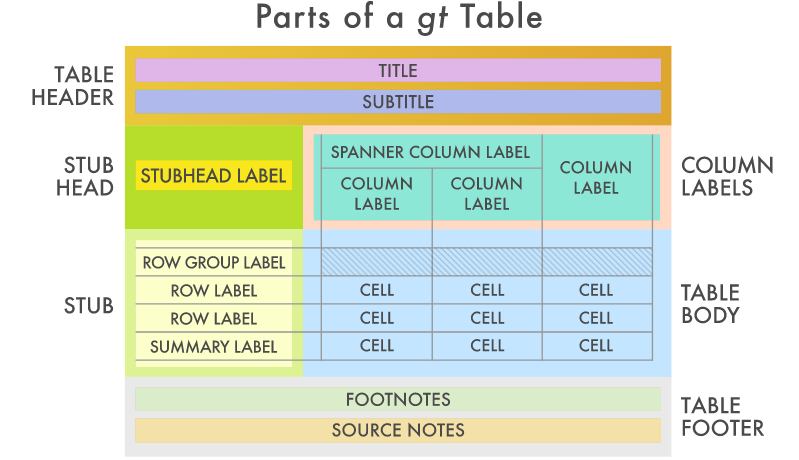
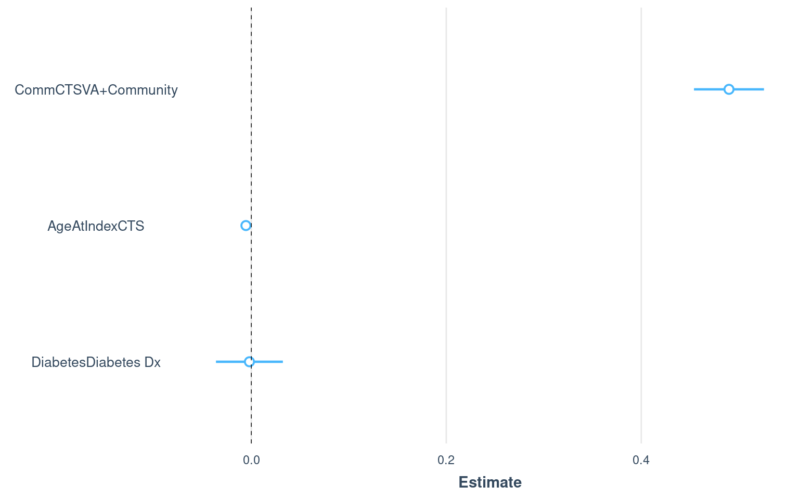
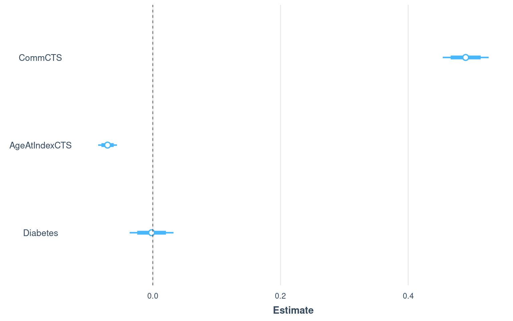

# Rationale

In this tutorial I will go through *so* many ways to make tables in R, Rstudio, and RMarkdown, and yet, it probably will not be exhaustive. Methods in this tutorial:

* Multipurpose
    + [arsenal](https://cran.r-project.org/web/packages/arsenal/index.html)
    + [tableone](https://cran.r-project.org/web/packages/tableone/vignettes/introduction.html)
    + [gt](https://gt.rstudio.com/articles/intro-creating-gt-tables.html)
    + [gtsummary](http://www.danieldsjoberg.com/gtsummary/)
    + [flextable](https://davidgohel.github.io/flextable/articles/offcran/examples.html)
    + [ttt](https://cran.r-project.org/web/packages/ttt/vignettes/ttt-intro.html)
* Model Summary Tables
    + gtsummary
    + [jtools](https://cran.r-project.org/web/packages/jtools/vignettes/summ.html)
    + [sjPlot](https://cran.r-project.org/web/packages/sjPlot/vignettes/tab_model_estimates.html)
    + [finalfit](https://cran.r-project.org/web/packages/finalfit/vignettes/finalfit.html)
* DIY

I'll be making use of some data from one of Dr. Erika Sears' Studies, sans any identifiable data, of course.

The first step in this document is to explain the data we'll be using, and setting it up for analysis, skip down to the tables section.

# Data

## Source

A retrospective cohort study of Veterans undergoing Carpal Tunnel Release (CTR) procedures from January 1, 2010 to December 31, 2016.  

## Cohort Inclusion

* Veteran has a primary care physician within the Veterans Administration  
* First CTR (not re-do CTR)  

## Exclusion

*	Concurrent procedures  
*	Last PCP visit to CTR > 7 years (outliers)  

## Study Variables

* Explanatory
    + Patient-level
        +	Age at index CTS (Consider non-linear relationship)
        +	Sex
        +	Race
        +	Ethnicity
        +	Charlson Comorbidity Index
        +	Diabetes
        + VA Priority Group (if service connected)
        + Patient Distance to PCP Facility
        +	Processes (VA vs. Community) - All as separate models
            + Steroid Injection
            +	Non Specific Therapy/Orthosis
            +	Specific Therapy
            + NSTES + STM
            +	Use of diagnostic studies (EMG, Imaging)
            + CTR
            + Overall Number of Community Encounters
    + Facility-Level Covariates
        + VA only vs. VA+Community (Proportion mixed at Facility-Level)
        + PCP clinic type
        + Access to Multiple Providers in same facility (requires adjustments)
            + PCP and Surgical Specialist
            + PCP and therapy
* Outcome
    + Time from last PCP visit to index CTR

# Set-up

## Packages/library Loading


```r
library(tidyverse) # data manipulation/tidying functions
library(magrittr)  # add() for plots, alternatively use `+`
library(janitor)   # custom tabyl functions
```

## Load Data


```r
sears <- readRDS("data/SurgicalCohort_AnalyticData.rds")
```

41,912 rows, 150 columns

# Process Data


```r
scale2 <- function(x) {
  (x - mean(x, na.rm = TRUE)) / (2 * sd(x, na.rm = TRUE))
}

# dput(grep("Comm", colnames(sears), value = TRUE))
comms <- c("CommDiagnostic",
           "CommEDS",
           "CommImaging",
           "CommSteroid",
           "CommNSTES",
           "CommSTM",
           "CommCTR")

sears <- sears %>%
  filter(PCPtoCTRDiffDays <= 365 * 7) %>%
  mutate(
    #--- Imaging Encounters ---#
    
    vaImaging = factor(ifelse(
      CommImaging == 1,
      "0 Imaging Encounters",
      as.character(EncImaging)
    )),
    CommImaging = factor(
      CommImaging,
      0:1,
      c("0 Imaging Encounters", ">= 1 Imaging Encounter")
    ),
    ImagingAny = factor(ifelse(
      vaImaging == ">= 1 Imaging Encounter"
        | CommImaging == ">= 1 Imaging Encounter",
      ">= 1 Imaging Encounter",
      "0 Imaging Encounters"
    )),
    
    #--- EDS Encounters ---#
    
    vaEDS = factor(ifelse(
      CommEDS == 1,
      "0 EDS Clinic Encounters",
      as.character(EncEDSclinic)
    )),
    CommEDS = factor(
      CommEDS,
      0:1,
      c("0 EDS Clinic Encounters", ">= 1 EDS Clinic Encounter")
    ),
    EDSAny = factor(ifelse(
      vaEDS == ">= 1 EDS Clinic Encounter"
        | CommEDS == ">= 1 EDS Clinic Encounter",
      ">= 1 EDS Clinic Encounter",
      "0 EDS Clinic Encounters"
    )),
    
    #--- Any Diagnostic (EDS or Imaging) Encounter ---#
    
    vaDiagnostic = factor(ifelse(
      vaImaging == ">= 1 Imaging Encounter" 
        | vaEDS == ">= 1 EDS Clinic Encounter",
      ">= 1 Diagnostic Encounter",
      "0 Diagnostic Encounters"
    )),
    CommDiagnostic = factor(
      CommDiagnostic,
      0:1,
      c("0 Diagnostic Encounters", ">= 1 Diagnostic Encounter")
    ),
    DiagnosticAny = factor(ifelse(
      vaDiagnostic == ">= 1 Diagnostic Encounter"
        | CommDiagnostic == ">= 1 Diagnostic Encounter",
      ">= 1 Diagnostic Encounter",
      "0 Diagnostic Encounters"
    )),
    
    #--- Steroid Receipt ---#
    
    vaSteroid = factor(ifelse(
      CommSteroid == 1,
      "0 Steroid Injections",
      as.character(SteroidInject)
    )),
    CommSteroid = factor(
      CommSteroid,
      0:1,
      c("0 Steroid Injections", ">= 1 Steroid Injections")
    ),
    SteroidAny = factor(ifelse(
      vaSteroid == ">= 1 Steroid Injections"
        | CommSteroid == ">= 1 Steroid Injections",
      ">= 1 Steroid Injections",
      "0 Steroid Injections"
    )),
    
    #--- NSTES/Splint Encounters ---#
    
    vaNSTES = factor(ifelse(
      CommNSTES == 1,
      "No Splint use",
      as.character(Splints)
    )),
    CommNSTES = factor(
      CommNSTES,
      0:1,
      c("No Splint use", ">= 1 Splints used")
    ),
    NSTESAny = factor(ifelse(
      vaNSTES == ">= 1 Splints used"
        | CommNSTES == ">= 1 Splints used",
      ">= 1 Splints used",
      "No Splint use"
    )),
    
    #--- STM Encounters ---#
    
    vaSTM = factor(ifelse(
      CommSTM == 1,
      "0 Therapeutic Modalities",
      as.character(SpecTherapyMod)
    )),
    CommSTM = factor(
      CommSTM,
      0:1,
      c("0 Therapeutic Modalities", ">= 1 Therapeutic Modalities")
    ),
    STMAny = factor(ifelse(
      vaSTM == ">= 1 Therapeutic Modalities"
        | CommSTM == ">= 1 Therapeutic Modalities",
      ">= 1 Therapeutic Modalities",
      "0 Therapeutic Modalities"
    )),
    
    #--- Combination of NSTES or STM - Therapeutics ---#
    
    vaTherapy = factor(ifelse(
      vaSTM == ">= 1 Therapeutic Modalities"
        | vaNSTES == ">= 1 Splints used",
      ">= 1 NSTES or STM",
      "Neither NSTES or STM"
    )),
    CommTherapy = factor(ifelse(
      CommSTM == ">= 1 Therapeutic Modalities"
        | CommNSTES == ">= 1 Splints used",
      ">= 1 NSTES or STM",
      "Neither NSTES or STM"
    )),
    TherapyAny = factor(ifelse(
      vaTherapy == ">= 1 NSTES or STM"
        | CommTherapy == ">= 1 NSTES or STM",
      ">= 1 NSTES or STM",
      "Neither NSTES or STM"
    )),
    
    #--- Count Community Encounters ---#
    
    CommCNT = rowSums(.[comms[-1]]),
    CommCTS = ifelse(CommCNT == 0, 0, 1),
    
    CommCTS = factor(CommCTS, 0:1, c("VA Only", "VA+Community")),
    CommCTR = factor(CommCTR, 0:1, c("VA Only", "Community")),
    age_std = scale2(AgeAtIndexCTS),
    charlson_std = scale2(charlsonCTS)
  ) %>%
  select(
    PatientICN,
    
    #--- Demographics & Characteristics---#
    
    AgeAtIndexCTS, age_std,
    Sex,
    Race,
    Eth_cat,
    charlsonCTS, charlson_std, charlsoncts_cat,
    Diabetes,
    VApriorityGrp,
    
    #--- Community Care Variables / Processes ---#
    
    vaSteroid,    CommSteroid,    SteroidAny,
    vaNSTES,      CommNSTES,      NSTESAny,
    vaSTM,        CommSTM,        STMAny,
    vaTherapy,    CommTherapy,    TherapyAny,
    vaDiagnostic, CommDiagnostic, DiagnosticAny,
    vaImaging,    CommImaging,    ImagingAny,
    vaEDS,        CommEDS,        EDSAny,
    CommCTS, 
    CommCTR,
    CommCNT,
    
    #--- Facility-Level Variables ---#
    
    Sta3n_ge50PCP,
    PCPcomplexity,
    dist_to_PCP_10,
    PCPandTherapy,
    PCPandSurg,
    
    #--- Outcome ---#
    
    PCPtoCTRDiffDays
  ) %>%
  rename(
    Sta3n = Sta3n_ge50PCP,
    charlsonCTS_cat = charlsoncts_cat # because it annoys me
  )

#---  Compute Proportion of Mixed Care (CommCTS), by Sta3n ---#

props <- sears %>%
  group_by(Sta3n, CommCTS) %>% 
  summarize(n = n()) %>%
  ungroup() %>%
  pivot_wider(names_from = CommCTS, values_from = n) %>%
  mutate(
    prop_mixedcare = `VA+Community` / (`VA Only` + `VA+Community`)
  ) %>%
  select(Sta3n, prop_mixedcare)

sears <- sears %>% left_join(props, by = "Sta3n")
```

# Tables {#tables}

## Arsenal

[Arsenal](https://cran.r-project.org/web/packages/arsenal/vignettes/tableby.html) requires you to have your dataframe setup with the variables as columns and the observations in rows, which is pretty common across most packages.


```r
tab_vars <- sears %>%
  select(
    AgeAtIndexCTS,
    Sex,
    Race,
    Eth_cat,
    charlsonCTS,
    charlsonCTS_cat,
    Diabetes,
    VApriorityGrp,
    dist_to_PCP_10,
    CommCTS
  )

tbl_df(head(tab_vars))
```

```
# A tibble: 6 × 10
  AgeAtIndexCTS Sex   Race       Eth_cat   charlsonCTS charlsonCTS_cat Diabetes 
          <dbl> <fct> <fct>      <fct>           <int> <fct>           <fct>    
1          36.6 M     WHITE      Not Hisp…           0 0               No Diabe…
2          50.1 M     WHITE      Not Hisp…           0 0               No Diabe…
3          59.7 M     WHITE      Not Hisp…           2 2+              No Diabe…
4          36.2 M     WHITE      Not Hisp…           0 0               No Diabe…
5          50.1 F     BLACK OR … Not Hisp…           1 1               Diabetes…
6          58.9 M     WHITE      Not Hisp…           0 0               No Diabe…
# … with 3 more variables: VApriorityGrp <fct>, dist_to_PCP_10 <dbl>,
#   CommCTS <fct>
```


```r
# install.packages("arsenal")
library(arsenal)

tab1 <- tableby(CommCTS ~ ., data = tab_vars)
summary(tab1)
```


|                                                                               | VA Only (N=23330) | VA+Community (N=5912) | Total (N=29242) | p value|
|:------------------------------------------------------------------------------|:-----------------:|:---------------------:|:---------------:|-------:|
|**AgeAtIndexCTS**                                                              |                   |                       |                 | < 0.001|
|&nbsp;&nbsp;&nbsp;N-Miss                                                       |         6         |           0           |        6        |        |
|&nbsp;&nbsp;&nbsp;Mean (SD)                                                    |  58.145 (12.926)  |    55.315 (12.121)    | 57.573 (12.818) |        |
|&nbsp;&nbsp;&nbsp;Range                                                        |  18.423 - 94.251  |    21.919 - 93.758    | 18.423 - 94.251 |        |
|**Sex**                                                                        |                   |                       |                 |   0.781|
|&nbsp;&nbsp;&nbsp;N-Miss                                                       |         6         |           0           |        6        |        |
|&nbsp;&nbsp;&nbsp;F                                                            |   2425 (10.4%)    |      622 (10.5%)      |  3047 (10.4%)   |        |
|&nbsp;&nbsp;&nbsp;M                                                            |   20899 (89.6%)   |     5290 (89.5%)      |  26189 (89.6%)  |        |
|**Race**                                                                       |                   |                       |                 | < 0.001|
|&nbsp;&nbsp;&nbsp;AMERICAN INDIAN OR ALASKA NATIVE                             |    213 (0.9%)     |       72 (1.2%)       |   285 (1.0%)    |        |
|&nbsp;&nbsp;&nbsp;ASIAN                                                        |    100 (0.4%)     |       27 (0.5%)       |   127 (0.4%)    |        |
|&nbsp;&nbsp;&nbsp;BLACK OR AFRICAN AMERICAN                                    |   3097 (13.3%)    |      585 (9.9%)       |  3682 (12.6%)   |        |
|&nbsp;&nbsp;&nbsp;MULTI-RACIAL                                                 |     2 (0.0%)      |       1 (0.0%)        |    3 (0.0%)     |        |
|&nbsp;&nbsp;&nbsp;NATIVE HAWAIIAN OR OTHER PACIFIC ISLANDER                    |    212 (0.9%)     |       64 (1.1%)       |   276 (0.9%)    |        |
|&nbsp;&nbsp;&nbsp;WHITE                                                        |   18664 (80.0%)   |     4879 (82.5%)      |  23543 (80.5%)  |        |
|&nbsp;&nbsp;&nbsp;UNKNOWN                                                      |    1042 (4.5%)    |      284 (4.8%)       |   1326 (4.5%)   |        |
|**Eth_cat**                                                                    |                   |                       |                 |   0.343|
|&nbsp;&nbsp;&nbsp;Hispanic/Latino                                              |    1285 (5.5%)    |      298 (5.0%)       |   1583 (5.4%)   |        |
|&nbsp;&nbsp;&nbsp;Not Hispanic/Latino                                          |   21337 (91.5%)   |     5439 (92.0%)      |  26776 (91.6%)  |        |
|&nbsp;&nbsp;&nbsp;Unspecificed/Unknown/Declined                                |    708 (3.0%)     |      175 (3.0%)       |   883 (3.0%)    |        |
|**charlsonCTS**                                                                |                   |                       |                 |   0.002|
|&nbsp;&nbsp;&nbsp;N-Miss                                                       |         6         |           0           |        6        |        |
|&nbsp;&nbsp;&nbsp;Mean (SD)                                                    |   0.474 (0.994)   |     0.430 (0.886)     |  0.465 (0.973)  |        |
|&nbsp;&nbsp;&nbsp;Range                                                        |  0.000 - 12.000   |     0.000 - 9.000     | 0.000 - 12.000  |        |
|**charlsonCTS_cat**                                                            |                   |                       |                 |   0.013|
|&nbsp;&nbsp;&nbsp;N-Miss                                                       |         6         |           0           |        6        |        |
|&nbsp;&nbsp;&nbsp;0                                                            |   17077 (73.2%)   |     4371 (73.9%)      |  21448 (73.4%)  |        |
|&nbsp;&nbsp;&nbsp;1                                                            |   3339 (14.3%)    |      884 (15.0%)      |  4223 (14.4%)   |        |
|&nbsp;&nbsp;&nbsp;2+                                                           |   2908 (12.5%)    |      657 (11.1%)      |  3565 (12.2%)   |        |
|**Diabetes**                                                                   |                   |                       |                 | < 0.001|
|&nbsp;&nbsp;&nbsp;No Diabetes Dx                                               |   17643 (75.6%)   |     4605 (77.9%)      |  22248 (76.1%)  |        |
|&nbsp;&nbsp;&nbsp;Diabetes Dx                                                  |   5687 (24.4%)    |     1307 (22.1%)      |  6994 (23.9%)   |        |
|**VApriorityGrp**                                                              |                   |                       |                 | < 0.001|
|&nbsp;&nbsp;&nbsp;Priority 1,4: High service-connected disability              |   4963 (21.3%)    |     1452 (24.6%)      |  6415 (21.9%)   |        |
|&nbsp;&nbsp;&nbsp;Priority 2,3,6: Low to moderate service-connected disability |   6747 (28.9%)    |     1963 (33.2%)      |  8710 (29.8%)   |        |
|&nbsp;&nbsp;&nbsp;Priority 5: Low income                                       |   7619 (32.7%)    |     1766 (29.9%)      |  9385 (32.1%)   |        |
|&nbsp;&nbsp;&nbsp;Priority 7,8: No service-connected disability                |   3599 (15.4%)    |      699 (11.8%)      |  4298 (14.7%)   |        |
|&nbsp;&nbsp;&nbsp;Priority: Unknown                                            |    402 (1.7%)     |       32 (0.5%)       |   434 (1.5%)    |        |
|**dist_to_PCP_10**                                                             |                   |                       |                 |   0.056|
|&nbsp;&nbsp;&nbsp;N-Miss                                                       |        185        |          973          |      1158       |        |
|&nbsp;&nbsp;&nbsp;Mean (SD)                                                    |  11.747 (39.345)  |    12.950 (43.900)    | 11.958 (40.185) |        |
|&nbsp;&nbsp;&nbsp;Range                                                        |  0.000 - 829.277  |    0.005 - 862.730    | 0.000 - 862.730 |        |

If you want the table to play nice with RMarkdown you have place `results = 'asis'` into the code chunk options.

````
```{r, results = "asis"}

library(arsenal)

tab1 <- tableby(CommCTS ~ ., data = tab_vars)
summary(tab1)

```
````

Arsenal has an overwhelming amount of options for customization, here's some examples from the vignette:

1. Summarize without a group/by variable
2. Display footnotes indicating which "test" was used
3. Summarize an ordered factor
4. Summarize a survival variable
5. Summarize date variables
6. Summarize multiple variables without typing them out
7. Subset the dataset used in the analysis
8. Create combinations of variables on the fly
9. Transform variables on the fly
10. Subsetting (change the ordering of the variables, delete a variable, sort by p-value, filter by p-value)
11. Merge two tableby objects together
12. Add a title to the table
13. Modify how missing values are displayed
14. Modify the number of digits used
15. Create a user-defined summary statistic
16. Use case-weights for creating summary statistics
17. Create your own p-value and add it to the table
18. For two-level categorical variables or one-line numeric variables, simplify the output.
19. Use tableby within an Sweave document
20. Export tableby object to a .CSV file
21. Write tableby object to a separate Word or HTML file
22. Use tableby in R Shiny
23. Use tableby in bookdown
24. Adjust tableby for multiple p-values
25. Tabulate multiple endpoints
26. Tabulate data by a non-test group (strata)

And that's just for the `tableby` function! It even has a function to approximate SAS's `PROC FREQ` when using the `TABLE /list` option.

Exporting to .csv or .doc(x) is one of the more useful functions of the package and it's pretty easy to do,


```r
write2word(
  tab1, 
  "/results/arsenal_table.doc", 
  title = "Arsenal Table in MS Word"
)
```


## tableone

I use to use the `tableone` package but it's fallen out of favor in recent years, as it's output is kind of ugly and there isn't much in the way of customization. That said, it's pretty easy to use and exporting into MS Word through simple copy and paste formats fairly nicely, without many headaches.

Data setup is almost the same as `arsenal` except you have to specify **every** variable you want to put into the table, separating them by continuous and categorical variables, and optionally, if you wish to separate them your continuous variables into "normal" and "non-normal", you can do that too.


```r
# install.packages("tableone")
library(tableone)

# dput(colnames(tab_vars))

cont <- c("AgeAtIndexCTS", "dist_to_PCP_10")
cate <- c("Sex", "Race", "Eth_cat", "charlsonCTS_cat", 
          "Diabetes", "VApriorityGrp")
strata <- "CommCTS"

tab1 <- CreateTableOne(
  vars = c(cont, cate, strata), 
  strata = strata, 
  data = tab_vars, 
  factorVars = cate
)

print(tab1, nonnormal = cont[2])
```

```
                                                                 Stratified by CommCTS
                                                                  VA Only           
  n                                                               23330             
  AgeAtIndexCTS (mean (SD))                                       58.15 (12.93)     
  dist_to_PCP_10 (median [IQR])                                    1.68 [0.72, 4.15]
  Sex = M (%)                                                     20899 (89.6)      
  Race (%)                                                                          
     AMERICAN INDIAN OR ALASKA NATIVE                               213 ( 0.9)      
     ASIAN                                                          100 ( 0.4)      
     BLACK OR AFRICAN AMERICAN                                     3097 (13.3)      
     MULTI-RACIAL                                                     2 ( 0.0)      
     NATIVE HAWAIIAN OR OTHER PACIFIC ISLANDER                      212 ( 0.9)      
     WHITE                                                        18664 (80.0)      
     UNKNOWN                                                       1042 ( 4.5)      
  Eth_cat (%)                                                                       
     Hispanic/Latino                                               1285 ( 5.5)      
     Not Hispanic/Latino                                          21337 (91.5)      
     Unspecificed/Unknown/Declined                                  708 ( 3.0)      
  charlsonCTS_cat (%)                                                               
     0                                                            17077 (73.2)      
     1                                                             3339 (14.3)      
     2+                                                            2908 (12.5)      
                                                                 Stratified by CommCTS
                                                                  VA+Community      
  n                                                                5912             
  AgeAtIndexCTS (mean (SD))                                       55.31 (12.12)     
  dist_to_PCP_10 (median [IQR])                                    2.13 [0.80, 5.20]
  Sex = M (%)                                                      5290 ( 89.5)     
  Race (%)                                                                          
     AMERICAN INDIAN OR ALASKA NATIVE                                72 (  1.2)     
     ASIAN                                                           27 (  0.5)     
     BLACK OR AFRICAN AMERICAN                                      585 (  9.9)     
     MULTI-RACIAL                                                     1 (  0.0)     
     NATIVE HAWAIIAN OR OTHER PACIFIC ISLANDER                       64 (  1.1)     
     WHITE                                                         4879 ( 82.5)     
     UNKNOWN                                                        284 (  4.8)     
  Eth_cat (%)                                                                       
     Hispanic/Latino                                                298 (  5.0)     
     Not Hispanic/Latino                                           5439 ( 92.0)     
     Unspecificed/Unknown/Declined                                  175 (  3.0)     
  charlsonCTS_cat (%)                                                               
     0                                                             4371 ( 73.9)     
     1                                                              884 ( 15.0)     
     2+                                                             657 ( 11.1)     
                                                                 Stratified by CommCTS
                                                                  p     
  n                                                                     
  AgeAtIndexCTS (mean (SD))                                       <0.001
  dist_to_PCP_10 (median [IQR])                                   <0.001
  Sex = M (%)                                                      0.799
  Race (%)                                                        <0.001
     AMERICAN INDIAN OR ALASKA NATIVE                                   
     ASIAN                                                              
     BLACK OR AFRICAN AMERICAN                                          
     MULTI-RACIAL                                                       
     NATIVE HAWAIIAN OR OTHER PACIFIC ISLANDER                          
     WHITE                                                              
     UNKNOWN                                                            
  Eth_cat (%)                                                      0.343
     Hispanic/Latino                                                    
     Not Hispanic/Latino                                                
     Unspecificed/Unknown/Declined                                      
  charlsonCTS_cat (%)                                              0.013
     0                                                                  
     1                                                                  
     2+                                                                 
                                                                 Stratified by CommCTS
                                                                  test   
  n                                                                      
  AgeAtIndexCTS (mean (SD))                                              
  dist_to_PCP_10 (median [IQR])                                   nonnorm
  Sex = M (%)                                                            
  Race (%)                                                               
     AMERICAN INDIAN OR ALASKA NATIVE                                    
     ASIAN                                                               
     BLACK OR AFRICAN AMERICAN                                           
     MULTI-RACIAL                                                        
     NATIVE HAWAIIAN OR OTHER PACIFIC ISLANDER                           
     WHITE                                                               
     UNKNOWN                                                             
  Eth_cat (%)                                                            
     Hispanic/Latino                                                     
     Not Hispanic/Latino                                                 
     Unspecificed/Unknown/Declined                                       
  charlsonCTS_cat (%)                                                    
     0                                                                   
     1                                                                   
     2+                                                                  
 [ reached getOption("max.print") -- omitted 8 rows ]
```

The workflow for exporting a table created via `tableone` is to first export to MS Excel, then to MS Word, via the "power" of copy & paste. I'll quote from the `tableone` vignette,

> Use the quote = TRUE argument to show the quotes and noSpaces = TRUE to remove spaces used to align text in the R console (the latter is optional). Now you can just copy and paste the whole thing to an Excel spread sheet. After pasting, click the small pasting icon to choose Use Text Import Wizard ..., in the dialogue you can just click finish to fit the values in the appropriate cells. Then you can edit or re-align things as you like. I usualy center-align the group summaries, and right-align the p-values.

for example ...


```r
print(
  tab1, 
  nonnormal = cont[2], 
  quote = TRUE, 
  noSpaces = TRUE
)
```

```
                                                                   "Stratified by CommCTS"
 ""                                                                 "VA Only"          
  "n"                                                               "23330"            
  "AgeAtIndexCTS (mean (SD))"                                       "58.15 (12.93)"    
  "dist_to_PCP_10 (median [IQR])"                                   "1.68 [0.72, 4.15]"
  "Sex = M (%)"                                                     "20899 (89.6)"     
  "Race (%)"                                                        ""                 
  "   AMERICAN INDIAN OR ALASKA NATIVE"                             "213 (0.9)"        
  "   ASIAN"                                                        "100 (0.4)"        
  "   BLACK OR AFRICAN AMERICAN"                                    "3097 (13.3)"      
  "   MULTI-RACIAL"                                                 "2 (0.0)"          
  "   NATIVE HAWAIIAN OR OTHER PACIFIC ISLANDER"                    "212 (0.9)"        
  "   WHITE"                                                        "18664 (80.0)"     
  "   UNKNOWN"                                                      "1042 (4.5)"       
  "Eth_cat (%)"                                                     ""                 
  "   Hispanic/Latino"                                              "1285 (5.5)"       
  "   Not Hispanic/Latino"                                          "21337 (91.5)"     
  "   Unspecificed/Unknown/Declined"                                "708 (3.0)"        
  "charlsonCTS_cat (%)"                                             ""                 
  "   0"                                                            "17077 (73.2)"     
  "   1"                                                            "3339 (14.3)"      
  "   2+"                                                           "2908 (12.5)"      
                                                                   "Stratified by CommCTS"
 ""                                                                 "VA+Community"     
  "n"                                                               "5912"             
  "AgeAtIndexCTS (mean (SD))"                                       "55.31 (12.12)"    
  "dist_to_PCP_10 (median [IQR])"                                   "2.13 [0.80, 5.20]"
  "Sex = M (%)"                                                     "5290 (89.5)"      
  "Race (%)"                                                        ""                 
  "   AMERICAN INDIAN OR ALASKA NATIVE"                             "72 (1.2)"         
  "   ASIAN"                                                        "27 (0.5)"         
  "   BLACK OR AFRICAN AMERICAN"                                    "585 (9.9)"        
  "   MULTI-RACIAL"                                                 "1 (0.0)"          
  "   NATIVE HAWAIIAN OR OTHER PACIFIC ISLANDER"                    "64 (1.1)"         
  "   WHITE"                                                        "4879 (82.5)"      
  "   UNKNOWN"                                                      "284 (4.8)"        
  "Eth_cat (%)"                                                     ""                 
  "   Hispanic/Latino"                                              "298 (5.0)"        
  "   Not Hispanic/Latino"                                          "5439 (92.0)"      
  "   Unspecificed/Unknown/Declined"                                "175 (3.0)"        
  "charlsonCTS_cat (%)"                                             ""                 
  "   0"                                                            "4371 (73.9)"      
  "   1"                                                            "884 (15.0)"       
  "   2+"                                                           "657 (11.1)"       
                                                                   "Stratified by CommCTS"
 ""                                                                 "p"     
  "n"                                                               ""      
  "AgeAtIndexCTS (mean (SD))"                                       "<0.001"
  "dist_to_PCP_10 (median [IQR])"                                   "<0.001"
  "Sex = M (%)"                                                     "0.799" 
  "Race (%)"                                                        "<0.001"
  "   AMERICAN INDIAN OR ALASKA NATIVE"                             ""      
  "   ASIAN"                                                        ""      
  "   BLACK OR AFRICAN AMERICAN"                                    ""      
  "   MULTI-RACIAL"                                                 ""      
  "   NATIVE HAWAIIAN OR OTHER PACIFIC ISLANDER"                    ""      
  "   WHITE"                                                        ""      
  "   UNKNOWN"                                                      ""      
  "Eth_cat (%)"                                                     "0.343" 
  "   Hispanic/Latino"                                              ""      
  "   Not Hispanic/Latino"                                          ""      
  "   Unspecificed/Unknown/Declined"                                ""      
  "charlsonCTS_cat (%)"                                             "0.013" 
  "   0"                                                            ""      
  "   1"                                                            ""      
  "   2+"                                                           ""      
                                                                   "Stratified by CommCTS"
 ""                                                                 "test"   
  "n"                                                               ""       
  "AgeAtIndexCTS (mean (SD))"                                       ""       
  "dist_to_PCP_10 (median [IQR])"                                   "nonnorm"
  "Sex = M (%)"                                                     ""       
  "Race (%)"                                                        ""       
  "   AMERICAN INDIAN OR ALASKA NATIVE"                             ""       
  "   ASIAN"                                                        ""       
  "   BLACK OR AFRICAN AMERICAN"                                    ""       
  "   MULTI-RACIAL"                                                 ""       
  "   NATIVE HAWAIIAN OR OTHER PACIFIC ISLANDER"                    ""       
  "   WHITE"                                                        ""       
  "   UNKNOWN"                                                      ""       
  "Eth_cat (%)"                                                     ""       
  "   Hispanic/Latino"                                              ""       
  "   Not Hispanic/Latino"                                          ""       
  "   Unspecificed/Unknown/Declined"                                ""       
  "charlsonCTS_cat (%)"                                             ""       
  "   0"                                                            ""       
  "   1"                                                            ""       
  "   2+"                                                           ""       
 [ reached getOption("max.print") -- omitted 8 rows ]
```

How fun.


## gt

`gt` is brand-new, designed to function like `ggplot2` but for making display tables instead of plots.



By itself it is not designed for displaying the typical "table 1" as seen in biomedical journals. That's what the next package is for ...

It's still pretty useful:


```r
# install.packages("gt")
library(gt)

VAgrp <- sears %>%
  janitor::tabyl(VApriorityGrp) %>%
  janitor::adorn_pct_formatting() %>%
  gt()

# Create two additional footnotes, using the
# `columns` and `where` arguments of `data_cells()`
VAgrp <- VAgrp %>%
  tab_footnote(
    footnote = "Is it though?",
    locations = cells_body(
      columns = vars(VApriorityGrp),
      rows = 5)
  ) %>%
  tab_source_note(
    source_note = "VA Priority Group Information: https://www.va.gov/health-care/eligibility/priority-groups/"
  )

# Show the gt Table
VAgrp
```

```{=html}
<div id="tdljkgbwlw" style="overflow-x:auto;overflow-y:auto;width:auto;height:auto;">
<style>html {
  font-family: -apple-system, BlinkMacSystemFont, 'Segoe UI', Roboto, Oxygen, Ubuntu, Cantarell, 'Helvetica Neue', 'Fira Sans', 'Droid Sans', Arial, sans-serif;
}

#tdljkgbwlw .gt_table {
  display: table;
  border-collapse: collapse;
  margin-left: auto;
  margin-right: auto;
  color: #333333;
  font-size: 16px;
  font-weight: normal;
  font-style: normal;
  background-color: #FFFFFF;
  width: auto;
  border-top-style: solid;
  border-top-width: 2px;
  border-top-color: #A8A8A8;
  border-right-style: none;
  border-right-width: 2px;
  border-right-color: #D3D3D3;
  border-bottom-style: solid;
  border-bottom-width: 2px;
  border-bottom-color: #A8A8A8;
  border-left-style: none;
  border-left-width: 2px;
  border-left-color: #D3D3D3;
}

#tdljkgbwlw .gt_heading {
  background-color: #FFFFFF;
  text-align: center;
  border-bottom-color: #FFFFFF;
  border-left-style: none;
  border-left-width: 1px;
  border-left-color: #D3D3D3;
  border-right-style: none;
  border-right-width: 1px;
  border-right-color: #D3D3D3;
}

#tdljkgbwlw .gt_title {
  color: #333333;
  font-size: 125%;
  font-weight: initial;
  padding-top: 4px;
  padding-bottom: 4px;
  border-bottom-color: #FFFFFF;
  border-bottom-width: 0;
}

#tdljkgbwlw .gt_subtitle {
  color: #333333;
  font-size: 85%;
  font-weight: initial;
  padding-top: 0;
  padding-bottom: 6px;
  border-top-color: #FFFFFF;
  border-top-width: 0;
}

#tdljkgbwlw .gt_bottom_border {
  border-bottom-style: solid;
  border-bottom-width: 2px;
  border-bottom-color: #D3D3D3;
}

#tdljkgbwlw .gt_col_headings {
  border-top-style: solid;
  border-top-width: 2px;
  border-top-color: #D3D3D3;
  border-bottom-style: solid;
  border-bottom-width: 2px;
  border-bottom-color: #D3D3D3;
  border-left-style: none;
  border-left-width: 1px;
  border-left-color: #D3D3D3;
  border-right-style: none;
  border-right-width: 1px;
  border-right-color: #D3D3D3;
}

#tdljkgbwlw .gt_col_heading {
  color: #333333;
  background-color: #FFFFFF;
  font-size: 100%;
  font-weight: normal;
  text-transform: inherit;
  border-left-style: none;
  border-left-width: 1px;
  border-left-color: #D3D3D3;
  border-right-style: none;
  border-right-width: 1px;
  border-right-color: #D3D3D3;
  vertical-align: bottom;
  padding-top: 5px;
  padding-bottom: 6px;
  padding-left: 5px;
  padding-right: 5px;
  overflow-x: hidden;
}

#tdljkgbwlw .gt_column_spanner_outer {
  color: #333333;
  background-color: #FFFFFF;
  font-size: 100%;
  font-weight: normal;
  text-transform: inherit;
  padding-top: 0;
  padding-bottom: 0;
  padding-left: 4px;
  padding-right: 4px;
}

#tdljkgbwlw .gt_column_spanner_outer:first-child {
  padding-left: 0;
}

#tdljkgbwlw .gt_column_spanner_outer:last-child {
  padding-right: 0;
}

#tdljkgbwlw .gt_column_spanner {
  border-bottom-style: solid;
  border-bottom-width: 2px;
  border-bottom-color: #D3D3D3;
  vertical-align: bottom;
  padding-top: 5px;
  padding-bottom: 5px;
  overflow-x: hidden;
  display: inline-block;
  width: 100%;
}

#tdljkgbwlw .gt_group_heading {
  padding: 8px;
  color: #333333;
  background-color: #FFFFFF;
  font-size: 100%;
  font-weight: initial;
  text-transform: inherit;
  border-top-style: solid;
  border-top-width: 2px;
  border-top-color: #D3D3D3;
  border-bottom-style: solid;
  border-bottom-width: 2px;
  border-bottom-color: #D3D3D3;
  border-left-style: none;
  border-left-width: 1px;
  border-left-color: #D3D3D3;
  border-right-style: none;
  border-right-width: 1px;
  border-right-color: #D3D3D3;
  vertical-align: middle;
}

#tdljkgbwlw .gt_empty_group_heading {
  padding: 0.5px;
  color: #333333;
  background-color: #FFFFFF;
  font-size: 100%;
  font-weight: initial;
  border-top-style: solid;
  border-top-width: 2px;
  border-top-color: #D3D3D3;
  border-bottom-style: solid;
  border-bottom-width: 2px;
  border-bottom-color: #D3D3D3;
  vertical-align: middle;
}

#tdljkgbwlw .gt_from_md > :first-child {
  margin-top: 0;
}

#tdljkgbwlw .gt_from_md > :last-child {
  margin-bottom: 0;
}

#tdljkgbwlw .gt_row {
  padding-top: 8px;
  padding-bottom: 8px;
  padding-left: 5px;
  padding-right: 5px;
  margin: 10px;
  border-top-style: solid;
  border-top-width: 1px;
  border-top-color: #D3D3D3;
  border-left-style: none;
  border-left-width: 1px;
  border-left-color: #D3D3D3;
  border-right-style: none;
  border-right-width: 1px;
  border-right-color: #D3D3D3;
  vertical-align: middle;
  overflow-x: hidden;
}

#tdljkgbwlw .gt_stub {
  color: #333333;
  background-color: #FFFFFF;
  font-size: 100%;
  font-weight: initial;
  text-transform: inherit;
  border-right-style: solid;
  border-right-width: 2px;
  border-right-color: #D3D3D3;
  padding-left: 12px;
}

#tdljkgbwlw .gt_summary_row {
  color: #333333;
  background-color: #FFFFFF;
  text-transform: inherit;
  padding-top: 8px;
  padding-bottom: 8px;
  padding-left: 5px;
  padding-right: 5px;
}

#tdljkgbwlw .gt_first_summary_row {
  padding-top: 8px;
  padding-bottom: 8px;
  padding-left: 5px;
  padding-right: 5px;
  border-top-style: solid;
  border-top-width: 2px;
  border-top-color: #D3D3D3;
}

#tdljkgbwlw .gt_grand_summary_row {
  color: #333333;
  background-color: #FFFFFF;
  text-transform: inherit;
  padding-top: 8px;
  padding-bottom: 8px;
  padding-left: 5px;
  padding-right: 5px;
}

#tdljkgbwlw .gt_first_grand_summary_row {
  padding-top: 8px;
  padding-bottom: 8px;
  padding-left: 5px;
  padding-right: 5px;
  border-top-style: double;
  border-top-width: 6px;
  border-top-color: #D3D3D3;
}

#tdljkgbwlw .gt_striped {
  background-color: rgba(128, 128, 128, 0.05);
}

#tdljkgbwlw .gt_table_body {
  border-top-style: solid;
  border-top-width: 2px;
  border-top-color: #D3D3D3;
  border-bottom-style: solid;
  border-bottom-width: 2px;
  border-bottom-color: #D3D3D3;
}

#tdljkgbwlw .gt_footnotes {
  color: #333333;
  background-color: #FFFFFF;
  border-bottom-style: none;
  border-bottom-width: 2px;
  border-bottom-color: #D3D3D3;
  border-left-style: none;
  border-left-width: 2px;
  border-left-color: #D3D3D3;
  border-right-style: none;
  border-right-width: 2px;
  border-right-color: #D3D3D3;
}

#tdljkgbwlw .gt_footnote {
  margin: 0px;
  font-size: 90%;
  padding: 4px;
}

#tdljkgbwlw .gt_sourcenotes {
  color: #333333;
  background-color: #FFFFFF;
  border-bottom-style: none;
  border-bottom-width: 2px;
  border-bottom-color: #D3D3D3;
  border-left-style: none;
  border-left-width: 2px;
  border-left-color: #D3D3D3;
  border-right-style: none;
  border-right-width: 2px;
  border-right-color: #D3D3D3;
}

#tdljkgbwlw .gt_sourcenote {
  font-size: 90%;
  padding: 4px;
}

#tdljkgbwlw .gt_left {
  text-align: left;
}

#tdljkgbwlw .gt_center {
  text-align: center;
}

#tdljkgbwlw .gt_right {
  text-align: right;
  font-variant-numeric: tabular-nums;
}

#tdljkgbwlw .gt_font_normal {
  font-weight: normal;
}

#tdljkgbwlw .gt_font_bold {
  font-weight: bold;
}

#tdljkgbwlw .gt_font_italic {
  font-style: italic;
}

#tdljkgbwlw .gt_super {
  font-size: 65%;
}

#tdljkgbwlw .gt_footnote_marks {
  font-style: italic;
  font-weight: normal;
  font-size: 65%;
}
</style>
<table class="gt_table">
  
  <thead class="gt_col_headings">
    <tr>
      <th class="gt_col_heading gt_columns_bottom_border gt_center" rowspan="1" colspan="1">VApriorityGrp</th>
      <th class="gt_col_heading gt_columns_bottom_border gt_right" rowspan="1" colspan="1">n</th>
      <th class="gt_col_heading gt_columns_bottom_border gt_left" rowspan="1" colspan="1">percent</th>
    </tr>
  </thead>
  <tbody class="gt_table_body">
    <tr><td class="gt_row gt_center">Priority 1,4: High service-connected disability</td>
<td class="gt_row gt_right">6415</td>
<td class="gt_row gt_left">21.9%</td></tr>
    <tr><td class="gt_row gt_center">Priority 2,3,6: Low to moderate service-connected disability</td>
<td class="gt_row gt_right">8710</td>
<td class="gt_row gt_left">29.8%</td></tr>
    <tr><td class="gt_row gt_center">Priority 5: Low income</td>
<td class="gt_row gt_right">9385</td>
<td class="gt_row gt_left">32.1%</td></tr>
    <tr><td class="gt_row gt_center">Priority 7,8: No service-connected disability</td>
<td class="gt_row gt_right">4298</td>
<td class="gt_row gt_left">14.7%</td></tr>
    <tr><td class="gt_row gt_center">Priority: Unknown<sup class="gt_footnote_marks">1</sup></td>
<td class="gt_row gt_right">434</td>
<td class="gt_row gt_left">1.5%</td></tr>
  </tbody>
  <tfoot class="gt_sourcenotes">
    <tr>
      <td class="gt_sourcenote" colspan="3">VA Priority Group Information: https://www.va.gov/health-care/eligibility/priority-groups/</td>
    </tr>
  </tfoot>
  <tfoot>
    <tr class="gt_footnotes">
      <td colspan="3">
        <p class="gt_footnote">
          <sup class="gt_footnote_marks">
            <em>1</em>
          </sup>
           
          Is it though?
          <br />
        </p>
      </td>
    </tr>
  </tfoot>
</table>
</div>
```

## gtsummary

As mentioned above, `gtsummary` is built on top of `gt` for display of journal-quality tables. And, it's one of the easiest to use since it uses `tidyverse` principles.


```r
# install.packages("gtsummary")
library(gtsummary)

tab1 <- tab_vars %>%
  tbl_summary(
    by = CommCTS, # split table by group
    missing = "no" # don't list missing data separately
  ) %>%
  add_n() %>% # add column with total number of non-missing observations
  add_p() %>% # test if there's difference between groups
  bold_labels()

tab1
```

```{=html}
<div id="qocytgkygw" style="overflow-x:auto;overflow-y:auto;width:auto;height:auto;">
<style>html {
  font-family: -apple-system, BlinkMacSystemFont, 'Segoe UI', Roboto, Oxygen, Ubuntu, Cantarell, 'Helvetica Neue', 'Fira Sans', 'Droid Sans', Arial, sans-serif;
}

#qocytgkygw .gt_table {
  display: table;
  border-collapse: collapse;
  margin-left: auto;
  margin-right: auto;
  color: #333333;
  font-size: 16px;
  font-weight: normal;
  font-style: normal;
  background-color: #FFFFFF;
  width: auto;
  border-top-style: solid;
  border-top-width: 2px;
  border-top-color: #A8A8A8;
  border-right-style: none;
  border-right-width: 2px;
  border-right-color: #D3D3D3;
  border-bottom-style: solid;
  border-bottom-width: 2px;
  border-bottom-color: #A8A8A8;
  border-left-style: none;
  border-left-width: 2px;
  border-left-color: #D3D3D3;
}

#qocytgkygw .gt_heading {
  background-color: #FFFFFF;
  text-align: center;
  border-bottom-color: #FFFFFF;
  border-left-style: none;
  border-left-width: 1px;
  border-left-color: #D3D3D3;
  border-right-style: none;
  border-right-width: 1px;
  border-right-color: #D3D3D3;
}

#qocytgkygw .gt_title {
  color: #333333;
  font-size: 125%;
  font-weight: initial;
  padding-top: 4px;
  padding-bottom: 4px;
  border-bottom-color: #FFFFFF;
  border-bottom-width: 0;
}

#qocytgkygw .gt_subtitle {
  color: #333333;
  font-size: 85%;
  font-weight: initial;
  padding-top: 0;
  padding-bottom: 6px;
  border-top-color: #FFFFFF;
  border-top-width: 0;
}

#qocytgkygw .gt_bottom_border {
  border-bottom-style: solid;
  border-bottom-width: 2px;
  border-bottom-color: #D3D3D3;
}

#qocytgkygw .gt_col_headings {
  border-top-style: solid;
  border-top-width: 2px;
  border-top-color: #D3D3D3;
  border-bottom-style: solid;
  border-bottom-width: 2px;
  border-bottom-color: #D3D3D3;
  border-left-style: none;
  border-left-width: 1px;
  border-left-color: #D3D3D3;
  border-right-style: none;
  border-right-width: 1px;
  border-right-color: #D3D3D3;
}

#qocytgkygw .gt_col_heading {
  color: #333333;
  background-color: #FFFFFF;
  font-size: 100%;
  font-weight: normal;
  text-transform: inherit;
  border-left-style: none;
  border-left-width: 1px;
  border-left-color: #D3D3D3;
  border-right-style: none;
  border-right-width: 1px;
  border-right-color: #D3D3D3;
  vertical-align: bottom;
  padding-top: 5px;
  padding-bottom: 6px;
  padding-left: 5px;
  padding-right: 5px;
  overflow-x: hidden;
}

#qocytgkygw .gt_column_spanner_outer {
  color: #333333;
  background-color: #FFFFFF;
  font-size: 100%;
  font-weight: normal;
  text-transform: inherit;
  padding-top: 0;
  padding-bottom: 0;
  padding-left: 4px;
  padding-right: 4px;
}

#qocytgkygw .gt_column_spanner_outer:first-child {
  padding-left: 0;
}

#qocytgkygw .gt_column_spanner_outer:last-child {
  padding-right: 0;
}

#qocytgkygw .gt_column_spanner {
  border-bottom-style: solid;
  border-bottom-width: 2px;
  border-bottom-color: #D3D3D3;
  vertical-align: bottom;
  padding-top: 5px;
  padding-bottom: 5px;
  overflow-x: hidden;
  display: inline-block;
  width: 100%;
}

#qocytgkygw .gt_group_heading {
  padding: 8px;
  color: #333333;
  background-color: #FFFFFF;
  font-size: 100%;
  font-weight: initial;
  text-transform: inherit;
  border-top-style: solid;
  border-top-width: 2px;
  border-top-color: #D3D3D3;
  border-bottom-style: solid;
  border-bottom-width: 2px;
  border-bottom-color: #D3D3D3;
  border-left-style: none;
  border-left-width: 1px;
  border-left-color: #D3D3D3;
  border-right-style: none;
  border-right-width: 1px;
  border-right-color: #D3D3D3;
  vertical-align: middle;
}

#qocytgkygw .gt_empty_group_heading {
  padding: 0.5px;
  color: #333333;
  background-color: #FFFFFF;
  font-size: 100%;
  font-weight: initial;
  border-top-style: solid;
  border-top-width: 2px;
  border-top-color: #D3D3D3;
  border-bottom-style: solid;
  border-bottom-width: 2px;
  border-bottom-color: #D3D3D3;
  vertical-align: middle;
}

#qocytgkygw .gt_from_md > :first-child {
  margin-top: 0;
}

#qocytgkygw .gt_from_md > :last-child {
  margin-bottom: 0;
}

#qocytgkygw .gt_row {
  padding-top: 8px;
  padding-bottom: 8px;
  padding-left: 5px;
  padding-right: 5px;
  margin: 10px;
  border-top-style: solid;
  border-top-width: 1px;
  border-top-color: #D3D3D3;
  border-left-style: none;
  border-left-width: 1px;
  border-left-color: #D3D3D3;
  border-right-style: none;
  border-right-width: 1px;
  border-right-color: #D3D3D3;
  vertical-align: middle;
  overflow-x: hidden;
}

#qocytgkygw .gt_stub {
  color: #333333;
  background-color: #FFFFFF;
  font-size: 100%;
  font-weight: initial;
  text-transform: inherit;
  border-right-style: solid;
  border-right-width: 2px;
  border-right-color: #D3D3D3;
  padding-left: 12px;
}

#qocytgkygw .gt_summary_row {
  color: #333333;
  background-color: #FFFFFF;
  text-transform: inherit;
  padding-top: 8px;
  padding-bottom: 8px;
  padding-left: 5px;
  padding-right: 5px;
}

#qocytgkygw .gt_first_summary_row {
  padding-top: 8px;
  padding-bottom: 8px;
  padding-left: 5px;
  padding-right: 5px;
  border-top-style: solid;
  border-top-width: 2px;
  border-top-color: #D3D3D3;
}

#qocytgkygw .gt_grand_summary_row {
  color: #333333;
  background-color: #FFFFFF;
  text-transform: inherit;
  padding-top: 8px;
  padding-bottom: 8px;
  padding-left: 5px;
  padding-right: 5px;
}

#qocytgkygw .gt_first_grand_summary_row {
  padding-top: 8px;
  padding-bottom: 8px;
  padding-left: 5px;
  padding-right: 5px;
  border-top-style: double;
  border-top-width: 6px;
  border-top-color: #D3D3D3;
}

#qocytgkygw .gt_striped {
  background-color: rgba(128, 128, 128, 0.05);
}

#qocytgkygw .gt_table_body {
  border-top-style: solid;
  border-top-width: 2px;
  border-top-color: #D3D3D3;
  border-bottom-style: solid;
  border-bottom-width: 2px;
  border-bottom-color: #D3D3D3;
}

#qocytgkygw .gt_footnotes {
  color: #333333;
  background-color: #FFFFFF;
  border-bottom-style: none;
  border-bottom-width: 2px;
  border-bottom-color: #D3D3D3;
  border-left-style: none;
  border-left-width: 2px;
  border-left-color: #D3D3D3;
  border-right-style: none;
  border-right-width: 2px;
  border-right-color: #D3D3D3;
}

#qocytgkygw .gt_footnote {
  margin: 0px;
  font-size: 90%;
  padding: 4px;
}

#qocytgkygw .gt_sourcenotes {
  color: #333333;
  background-color: #FFFFFF;
  border-bottom-style: none;
  border-bottom-width: 2px;
  border-bottom-color: #D3D3D3;
  border-left-style: none;
  border-left-width: 2px;
  border-left-color: #D3D3D3;
  border-right-style: none;
  border-right-width: 2px;
  border-right-color: #D3D3D3;
}

#qocytgkygw .gt_sourcenote {
  font-size: 90%;
  padding: 4px;
}

#qocytgkygw .gt_left {
  text-align: left;
}

#qocytgkygw .gt_center {
  text-align: center;
}

#qocytgkygw .gt_right {
  text-align: right;
  font-variant-numeric: tabular-nums;
}

#qocytgkygw .gt_font_normal {
  font-weight: normal;
}

#qocytgkygw .gt_font_bold {
  font-weight: bold;
}

#qocytgkygw .gt_font_italic {
  font-style: italic;
}

#qocytgkygw .gt_super {
  font-size: 65%;
}

#qocytgkygw .gt_footnote_marks {
  font-style: italic;
  font-weight: normal;
  font-size: 65%;
}
</style>
<table class="gt_table">
  
  <thead class="gt_col_headings">
    <tr>
      <th class="gt_col_heading gt_columns_bottom_border gt_left" rowspan="1" colspan="1"><strong>Characteristic</strong></th>
      <th class="gt_col_heading gt_columns_bottom_border gt_center" rowspan="1" colspan="1"><strong>N</strong></th>
      <th class="gt_col_heading gt_columns_bottom_border gt_center" rowspan="1" colspan="1"><strong>VA Only</strong>, N = 23,330<sup class="gt_footnote_marks">1</sup></th>
      <th class="gt_col_heading gt_columns_bottom_border gt_center" rowspan="1" colspan="1"><strong>VA+Community</strong>, N = 5,912<sup class="gt_footnote_marks">1</sup></th>
      <th class="gt_col_heading gt_columns_bottom_border gt_center" rowspan="1" colspan="1"><strong>p-value</strong><sup class="gt_footnote_marks">2</sup></th>
    </tr>
  </thead>
  <tbody class="gt_table_body">
    <tr><td class="gt_row gt_left" style="font-weight: bold;">AgeAtIndexCTS</td>
<td class="gt_row gt_center">29,236</td>
<td class="gt_row gt_center">59 (50, 66)</td>
<td class="gt_row gt_center">57 (48, 63)</td>
<td class="gt_row gt_center"><0.001</td></tr>
    <tr><td class="gt_row gt_left" style="font-weight: bold;">Sex</td>
<td class="gt_row gt_center">29,236</td>
<td class="gt_row gt_center"></td>
<td class="gt_row gt_center"></td>
<td class="gt_row gt_center">0.8</td></tr>
    <tr><td class="gt_row gt_left" style="text-align: left; text-indent: 10px;">F</td>
<td class="gt_row gt_center"></td>
<td class="gt_row gt_center">2,425 (10%)</td>
<td class="gt_row gt_center">622 (11%)</td>
<td class="gt_row gt_center"></td></tr>
    <tr><td class="gt_row gt_left" style="text-align: left; text-indent: 10px;">M</td>
<td class="gt_row gt_center"></td>
<td class="gt_row gt_center">20,899 (90%)</td>
<td class="gt_row gt_center">5,290 (89%)</td>
<td class="gt_row gt_center"></td></tr>
    <tr><td class="gt_row gt_left" style="font-weight: bold;">Race</td>
<td class="gt_row gt_center">29,242</td>
<td class="gt_row gt_center"></td>
<td class="gt_row gt_center"></td>
<td class="gt_row gt_center"></td></tr>
    <tr><td class="gt_row gt_left" style="text-align: left; text-indent: 10px;">AMERICAN INDIAN OR ALASKA NATIVE</td>
<td class="gt_row gt_center"></td>
<td class="gt_row gt_center">213 (0.9%)</td>
<td class="gt_row gt_center">72 (1.2%)</td>
<td class="gt_row gt_center"></td></tr>
    <tr><td class="gt_row gt_left" style="text-align: left; text-indent: 10px;">ASIAN</td>
<td class="gt_row gt_center"></td>
<td class="gt_row gt_center">100 (0.4%)</td>
<td class="gt_row gt_center">27 (0.5%)</td>
<td class="gt_row gt_center"></td></tr>
    <tr><td class="gt_row gt_left" style="text-align: left; text-indent: 10px;">BLACK OR AFRICAN AMERICAN</td>
<td class="gt_row gt_center"></td>
<td class="gt_row gt_center">3,097 (13%)</td>
<td class="gt_row gt_center">585 (9.9%)</td>
<td class="gt_row gt_center"></td></tr>
    <tr><td class="gt_row gt_left" style="text-align: left; text-indent: 10px;">MULTI-RACIAL</td>
<td class="gt_row gt_center"></td>
<td class="gt_row gt_center">2 (&lt;0.1%)</td>
<td class="gt_row gt_center">1 (&lt;0.1%)</td>
<td class="gt_row gt_center"></td></tr>
    <tr><td class="gt_row gt_left" style="text-align: left; text-indent: 10px;">NATIVE HAWAIIAN OR OTHER PACIFIC ISLANDER</td>
<td class="gt_row gt_center"></td>
<td class="gt_row gt_center">212 (0.9%)</td>
<td class="gt_row gt_center">64 (1.1%)</td>
<td class="gt_row gt_center"></td></tr>
    <tr><td class="gt_row gt_left" style="text-align: left; text-indent: 10px;">WHITE</td>
<td class="gt_row gt_center"></td>
<td class="gt_row gt_center">18,664 (80%)</td>
<td class="gt_row gt_center">4,879 (83%)</td>
<td class="gt_row gt_center"></td></tr>
    <tr><td class="gt_row gt_left" style="text-align: left; text-indent: 10px;">UNKNOWN</td>
<td class="gt_row gt_center"></td>
<td class="gt_row gt_center">1,042 (4.5%)</td>
<td class="gt_row gt_center">284 (4.8%)</td>
<td class="gt_row gt_center"></td></tr>
    <tr><td class="gt_row gt_left" style="font-weight: bold;">Eth_cat</td>
<td class="gt_row gt_center">29,242</td>
<td class="gt_row gt_center"></td>
<td class="gt_row gt_center"></td>
<td class="gt_row gt_center">0.3</td></tr>
    <tr><td class="gt_row gt_left" style="text-align: left; text-indent: 10px;">Hispanic/Latino</td>
<td class="gt_row gt_center"></td>
<td class="gt_row gt_center">1,285 (5.5%)</td>
<td class="gt_row gt_center">298 (5.0%)</td>
<td class="gt_row gt_center"></td></tr>
    <tr><td class="gt_row gt_left" style="text-align: left; text-indent: 10px;">Not Hispanic/Latino</td>
<td class="gt_row gt_center"></td>
<td class="gt_row gt_center">21,337 (91%)</td>
<td class="gt_row gt_center">5,439 (92%)</td>
<td class="gt_row gt_center"></td></tr>
    <tr><td class="gt_row gt_left" style="text-align: left; text-indent: 10px;">Unspecificed/Unknown/Declined</td>
<td class="gt_row gt_center"></td>
<td class="gt_row gt_center">708 (3.0%)</td>
<td class="gt_row gt_center">175 (3.0%)</td>
<td class="gt_row gt_center"></td></tr>
    <tr><td class="gt_row gt_left" style="font-weight: bold;">charlsonCTS</td>
<td class="gt_row gt_center">29,236</td>
<td class="gt_row gt_center">0 (0, 1)</td>
<td class="gt_row gt_center">0 (0, 1)</td>
<td class="gt_row gt_center">0.11</td></tr>
    <tr><td class="gt_row gt_left" style="font-weight: bold;">charlsonCTS_cat</td>
<td class="gt_row gt_center">29,236</td>
<td class="gt_row gt_center"></td>
<td class="gt_row gt_center"></td>
<td class="gt_row gt_center">0.013</td></tr>
    <tr><td class="gt_row gt_left" style="text-align: left; text-indent: 10px;">0</td>
<td class="gt_row gt_center"></td>
<td class="gt_row gt_center">17,077 (73%)</td>
<td class="gt_row gt_center">4,371 (74%)</td>
<td class="gt_row gt_center"></td></tr>
    <tr><td class="gt_row gt_left" style="text-align: left; text-indent: 10px;">1</td>
<td class="gt_row gt_center"></td>
<td class="gt_row gt_center">3,339 (14%)</td>
<td class="gt_row gt_center">884 (15%)</td>
<td class="gt_row gt_center"></td></tr>
    <tr><td class="gt_row gt_left" style="text-align: left; text-indent: 10px;">2+</td>
<td class="gt_row gt_center"></td>
<td class="gt_row gt_center">2,908 (12%)</td>
<td class="gt_row gt_center">657 (11%)</td>
<td class="gt_row gt_center"></td></tr>
    <tr><td class="gt_row gt_left" style="font-weight: bold;">Diabetes</td>
<td class="gt_row gt_center">29,242</td>
<td class="gt_row gt_center"></td>
<td class="gt_row gt_center"></td>
<td class="gt_row gt_center"><0.001</td></tr>
    <tr><td class="gt_row gt_left" style="text-align: left; text-indent: 10px;">No Diabetes Dx</td>
<td class="gt_row gt_center"></td>
<td class="gt_row gt_center">17,643 (76%)</td>
<td class="gt_row gt_center">4,605 (78%)</td>
<td class="gt_row gt_center"></td></tr>
    <tr><td class="gt_row gt_left" style="text-align: left; text-indent: 10px;">Diabetes Dx</td>
<td class="gt_row gt_center"></td>
<td class="gt_row gt_center">5,687 (24%)</td>
<td class="gt_row gt_center">1,307 (22%)</td>
<td class="gt_row gt_center"></td></tr>
    <tr><td class="gt_row gt_left" style="font-weight: bold;">VApriorityGrp</td>
<td class="gt_row gt_center">29,242</td>
<td class="gt_row gt_center"></td>
<td class="gt_row gt_center"></td>
<td class="gt_row gt_center"><0.001</td></tr>
    <tr><td class="gt_row gt_left" style="text-align: left; text-indent: 10px;">Priority 1,4: High service-connected disability</td>
<td class="gt_row gt_center"></td>
<td class="gt_row gt_center">4,963 (21%)</td>
<td class="gt_row gt_center">1,452 (25%)</td>
<td class="gt_row gt_center"></td></tr>
    <tr><td class="gt_row gt_left" style="text-align: left; text-indent: 10px;">Priority 2,3,6: Low to moderate service-connected disability</td>
<td class="gt_row gt_center"></td>
<td class="gt_row gt_center">6,747 (29%)</td>
<td class="gt_row gt_center">1,963 (33%)</td>
<td class="gt_row gt_center"></td></tr>
    <tr><td class="gt_row gt_left" style="text-align: left; text-indent: 10px;">Priority 5: Low income</td>
<td class="gt_row gt_center"></td>
<td class="gt_row gt_center">7,619 (33%)</td>
<td class="gt_row gt_center">1,766 (30%)</td>
<td class="gt_row gt_center"></td></tr>
    <tr><td class="gt_row gt_left" style="text-align: left; text-indent: 10px;">Priority 7,8: No service-connected disability</td>
<td class="gt_row gt_center"></td>
<td class="gt_row gt_center">3,599 (15%)</td>
<td class="gt_row gt_center">699 (12%)</td>
<td class="gt_row gt_center"></td></tr>
    <tr><td class="gt_row gt_left" style="text-align: left; text-indent: 10px;">Priority: Unknown</td>
<td class="gt_row gt_center"></td>
<td class="gt_row gt_center">402 (1.7%)</td>
<td class="gt_row gt_center">32 (0.5%)</td>
<td class="gt_row gt_center"></td></tr>
    <tr><td class="gt_row gt_left" style="font-weight: bold;">dist_to_PCP_10</td>
<td class="gt_row gt_center">28,084</td>
<td class="gt_row gt_center">2 (1, 4)</td>
<td class="gt_row gt_center">2 (1, 5)</td>
<td class="gt_row gt_center"><0.001</td></tr>
  </tbody>
  
  <tfoot>
    <tr class="gt_footnotes">
      <td colspan="5">
        <p class="gt_footnote">
          <sup class="gt_footnote_marks">
            <em>1</em>
          </sup>
           
          Median (IQR); n (%)
          <br />
        </p>
        <p class="gt_footnote">
          <sup class="gt_footnote_marks">
            <em>2</em>
          </sup>
           
          Wilcoxon rank sum test; Pearson's Chi-squared test
          <br />
        </p>
      </td>
    </tr>
  </tfoot>
</table>
</div>
```

`gtsummary` does not allow for multiple-comparisons adjustment, you'll have to do it manually.


## flextable

`flextable` is used by some other packages for making tables so I'll introduce it here and though it isn't specifically for making a "table 1". It can do one cool new trick and that's conditional coloring of specific cells.


```r
sum_tab <- tab_vars %>%
  group_by(CommCTS) %>%
  select_if(is.numeric) %>%
  pivot_longer(
    cols = c("AgeAtIndexCTS", "charlsonCTS", "dist_to_PCP_10"), 
    names_to = "Variable", 
    values_to = "value"
  ) %>%
  na.omit() %>%
  group_by(CommCTS, Variable) %>%
  summarize(
    n      = n(),
    mean   = mean(value),
    sd     = sd(value),
    min    = min(value),
    Q1     = fivenum(value)[2],
    median = median(value),
    Q3     = fivenum(value)[4],
    max    = max(value)
  ) %>%
  mutate_if(is.numeric, round, 2)

sum_tab %>%
  arrange(Variable, CommCTS)
```

```
# A tibble: 6 × 10
# Groups:   CommCTS [2]
  CommCTS      Variable           n  mean    sd   min    Q1 median    Q3   max
  <fct>        <chr>          <dbl> <dbl> <dbl> <dbl> <dbl>  <dbl> <dbl> <dbl>
1 VA Only      AgeAtIndexCTS  23324 58.2  12.9  18.4  50.1   59.5  66     94.2
2 VA+Community AgeAtIndexCTS   5912 55.3  12.1  21.9  47.7   56.5  63.0   93.8
3 VA Only      charlsonCTS    23324  0.47  0.99  0     0      0     1     12  
4 VA+Community charlsonCTS     5912  0.43  0.89  0     0      0     1      9  
5 VA Only      dist_to_PCP_10 23145 11.8  39.4   0     0.72   1.68  4.15 829. 
6 VA+Community dist_to_PCP_10  4939 13.0  43.9   0.01  0.8    2.13  5.2  863. 
```


```r
# install.packages("flextable")
library(flextable)

ft <- flextable(sum_tab)
ft <- color(ft, i = ~ max > 90, j = ~ max, color = "red")
ft <- bg(ft,    i = ~ min <= 0, j = "median", bg = "#EFEF99")
ft
```

```{=html}
<template id="f6857fd0-620f-4fd3-bb09-6f7e5457d862"><style>
.tabwid table{
  border-spacing:0px !important;
  border-collapse:collapse;
  line-height:1;
  margin-left:auto;
  margin-right:auto;
  border-width: 0;
  display: table;
  margin-top: 1.275em;
  margin-bottom: 1.275em;
  border-color: transparent;
}
.tabwid_left table{
  margin-left:0;
}
.tabwid_right table{
  margin-right:0;
}
.tabwid td {
    padding: 0;
}
.tabwid a {
  text-decoration: none;
}
.tabwid thead {
    background-color: transparent;
}
.tabwid tfoot {
    background-color: transparent;
}
.tabwid table tr {
background-color: transparent;
}
</style><div class="tabwid"><style>.cl-01567f00{}.cl-0150e7a2{font-family:'DejaVu Sans';font-size:11pt;font-weight:normal;font-style:normal;text-decoration:none;color:rgba(0, 0, 0, 1.00);background-color:transparent;}.cl-0150e7ac{font-family:'DejaVu Sans';font-size:11pt;font-weight:normal;font-style:normal;text-decoration:none;color:rgba(255, 0, 0, 1.00);background-color:transparent;}.cl-0150fcf6{margin:0;text-align:left;border-bottom: 0 solid rgba(0, 0, 0, 1.00);border-top: 0 solid rgba(0, 0, 0, 1.00);border-left: 0 solid rgba(0, 0, 0, 1.00);border-right: 0 solid rgba(0, 0, 0, 1.00);padding-bottom:5pt;padding-top:5pt;padding-left:5pt;padding-right:5pt;line-height: 1;background-color:transparent;}.cl-0150fd00{margin:0;text-align:right;border-bottom: 0 solid rgba(0, 0, 0, 1.00);border-top: 0 solid rgba(0, 0, 0, 1.00);border-left: 0 solid rgba(0, 0, 0, 1.00);border-right: 0 solid rgba(0, 0, 0, 1.00);padding-bottom:5pt;padding-top:5pt;padding-left:5pt;padding-right:5pt;line-height: 1;background-color:transparent;}.cl-01513f90{width:54pt;background-color:transparent;vertical-align: middle;border-bottom: 0 solid rgba(0, 0, 0, 1.00);border-top: 0 solid rgba(0, 0, 0, 1.00);border-left: 0 solid rgba(0, 0, 0, 1.00);border-right: 0 solid rgba(0, 0, 0, 1.00);margin-bottom:0;margin-top:0;margin-left:0;margin-right:0;}.cl-01513f9a{width:54pt;background-color:transparent;vertical-align: middle;border-bottom: 0 solid rgba(0, 0, 0, 1.00);border-top: 0 solid rgba(0, 0, 0, 1.00);border-left: 0 solid rgba(0, 0, 0, 1.00);border-right: 0 solid rgba(0, 0, 0, 1.00);margin-bottom:0;margin-top:0;margin-left:0;margin-right:0;}.cl-01513fa4{width:54pt;background-color:rgba(239, 239, 153, 1.00);vertical-align: middle;border-bottom: 0 solid rgba(0, 0, 0, 1.00);border-top: 0 solid rgba(0, 0, 0, 1.00);border-left: 0 solid rgba(0, 0, 0, 1.00);border-right: 0 solid rgba(0, 0, 0, 1.00);margin-bottom:0;margin-top:0;margin-left:0;margin-right:0;}.cl-01513fa5{width:54pt;background-color:transparent;vertical-align: middle;border-bottom: 2pt solid rgba(102, 102, 102, 1.00);border-top: 0 solid rgba(0, 0, 0, 1.00);border-left: 0 solid rgba(0, 0, 0, 1.00);border-right: 0 solid rgba(0, 0, 0, 1.00);margin-bottom:0;margin-top:0;margin-left:0;margin-right:0;}.cl-01513fae{width:54pt;background-color:transparent;vertical-align: middle;border-bottom: 2pt solid rgba(102, 102, 102, 1.00);border-top: 0 solid rgba(0, 0, 0, 1.00);border-left: 0 solid rgba(0, 0, 0, 1.00);border-right: 0 solid rgba(0, 0, 0, 1.00);margin-bottom:0;margin-top:0;margin-left:0;margin-right:0;}.cl-01513faf{width:54pt;background-color:transparent;vertical-align: middle;border-bottom: 2pt solid rgba(102, 102, 102, 1.00);border-top: 2pt solid rgba(102, 102, 102, 1.00);border-left: 0 solid rgba(0, 0, 0, 1.00);border-right: 0 solid rgba(0, 0, 0, 1.00);margin-bottom:0;margin-top:0;margin-left:0;margin-right:0;}.cl-01513fb0{width:54pt;background-color:transparent;vertical-align: middle;border-bottom: 2pt solid rgba(102, 102, 102, 1.00);border-top: 2pt solid rgba(102, 102, 102, 1.00);border-left: 0 solid rgba(0, 0, 0, 1.00);border-right: 0 solid rgba(0, 0, 0, 1.00);margin-bottom:0;margin-top:0;margin-left:0;margin-right:0;}</style><table class='cl-01567f00'>
```

```{=html}
<thead><tr style="overflow-wrap:break-word;"><td class="cl-01513faf"><p class="cl-0150fcf6"><span class="cl-0150e7a2">CommCTS</span></p></td><td class="cl-01513faf"><p class="cl-0150fcf6"><span class="cl-0150e7a2">Variable</span></p></td><td class="cl-01513fb0"><p class="cl-0150fd00"><span class="cl-0150e7a2">n</span></p></td><td class="cl-01513fb0"><p class="cl-0150fd00"><span class="cl-0150e7a2">mean</span></p></td><td class="cl-01513fb0"><p class="cl-0150fd00"><span class="cl-0150e7a2">sd</span></p></td><td class="cl-01513fb0"><p class="cl-0150fd00"><span class="cl-0150e7a2">min</span></p></td><td class="cl-01513fb0"><p class="cl-0150fd00"><span class="cl-0150e7a2">Q1</span></p></td><td class="cl-01513fb0"><p class="cl-0150fd00"><span class="cl-0150e7a2">median</span></p></td><td class="cl-01513fb0"><p class="cl-0150fd00"><span class="cl-0150e7a2">Q3</span></p></td><td class="cl-01513fb0"><p class="cl-0150fd00"><span class="cl-0150e7a2">max</span></p></td></tr></thead><tbody><tr style="overflow-wrap:break-word;"><td class="cl-01513f9a"><p class="cl-0150fcf6"><span class="cl-0150e7a2">VA Only</span></p></td><td class="cl-01513f9a"><p class="cl-0150fcf6"><span class="cl-0150e7a2">AgeAtIndexCTS</span></p></td><td class="cl-01513f90"><p class="cl-0150fd00"><span class="cl-0150e7a2">23,324</span></p></td><td class="cl-01513f90"><p class="cl-0150fd00"><span class="cl-0150e7a2">58.15</span></p></td><td class="cl-01513f90"><p class="cl-0150fd00"><span class="cl-0150e7a2">12.93</span></p></td><td class="cl-01513f90"><p class="cl-0150fd00"><span class="cl-0150e7a2">18.42</span></p></td><td class="cl-01513f90"><p class="cl-0150fd00"><span class="cl-0150e7a2">50.14</span></p></td><td class="cl-01513f90"><p class="cl-0150fd00"><span class="cl-0150e7a2">59.48</span></p></td><td class="cl-01513f90"><p class="cl-0150fd00"><span class="cl-0150e7a2">66.00</span></p></td><td class="cl-01513f90"><p class="cl-0150fd00"><span class="cl-0150e7ac">94.25</span></p></td></tr><tr style="overflow-wrap:break-word;"><td class="cl-01513f9a"><p class="cl-0150fcf6"><span class="cl-0150e7a2">VA Only</span></p></td><td class="cl-01513f9a"><p class="cl-0150fcf6"><span class="cl-0150e7a2">charlsonCTS</span></p></td><td class="cl-01513f90"><p class="cl-0150fd00"><span class="cl-0150e7a2">23,324</span></p></td><td class="cl-01513f90"><p class="cl-0150fd00"><span class="cl-0150e7a2">0.47</span></p></td><td class="cl-01513f90"><p class="cl-0150fd00"><span class="cl-0150e7a2">0.99</span></p></td><td class="cl-01513f90"><p class="cl-0150fd00"><span class="cl-0150e7a2">0.00</span></p></td><td class="cl-01513f90"><p class="cl-0150fd00"><span class="cl-0150e7a2">0.00</span></p></td><td class="cl-01513fa4"><p class="cl-0150fd00"><span class="cl-0150e7a2">0.00</span></p></td><td class="cl-01513f90"><p class="cl-0150fd00"><span class="cl-0150e7a2">1.00</span></p></td><td class="cl-01513f90"><p class="cl-0150fd00"><span class="cl-0150e7a2">12.00</span></p></td></tr><tr style="overflow-wrap:break-word;"><td class="cl-01513f9a"><p class="cl-0150fcf6"><span class="cl-0150e7a2">VA Only</span></p></td><td class="cl-01513f9a"><p class="cl-0150fcf6"><span class="cl-0150e7a2">dist_to_PCP_10</span></p></td><td class="cl-01513f90"><p class="cl-0150fd00"><span class="cl-0150e7a2">23,145</span></p></td><td class="cl-01513f90"><p class="cl-0150fd00"><span class="cl-0150e7a2">11.75</span></p></td><td class="cl-01513f90"><p class="cl-0150fd00"><span class="cl-0150e7a2">39.35</span></p></td><td class="cl-01513f90"><p class="cl-0150fd00"><span class="cl-0150e7a2">0.00</span></p></td><td class="cl-01513f90"><p class="cl-0150fd00"><span class="cl-0150e7a2">0.72</span></p></td><td class="cl-01513fa4"><p class="cl-0150fd00"><span class="cl-0150e7a2">1.68</span></p></td><td class="cl-01513f90"><p class="cl-0150fd00"><span class="cl-0150e7a2">4.15</span></p></td><td class="cl-01513f90"><p class="cl-0150fd00"><span class="cl-0150e7ac">829.28</span></p></td></tr><tr style="overflow-wrap:break-word;"><td class="cl-01513f9a"><p class="cl-0150fcf6"><span class="cl-0150e7a2">VA+Community</span></p></td><td class="cl-01513f9a"><p class="cl-0150fcf6"><span class="cl-0150e7a2">AgeAtIndexCTS</span></p></td><td class="cl-01513f90"><p class="cl-0150fd00"><span class="cl-0150e7a2">5,912</span></p></td><td class="cl-01513f90"><p class="cl-0150fd00"><span class="cl-0150e7a2">55.31</span></p></td><td class="cl-01513f90"><p class="cl-0150fd00"><span class="cl-0150e7a2">12.12</span></p></td><td class="cl-01513f90"><p class="cl-0150fd00"><span class="cl-0150e7a2">21.92</span></p></td><td class="cl-01513f90"><p class="cl-0150fd00"><span class="cl-0150e7a2">47.66</span></p></td><td class="cl-01513f90"><p class="cl-0150fd00"><span class="cl-0150e7a2">56.51</span></p></td><td class="cl-01513f90"><p class="cl-0150fd00"><span class="cl-0150e7a2">62.99</span></p></td><td class="cl-01513f90"><p class="cl-0150fd00"><span class="cl-0150e7ac">93.76</span></p></td></tr><tr style="overflow-wrap:break-word;"><td class="cl-01513f9a"><p class="cl-0150fcf6"><span class="cl-0150e7a2">VA+Community</span></p></td><td class="cl-01513f9a"><p class="cl-0150fcf6"><span class="cl-0150e7a2">charlsonCTS</span></p></td><td class="cl-01513f90"><p class="cl-0150fd00"><span class="cl-0150e7a2">5,912</span></p></td><td class="cl-01513f90"><p class="cl-0150fd00"><span class="cl-0150e7a2">0.43</span></p></td><td class="cl-01513f90"><p class="cl-0150fd00"><span class="cl-0150e7a2">0.89</span></p></td><td class="cl-01513f90"><p class="cl-0150fd00"><span class="cl-0150e7a2">0.00</span></p></td><td class="cl-01513f90"><p class="cl-0150fd00"><span class="cl-0150e7a2">0.00</span></p></td><td class="cl-01513fa4"><p class="cl-0150fd00"><span class="cl-0150e7a2">0.00</span></p></td><td class="cl-01513f90"><p class="cl-0150fd00"><span class="cl-0150e7a2">1.00</span></p></td><td class="cl-01513f90"><p class="cl-0150fd00"><span class="cl-0150e7a2">9.00</span></p></td></tr><tr style="overflow-wrap:break-word;"><td class="cl-01513fae"><p class="cl-0150fcf6"><span class="cl-0150e7a2">VA+Community</span></p></td><td class="cl-01513fae"><p class="cl-0150fcf6"><span class="cl-0150e7a2">dist_to_PCP_10</span></p></td><td class="cl-01513fa5"><p class="cl-0150fd00"><span class="cl-0150e7a2">4,939</span></p></td><td class="cl-01513fa5"><p class="cl-0150fd00"><span class="cl-0150e7a2">12.95</span></p></td><td class="cl-01513fa5"><p class="cl-0150fd00"><span class="cl-0150e7a2">43.90</span></p></td><td class="cl-01513fa5"><p class="cl-0150fd00"><span class="cl-0150e7a2">0.01</span></p></td><td class="cl-01513fa5"><p class="cl-0150fd00"><span class="cl-0150e7a2">0.80</span></p></td><td class="cl-01513fa5"><p class="cl-0150fd00"><span class="cl-0150e7a2">2.13</span></p></td><td class="cl-01513fa5"><p class="cl-0150fd00"><span class="cl-0150e7a2">5.20</span></p></td><td class="cl-01513fa5"><p class="cl-0150fd00"><span class="cl-0150e7ac">862.73</span></p></td></tr></tbody></table></div></template>
<div class="flextable-shadow-host" id="c4fac017-4cb7-48e7-aa78-3a8cdd2bc988"></div>
<script>
var dest = document.getElementById("c4fac017-4cb7-48e7-aa78-3a8cdd2bc988");
var template = document.getElementById("f6857fd0-620f-4fd3-bb09-6f7e5457d862");
var caption = template.content.querySelector("caption");
if(caption) {
  caption.style.cssText = "display:block;text-align:center;";
  var newcapt = document.createElement("p");
  newcapt.appendChild(caption)
  dest.parentNode.insertBefore(newcapt, dest.previousSibling);
}
var fantome = dest.attachShadow({mode: 'open'});
var templateContent = template.content;
fantome.appendChild(templateContent);
</script>

```


## ttt

> `ttt` stands for "The Table Tool" (or, if you prefer "Tables! Tables! Tables!").

This one may be the newest on this list. The author claims the approach used in development of the package was to simplify the coding interface when producing tables, I personally find the `formula` interface "limiting". Here's a few simple examples,


```r
library(ttt)

ttt(
  PCPtoCTRDiffDays ~ Diabetes | CommCTS, 
  data = sears, 
  lab = "Just Messin' around", 
  render = median
)
```

```{=html}
<div class="Rttt">
<table>
<thead>
<tr>
<th rowspan="2" class="Rttt-rlh">Diabetes</th>
<th colspan="2" class="Rttt-lab">Just Messin' around</th>
</tr>
<tr>
<th class="Rttt-cl Rttt-cl-lvl1">VA Only</th>
<th class="Rttt-cl Rttt-cl-lvl1">VA+Community</th>
</tr>
</thead>
<tbody>
<tr>
<td class="Rttt-rl Rttt-rl-lvl1">No Diabetes Dx</td>
<td>178</td>
<td>376</td>
</tr>
<tr>
<td class="Rttt-rl Rttt-rl-lvl1">Diabetes Dx</td>
<td>168</td>
<td>384</td>
</tr>
</tbody>
</table>
</div>
```

If something more specific is required, you must build a `render` function,


```r
rndr.meansd <- function(x) {
  table1::signif_pad(
    c(Mean = mean(x), SD = sd(x)), 
    digits = 3
  )
}

ttt(
  PCPtoCTRDiffDays ~ Diabetes | CommCTS, 
  data = sears, 
  lab = "Just Messin' around", 
  render = rndr.meansd,
  expand.along = "columns"
)
```

```{=html}
<div class="Rttt">
<table>
<thead>
<tr>
<th rowspan="3" class="Rttt-rlh">Diabetes</th>
<th colspan="4" class="Rttt-lab">Just Messin' around</th>
</tr>
<tr>
<th colspan="2" class="Rttt-cl Rttt-cl-lvl2">VA Only</th>
<th colspan="2" class="Rttt-cl Rttt-cl-lvl2">VA+Community</th>
</tr>
<tr>
<th class="Rttt-cl Rttt-cl-lvl1">Mean</th>
<th class="Rttt-cl Rttt-cl-lvl1">SD</th>
<th class="Rttt-cl Rttt-cl-lvl1">Mean</th>
<th class="Rttt-cl Rttt-cl-lvl1">SD</th>
</tr>
</thead>
<tbody>
<tr>
<td class="Rttt-rl Rttt-rl-lvl1">No Diabetes Dx</td>
<td>426</td>
<td>555</td>
<td>699</td>
<td>705</td>
</tr>
<tr>
<td class="Rttt-rl Rttt-rl-lvl1">Diabetes Dx</td>
<td>411</td>
<td>544</td>
<td>694</td>
<td>694</td>
</tr>
</tbody>
</table>
</div>
```

I would only use `ttt` for simple crosstabs of variables with low cardinality.

## jtools

`jtools` is mostly for modelling and tidy output of those results, in both table and plot formats. Warning: the example model build here will be overly simplified and probably misspecified.


```r
# install.packages("jtools")
library(jtools)
library(kableExtra) # helps for RMarkdown output!

mod <- glm(
  PCPtoCTRDiffDays ~ CommCTS + AgeAtIndexCTS + Diabetes,
  data = sears,
  family = Gamma(link = "log")
)

summ(mod, confint = TRUE)
```

<table class="table table-striped table-hover table-condensed table-responsive" style="width: auto !important; margin-left: auto; margin-right: auto;">
<tbody>
  <tr>
   <td style="text-align:left;font-weight: bold;"> Observations </td>
   <td style="text-align:right;"> 29236 (6 missing obs. deleted) </td>
  </tr>
  <tr>
   <td style="text-align:left;font-weight: bold;"> Dependent variable </td>
   <td style="text-align:right;"> PCPtoCTRDiffDays </td>
  </tr>
  <tr>
   <td style="text-align:left;font-weight: bold;"> Type </td>
   <td style="text-align:right;"> Generalized linear model </td>
  </tr>
  <tr>
   <td style="text-align:left;font-weight: bold;"> Family </td>
   <td style="text-align:right;"> Gamma </td>
  </tr>
  <tr>
   <td style="text-align:left;font-weight: bold;"> Link </td>
   <td style="text-align:right;"> log </td>
  </tr>
</tbody>
</table> <table class="table table-striped table-hover table-condensed table-responsive" style="width: auto !important; margin-left: auto; margin-right: auto;">
<tbody>
  <tr>
   <td style="text-align:left;font-weight: bold;"> 𝛘²(3) </td>
   <td style="text-align:right;"> 1442.80 </td>
  </tr>
  <tr>
   <td style="text-align:left;font-weight: bold;"> Pseudo-R² (Cragg-Uhler) </td>
   <td style="text-align:right;"> 0.04 </td>
  </tr>
  <tr>
   <td style="text-align:left;font-weight: bold;"> Pseudo-R² (McFadden) </td>
   <td style="text-align:right;"> 0.00 </td>
  </tr>
  <tr>
   <td style="text-align:left;font-weight: bold;"> AIC </td>
   <td style="text-align:right;"> 417868.83 </td>
  </tr>
  <tr>
   <td style="text-align:left;font-weight: bold;"> BIC </td>
   <td style="text-align:right;"> 417910.25 </td>
  </tr>
</tbody>
</table> <table class="table table-striped table-hover table-condensed table-responsive" style="width: auto !important; margin-left: auto; margin-right: auto;border-bottom: 0;">
 <thead>
  <tr>
   <th style="text-align:left;">   </th>
   <th style="text-align:right;"> Est. </th>
   <th style="text-align:right;"> 2.5% </th>
   <th style="text-align:right;"> 97.5% </th>
   <th style="text-align:right;"> t val. </th>
   <th style="text-align:right;"> p </th>
  </tr>
 </thead>
<tbody>
  <tr>
   <td style="text-align:left;font-weight: bold;"> (Intercept) </td>
   <td style="text-align:right;"> 6.36 </td>
   <td style="text-align:right;"> 6.30 </td>
   <td style="text-align:right;"> 6.43 </td>
   <td style="text-align:right;"> 184.73 </td>
   <td style="text-align:right;"> 0.00 </td>
  </tr>
  <tr>
   <td style="text-align:left;font-weight: bold;"> CommCTSVA+Community </td>
   <td style="text-align:right;"> 0.49 </td>
   <td style="text-align:right;"> 0.45 </td>
   <td style="text-align:right;"> 0.53 </td>
   <td style="text-align:right;"> 26.74 </td>
   <td style="text-align:right;"> 0.00 </td>
  </tr>
  <tr>
   <td style="text-align:left;font-weight: bold;"> AgeAtIndexCTS </td>
   <td style="text-align:right;"> -0.01 </td>
   <td style="text-align:right;"> -0.01 </td>
   <td style="text-align:right;"> -0.00 </td>
   <td style="text-align:right;"> -9.45 </td>
   <td style="text-align:right;"> 0.00 </td>
  </tr>
  <tr>
   <td style="text-align:left;font-weight: bold;"> DiabetesDiabetes Dx </td>
   <td style="text-align:right;"> -0.00 </td>
   <td style="text-align:right;"> -0.04 </td>
   <td style="text-align:right;"> 0.03 </td>
   <td style="text-align:right;"> -0.11 </td>
   <td style="text-align:right;"> 0.91 </td>
  </tr>
</tbody>
<tfoot><tr><td style="padding: 0; " colspan="100%">
<sup></sup> Standard errors: MLE</td></tr></tfoot>
</table>

It even allows the user to center and scale continuous variables on the fly,


```r
summ(mod, center = TRUE, scale = TRUE, n.sd = 2, confint = TRUE)
```

<table class="table table-striped table-hover table-condensed table-responsive" style="width: auto !important; margin-left: auto; margin-right: auto;">
<tbody>
  <tr>
   <td style="text-align:left;font-weight: bold;"> Observations </td>
   <td style="text-align:right;"> 29236 (6 missing obs. deleted) </td>
  </tr>
  <tr>
   <td style="text-align:left;font-weight: bold;"> Dependent variable </td>
   <td style="text-align:right;"> PCPtoCTRDiffDays </td>
  </tr>
  <tr>
   <td style="text-align:left;font-weight: bold;"> Type </td>
   <td style="text-align:right;"> Generalized linear model </td>
  </tr>
  <tr>
   <td style="text-align:left;font-weight: bold;"> Family </td>
   <td style="text-align:right;"> Gamma </td>
  </tr>
  <tr>
   <td style="text-align:left;font-weight: bold;"> Link </td>
   <td style="text-align:right;"> log </td>
  </tr>
</tbody>
</table> <table class="table table-striped table-hover table-condensed table-responsive" style="width: auto !important; margin-left: auto; margin-right: auto;">
<tbody>
  <tr>
   <td style="text-align:left;font-weight: bold;"> 𝛘²(3) </td>
   <td style="text-align:right;"> 1442.80 </td>
  </tr>
  <tr>
   <td style="text-align:left;font-weight: bold;"> Pseudo-R² (Cragg-Uhler) </td>
   <td style="text-align:right;"> 0.04 </td>
  </tr>
  <tr>
   <td style="text-align:left;font-weight: bold;"> Pseudo-R² (McFadden) </td>
   <td style="text-align:right;"> 0.00 </td>
  </tr>
  <tr>
   <td style="text-align:left;font-weight: bold;"> AIC </td>
   <td style="text-align:right;"> 417868.83 </td>
  </tr>
  <tr>
   <td style="text-align:left;font-weight: bold;"> BIC </td>
   <td style="text-align:right;"> 417910.25 </td>
  </tr>
</tbody>
</table> <table class="table table-striped table-hover table-condensed table-responsive" style="width: auto !important; margin-left: auto; margin-right: auto;border-bottom: 0;">
 <thead>
  <tr>
   <th style="text-align:left;">   </th>
   <th style="text-align:right;"> Est. </th>
   <th style="text-align:right;"> 2.5% </th>
   <th style="text-align:right;"> 97.5% </th>
   <th style="text-align:right;"> t val. </th>
   <th style="text-align:right;"> p </th>
  </tr>
 </thead>
<tbody>
  <tr>
   <td style="text-align:left;font-weight: bold;"> (Intercept) </td>
   <td style="text-align:right;"> 6.05 </td>
   <td style="text-align:right;"> 6.03 </td>
   <td style="text-align:right;"> 6.06 </td>
   <td style="text-align:right;"> 655.23 </td>
   <td style="text-align:right;"> 0.00 </td>
  </tr>
  <tr>
   <td style="text-align:left;font-weight: bold;"> CommCTS </td>
   <td style="text-align:right;"> 0.49 </td>
   <td style="text-align:right;"> 0.45 </td>
   <td style="text-align:right;"> 0.53 </td>
   <td style="text-align:right;"> 26.74 </td>
   <td style="text-align:right;"> 0.00 </td>
  </tr>
  <tr>
   <td style="text-align:left;font-weight: bold;"> AgeAtIndexCTS </td>
   <td style="text-align:right;"> -0.14 </td>
   <td style="text-align:right;"> -0.17 </td>
   <td style="text-align:right;"> -0.11 </td>
   <td style="text-align:right;"> -9.45 </td>
   <td style="text-align:right;"> 0.00 </td>
  </tr>
  <tr>
   <td style="text-align:left;font-weight: bold;"> Diabetes </td>
   <td style="text-align:right;"> -0.00 </td>
   <td style="text-align:right;"> -0.04 </td>
   <td style="text-align:right;"> 0.03 </td>
   <td style="text-align:right;"> -0.11 </td>
   <td style="text-align:right;"> 0.91 </td>
  </tr>
</tbody>
<tfoot><tr><td style="padding: 0; " colspan="100%">
<sup></sup> Standard errors: MLE; Continuous predictors are mean-centered and scaled by 2 s.d.</td></tr></tfoot>
</table>

The function `export_summs` is what you'll want to use to export results for dissemination to others.


```r
export_summs(
  mod,
  scale = TRUE,
  error_format = "[{conf.low}, {conf.high}]"
)
```

preserve307a4ededb7a4308

Watch out for the hidden dependency when using `export_summs`, you'll want to run `install.packages("huxtable")`

And I'm not doing it here but the following code shows you how to export to MS Word


```r
export_summs(
  mod,
  scale = TRUE,
  error_format = "[{conf.low}, {conf.high}]",
  to.file = "docx", 
  file.name = "results/Gamma_model.docx"
)
```

And here are some of the plots


```r
plot_summs(mod)
```



More hidden dependencies! `install.packages(c("ggstance", "broom.mixed"))`

scaled with 80% confidence intervals overlaid


```r
plot_summs(mod, scale = TRUE, inner_ci_level = 0.8)
```




## sj-family

The `sj` family of functions is becoming my favorite for it's flexibility across multiple frameworks of modeling, including Bayesian models and survey building tasks. The packages we'll use here are `sjmisc`, `sjlabelled`, and `sjPlot`.


```r
# install.packages(c("sjplot", "sjmisc", "sjlabelled"))
library(sjlabelled)
library(sjmisc)
library(sjPlot)

sjPlot::tab_model(mod)
```

<table style="border-collapse:collapse; border:none;">
<tr>
<th style="border-top: double; text-align:center; font-style:normal; font-weight:bold; padding:0.2cm;  text-align:left; ">&nbsp;</th>
<th colspan="3" style="border-top: double; text-align:center; font-style:normal; font-weight:bold; padding:0.2cm; ">PC Pto CTR Diff Days</th>
</tr>
<tr>
<td style=" text-align:center; border-bottom:1px solid; font-style:italic; font-weight:normal;  text-align:left; ">Predictors</td>
<td style=" text-align:center; border-bottom:1px solid; font-style:italic; font-weight:normal;  ">Estimates</td>
<td style=" text-align:center; border-bottom:1px solid; font-style:italic; font-weight:normal;  ">CI</td>
<td style=" text-align:center; border-bottom:1px solid; font-style:italic; font-weight:normal;  ">p</td>
</tr>
<tr>
<td style=" padding:0.2cm; text-align:left; vertical-align:top; text-align:left; ">(Intercept)</td>
<td style=" padding:0.2cm; text-align:left; vertical-align:top; text-align:center;  ">580.75</td>
<td style=" padding:0.2cm; text-align:left; vertical-align:top; text-align:center;  ">540.33&nbsp;&ndash;&nbsp;624.30</td>
<td style=" padding:0.2cm; text-align:left; vertical-align:top; text-align:center;  "><strong>&lt;0.001</strong></td>
</tr>
<tr>
<td style=" padding:0.2cm; text-align:left; vertical-align:top; text-align:left; ">CommCTS [VA+Community]</td>
<td style=" padding:0.2cm; text-align:left; vertical-align:top; text-align:center;  ">1.63</td>
<td style=" padding:0.2cm; text-align:left; vertical-align:top; text-align:center;  ">1.57&nbsp;&ndash;&nbsp;1.69</td>
<td style=" padding:0.2cm; text-align:left; vertical-align:top; text-align:center;  "><strong>&lt;0.001</strong></td>
</tr>
<tr>
<td style=" padding:0.2cm; text-align:left; vertical-align:top; text-align:left; ">AgeAtIndexCTS</td>
<td style=" padding:0.2cm; text-align:left; vertical-align:top; text-align:center;  ">0.99</td>
<td style=" padding:0.2cm; text-align:left; vertical-align:top; text-align:center;  ">0.99&nbsp;&ndash;&nbsp;1.00</td>
<td style=" padding:0.2cm; text-align:left; vertical-align:top; text-align:center;  "><strong>&lt;0.001</strong></td>
</tr>
<tr>
<td style=" padding:0.2cm; text-align:left; vertical-align:top; text-align:left; ">Diabetes [Diabetes Dx]</td>
<td style=" padding:0.2cm; text-align:left; vertical-align:top; text-align:center;  ">1.00</td>
<td style=" padding:0.2cm; text-align:left; vertical-align:top; text-align:center;  ">0.96&nbsp;&ndash;&nbsp;1.03</td>
<td style=" padding:0.2cm; text-align:left; vertical-align:top; text-align:center;  ">0.912</td>
</tr>
<tr>
<td style=" padding:0.2cm; text-align:left; vertical-align:top; text-align:left; padding-top:0.1cm; padding-bottom:0.1cm; border-top:1px solid;">Observations</td>
<td style=" padding:0.2cm; text-align:left; vertical-align:top; padding-top:0.1cm; padding-bottom:0.1cm; text-align:left; border-top:1px solid;" colspan="3">29236</td>
</tr>
<tr>
<td style=" padding:0.2cm; text-align:left; vertical-align:top; text-align:left; padding-top:0.1cm; padding-bottom:0.1cm;">R<sup>2</sup> Nagelkerke</td>
<td style=" padding:0.2cm; text-align:left; vertical-align:top; padding-top:0.1cm; padding-bottom:0.1cm; text-align:left;" colspan="3">0.064</td>
</tr>

</table>

Notice that `tab_model` will try to "fix" the outcome/dependent variable name - "PC Pto CTR Diff Days" - it got some of it right. There's an argument to turn this option off.

If instead the model we built incorporated a varying intercept for each `Sta3n`, `sjPlot` can handle that as well,


```r
library(lme4)

mod2 <- glmer(
  PCPtoCTRDiffDays ~ CommCTS + AgeAtIndexCTS + Diabetes + (1 | Sta3n),
  data = sears %>% filter(!(Sta3n == "358")),
  family = Gamma(link = "log")
)

tab_model(mod2)
```

<table style="border-collapse:collapse; border:none;">
<tr>
<th style="border-top: double; text-align:center; font-style:normal; font-weight:bold; padding:0.2cm;  text-align:left; ">&nbsp;</th>
<th colspan="3" style="border-top: double; text-align:center; font-style:normal; font-weight:bold; padding:0.2cm; ">PC Pto CTR Diff Days</th>
</tr>
<tr>
<td style=" text-align:center; border-bottom:1px solid; font-style:italic; font-weight:normal;  text-align:left; ">Predictors</td>
<td style=" text-align:center; border-bottom:1px solid; font-style:italic; font-weight:normal;  ">Estimates</td>
<td style=" text-align:center; border-bottom:1px solid; font-style:italic; font-weight:normal;  ">CI</td>
<td style=" text-align:center; border-bottom:1px solid; font-style:italic; font-weight:normal;  ">p</td>
</tr>
<tr>
<td style=" padding:0.2cm; text-align:left; vertical-align:top; text-align:left; ">(Intercept)</td>
<td style=" padding:0.2cm; text-align:left; vertical-align:top; text-align:center;  ">570.50</td>
<td style=" padding:0.2cm; text-align:left; vertical-align:top; text-align:center;  ">531.39&nbsp;&ndash;&nbsp;612.49</td>
<td style=" padding:0.2cm; text-align:left; vertical-align:top; text-align:center;  "><strong>&lt;0.001</strong></td>
</tr>
<tr>
<td style=" padding:0.2cm; text-align:left; vertical-align:top; text-align:left; ">CommCTS [VA+Community]</td>
<td style=" padding:0.2cm; text-align:left; vertical-align:top; text-align:center;  ">1.76</td>
<td style=" padding:0.2cm; text-align:left; vertical-align:top; text-align:center;  ">1.71&nbsp;&ndash;&nbsp;1.82</td>
<td style=" padding:0.2cm; text-align:left; vertical-align:top; text-align:center;  "><strong>&lt;0.001</strong></td>
</tr>
<tr>
<td style=" padding:0.2cm; text-align:left; vertical-align:top; text-align:left; ">AgeAtIndexCTS</td>
<td style=" padding:0.2cm; text-align:left; vertical-align:top; text-align:center;  ">0.99</td>
<td style=" padding:0.2cm; text-align:left; vertical-align:top; text-align:center;  ">0.99&nbsp;&ndash;&nbsp;1.00</td>
<td style=" padding:0.2cm; text-align:left; vertical-align:top; text-align:center;  "><strong>&lt;0.001</strong></td>
</tr>
<tr>
<td style=" padding:0.2cm; text-align:left; vertical-align:top; text-align:left; ">Diabetes [Diabetes Dx]</td>
<td style=" padding:0.2cm; text-align:left; vertical-align:top; text-align:center;  ">0.99</td>
<td style=" padding:0.2cm; text-align:left; vertical-align:top; text-align:center;  ">0.96&nbsp;&ndash;&nbsp;1.02</td>
<td style=" padding:0.2cm; text-align:left; vertical-align:top; text-align:center;  ">0.549</td>
</tr>
<tr>
<td colspan="4" style="font-weight:bold; text-align:left; padding-top:.8em;">Random Effects</td>
</tr>

<tr>
<td style=" padding:0.2cm; text-align:left; vertical-align:top; text-align:left; padding-top:0.1cm; padding-bottom:0.1cm;">&sigma;<sup>2</sup></td>
<td style=" padding:0.2cm; text-align:left; vertical-align:top; padding-top:0.1cm; padding-bottom:0.1cm; text-align:left;" colspan="3">1.57</td>
</tr>

<tr>
<td style=" padding:0.2cm; text-align:left; vertical-align:top; text-align:left; padding-top:0.1cm; padding-bottom:0.1cm;">&tau;<sub>00</sub> <sub>Sta3n</sub></td>
<td style=" padding:0.2cm; text-align:left; vertical-align:top; padding-top:0.1cm; padding-bottom:0.1cm; text-align:left;" colspan="3">0.06</td>

<tr>
<td style=" padding:0.2cm; text-align:left; vertical-align:top; text-align:left; padding-top:0.1cm; padding-bottom:0.1cm;">ICC</td>
<td style=" padding:0.2cm; text-align:left; vertical-align:top; padding-top:0.1cm; padding-bottom:0.1cm; text-align:left;" colspan="3">0.04</td>

<tr>
<td style=" padding:0.2cm; text-align:left; vertical-align:top; text-align:left; padding-top:0.1cm; padding-bottom:0.1cm;">N <sub>Sta3n</sub></td>
<td style=" padding:0.2cm; text-align:left; vertical-align:top; padding-top:0.1cm; padding-bottom:0.1cm; text-align:left;" colspan="3">129</td>
<tr>
<td style=" padding:0.2cm; text-align:left; vertical-align:top; text-align:left; padding-top:0.1cm; padding-bottom:0.1cm; border-top:1px solid;">Observations</td>
<td style=" padding:0.2cm; text-align:left; vertical-align:top; padding-top:0.1cm; padding-bottom:0.1cm; text-align:left; border-top:1px solid;" colspan="3">29232</td>
</tr>
<tr>
<td style=" padding:0.2cm; text-align:left; vertical-align:top; text-align:left; padding-top:0.1cm; padding-bottom:0.1cm;">Marginal R<sup>2</sup> / Conditional R<sup>2</sup></td>
<td style=" padding:0.2cm; text-align:left; vertical-align:top; padding-top:0.1cm; padding-bottom:0.1cm; text-align:left;" colspan="3">0.035 / 0.070</td>
</tr>

</table>

This model had convergence issues, but that's not really something we care about here.

You can even place models side-by-side, for comparison purposes


```r
tab_model(mod, mod2)
```

<table style="border-collapse:collapse; border:none;">
<tr>
<th style="border-top: double; text-align:center; font-style:normal; font-weight:bold; padding:0.2cm;  text-align:left; ">&nbsp;</th>
<th colspan="3" style="border-top: double; text-align:center; font-style:normal; font-weight:bold; padding:0.2cm; ">PC Pto CTR Diff Days</th>
<th colspan="3" style="border-top: double; text-align:center; font-style:normal; font-weight:bold; padding:0.2cm; ">PC Pto CTR Diff Days</th>
</tr>
<tr>
<td style=" text-align:center; border-bottom:1px solid; font-style:italic; font-weight:normal;  text-align:left; ">Predictors</td>
<td style=" text-align:center; border-bottom:1px solid; font-style:italic; font-weight:normal;  ">Estimates</td>
<td style=" text-align:center; border-bottom:1px solid; font-style:italic; font-weight:normal;  ">CI</td>
<td style=" text-align:center; border-bottom:1px solid; font-style:italic; font-weight:normal;  ">p</td>
<td style=" text-align:center; border-bottom:1px solid; font-style:italic; font-weight:normal;  ">Estimates</td>
<td style=" text-align:center; border-bottom:1px solid; font-style:italic; font-weight:normal;  ">CI</td>
<td style=" text-align:center; border-bottom:1px solid; font-style:italic; font-weight:normal;  col7">p</td>
</tr>
<tr>
<td style=" padding:0.2cm; text-align:left; vertical-align:top; text-align:left; ">(Intercept)</td>
<td style=" padding:0.2cm; text-align:left; vertical-align:top; text-align:center;  ">580.75</td>
<td style=" padding:0.2cm; text-align:left; vertical-align:top; text-align:center;  ">540.33&nbsp;&ndash;&nbsp;624.30</td>
<td style=" padding:0.2cm; text-align:left; vertical-align:top; text-align:center;  "><strong>&lt;0.001</strong></td>
<td style=" padding:0.2cm; text-align:left; vertical-align:top; text-align:center;  ">570.50</td>
<td style=" padding:0.2cm; text-align:left; vertical-align:top; text-align:center;  ">531.39&nbsp;&ndash;&nbsp;612.49</td>
<td style=" padding:0.2cm; text-align:left; vertical-align:top; text-align:center;  col7"><strong>&lt;0.001</strong></td>
</tr>
<tr>
<td style=" padding:0.2cm; text-align:left; vertical-align:top; text-align:left; ">CommCTS [VA+Community]</td>
<td style=" padding:0.2cm; text-align:left; vertical-align:top; text-align:center;  ">1.63</td>
<td style=" padding:0.2cm; text-align:left; vertical-align:top; text-align:center;  ">1.57&nbsp;&ndash;&nbsp;1.69</td>
<td style=" padding:0.2cm; text-align:left; vertical-align:top; text-align:center;  "><strong>&lt;0.001</strong></td>
<td style=" padding:0.2cm; text-align:left; vertical-align:top; text-align:center;  ">1.76</td>
<td style=" padding:0.2cm; text-align:left; vertical-align:top; text-align:center;  ">1.71&nbsp;&ndash;&nbsp;1.82</td>
<td style=" padding:0.2cm; text-align:left; vertical-align:top; text-align:center;  col7"><strong>&lt;0.001</strong></td>
</tr>
<tr>
<td style=" padding:0.2cm; text-align:left; vertical-align:top; text-align:left; ">AgeAtIndexCTS</td>
<td style=" padding:0.2cm; text-align:left; vertical-align:top; text-align:center;  ">0.99</td>
<td style=" padding:0.2cm; text-align:left; vertical-align:top; text-align:center;  ">0.99&nbsp;&ndash;&nbsp;1.00</td>
<td style=" padding:0.2cm; text-align:left; vertical-align:top; text-align:center;  "><strong>&lt;0.001</strong></td>
<td style=" padding:0.2cm; text-align:left; vertical-align:top; text-align:center;  ">0.99</td>
<td style=" padding:0.2cm; text-align:left; vertical-align:top; text-align:center;  ">0.99&nbsp;&ndash;&nbsp;1.00</td>
<td style=" padding:0.2cm; text-align:left; vertical-align:top; text-align:center;  col7"><strong>&lt;0.001</strong></td>
</tr>
<tr>
<td style=" padding:0.2cm; text-align:left; vertical-align:top; text-align:left; ">Diabetes [Diabetes Dx]</td>
<td style=" padding:0.2cm; text-align:left; vertical-align:top; text-align:center;  ">1.00</td>
<td style=" padding:0.2cm; text-align:left; vertical-align:top; text-align:center;  ">0.96&nbsp;&ndash;&nbsp;1.03</td>
<td style=" padding:0.2cm; text-align:left; vertical-align:top; text-align:center;  ">0.912</td>
<td style=" padding:0.2cm; text-align:left; vertical-align:top; text-align:center;  ">0.99</td>
<td style=" padding:0.2cm; text-align:left; vertical-align:top; text-align:center;  ">0.96&nbsp;&ndash;&nbsp;1.02</td>
<td style=" padding:0.2cm; text-align:left; vertical-align:top; text-align:center;  col7">0.549</td>
</tr>
<tr>
<td colspan="7" style="font-weight:bold; text-align:left; padding-top:.8em;">Random Effects</td>
</tr>

<tr>
<td style=" padding:0.2cm; text-align:left; vertical-align:top; text-align:left; padding-top:0.1cm; padding-bottom:0.1cm;">&sigma;<sup>2</sup></td>
<td style=" padding:0.2cm; text-align:left; vertical-align:top; padding-top:0.1cm; padding-bottom:0.1cm; text-align:left;" colspan="3">&nbsp;</td>
<td style=" padding:0.2cm; text-align:left; vertical-align:top; padding-top:0.1cm; padding-bottom:0.1cm; text-align:left;" colspan="3">1.57</td>
</tr>

<tr>
<td style=" padding:0.2cm; text-align:left; vertical-align:top; text-align:left; padding-top:0.1cm; padding-bottom:0.1cm;">&tau;<sub>00</sub></td>
<td style=" padding:0.2cm; text-align:left; vertical-align:top; padding-top:0.1cm; padding-bottom:0.1cm; text-align:left;" colspan="3">&nbsp;</td>
<td style=" padding:0.2cm; text-align:left; vertical-align:top; padding-top:0.1cm; padding-bottom:0.1cm; text-align:left;" colspan="3">0.06 <sub>Sta3n</sub></td>

<tr>
<td style=" padding:0.2cm; text-align:left; vertical-align:top; text-align:left; padding-top:0.1cm; padding-bottom:0.1cm;">ICC</td>
<td style=" padding:0.2cm; text-align:left; vertical-align:top; padding-top:0.1cm; padding-bottom:0.1cm; text-align:left;" colspan="3">&nbsp;</td>
<td style=" padding:0.2cm; text-align:left; vertical-align:top; padding-top:0.1cm; padding-bottom:0.1cm; text-align:left;" colspan="3">0.04</td>

<tr>
<td style=" padding:0.2cm; text-align:left; vertical-align:top; text-align:left; padding-top:0.1cm; padding-bottom:0.1cm;">N</td>
<td style=" padding:0.2cm; text-align:left; vertical-align:top; padding-top:0.1cm; padding-bottom:0.1cm; text-align:left;" colspan="3">&nbsp;</td>
<td style=" padding:0.2cm; text-align:left; vertical-align:top; padding-top:0.1cm; padding-bottom:0.1cm; text-align:left;" colspan="3">129 <sub>Sta3n</sub></td>
<tr>
<td style=" padding:0.2cm; text-align:left; vertical-align:top; text-align:left; padding-top:0.1cm; padding-bottom:0.1cm; border-top:1px solid;">Observations</td>
<td style=" padding:0.2cm; text-align:left; vertical-align:top; padding-top:0.1cm; padding-bottom:0.1cm; text-align:left; border-top:1px solid;" colspan="3">29236</td>
<td style=" padding:0.2cm; text-align:left; vertical-align:top; padding-top:0.1cm; padding-bottom:0.1cm; text-align:left; border-top:1px solid;" colspan="3">29232</td>
</tr>
<tr>
<td style=" padding:0.2cm; text-align:left; vertical-align:top; text-align:left; padding-top:0.1cm; padding-bottom:0.1cm;">R<sup>2</sup> Nagelkerke</td>
<td style=" padding:0.2cm; text-align:left; vertical-align:top; padding-top:0.1cm; padding-bottom:0.1cm; text-align:left;" colspan="3">0.064</td>
<td style=" padding:0.2cm; text-align:left; vertical-align:top; padding-top:0.1cm; padding-bottom:0.1cm; text-align:left;" colspan="3">0.035 / 0.070</td>
</tr>

</table>

As usual, there are many ways to change the overall appearance of the output, refer to the vignettes for details.


## finalfit

This ones been floating around for years and it can be pretty cool for showing both model summaries and table 1 summaries. The syntax is similar to `tableone`.


```r
# install.packages("finalfit")
library(finalfit)

# Table 1 - Patient demographics by variable of interest ----
explanatory <- c(cont, cate)
dependent <- strata

tab_vars %>%
  summary_factorlist(
    dependent, 
    explanatory,
    p = TRUE, 
    add_dependent_label = TRUE
  ) %>%
  knitr::kable(
    row.names = FALSE, 
    align = c("l", "l", "r", "r", "r")
  )
```

<table>
 <thead>
  <tr>
   <th style="text-align:left;"> Dependent: CommCTS </th>
   <th style="text-align:left;">   </th>
   <th style="text-align:right;"> VA Only </th>
   <th style="text-align:right;"> VA+Community </th>
   <th style="text-align:right;"> p </th>
  </tr>
 </thead>
<tbody>
  <tr>
   <td style="text-align:left;"> AgeAtIndexCTS </td>
   <td style="text-align:left;"> Mean (SD) </td>
   <td style="text-align:right;"> 58.1 (12.9) </td>
   <td style="text-align:right;"> 55.3 (12.1) </td>
   <td style="text-align:right;"> &lt;0.001 </td>
  </tr>
  <tr>
   <td style="text-align:left;"> dist_to_PCP_10 </td>
   <td style="text-align:left;"> Mean (SD) </td>
   <td style="text-align:right;"> 11.7 (39.3) </td>
   <td style="text-align:right;"> 12.9 (43.9) </td>
   <td style="text-align:right;"> 0.056 </td>
  </tr>
  <tr>
   <td style="text-align:left;"> Sex </td>
   <td style="text-align:left;"> F </td>
   <td style="text-align:right;"> 2425 (10.4) </td>
   <td style="text-align:right;"> 622 (10.5) </td>
   <td style="text-align:right;"> 0.799 </td>
  </tr>
  <tr>
   <td style="text-align:left;">  </td>
   <td style="text-align:left;"> M </td>
   <td style="text-align:right;"> 20899 (89.6) </td>
   <td style="text-align:right;"> 5290 (89.5) </td>
   <td style="text-align:right;">  </td>
  </tr>
  <tr>
   <td style="text-align:left;"> Race </td>
   <td style="text-align:left;"> AMERICAN INDIAN OR ALASKA NATIVE </td>
   <td style="text-align:right;"> 213 (0.9) </td>
   <td style="text-align:right;"> 72 (1.2) </td>
   <td style="text-align:right;"> &lt;0.001 </td>
  </tr>
  <tr>
   <td style="text-align:left;">  </td>
   <td style="text-align:left;"> ASIAN </td>
   <td style="text-align:right;"> 100 (0.4) </td>
   <td style="text-align:right;"> 27 (0.5) </td>
   <td style="text-align:right;">  </td>
  </tr>
  <tr>
   <td style="text-align:left;">  </td>
   <td style="text-align:left;"> BLACK OR AFRICAN AMERICAN </td>
   <td style="text-align:right;"> 3097 (13.3) </td>
   <td style="text-align:right;"> 585 (9.9) </td>
   <td style="text-align:right;">  </td>
  </tr>
  <tr>
   <td style="text-align:left;">  </td>
   <td style="text-align:left;"> MULTI-RACIAL </td>
   <td style="text-align:right;"> 2 (0.0) </td>
   <td style="text-align:right;"> 1 (0.0) </td>
   <td style="text-align:right;">  </td>
  </tr>
  <tr>
   <td style="text-align:left;">  </td>
   <td style="text-align:left;"> NATIVE HAWAIIAN OR OTHER PACIFIC ISLANDER </td>
   <td style="text-align:right;"> 212 (0.9) </td>
   <td style="text-align:right;"> 64 (1.1) </td>
   <td style="text-align:right;">  </td>
  </tr>
  <tr>
   <td style="text-align:left;">  </td>
   <td style="text-align:left;"> WHITE </td>
   <td style="text-align:right;"> 18664 (80.0) </td>
   <td style="text-align:right;"> 4879 (82.5) </td>
   <td style="text-align:right;">  </td>
  </tr>
  <tr>
   <td style="text-align:left;">  </td>
   <td style="text-align:left;"> UNKNOWN </td>
   <td style="text-align:right;"> 1042 (4.5) </td>
   <td style="text-align:right;"> 284 (4.8) </td>
   <td style="text-align:right;">  </td>
  </tr>
  <tr>
   <td style="text-align:left;"> Eth_cat </td>
   <td style="text-align:left;"> Hispanic/Latino </td>
   <td style="text-align:right;"> 1285 (5.5) </td>
   <td style="text-align:right;"> 298 (5.0) </td>
   <td style="text-align:right;"> 0.343 </td>
  </tr>
  <tr>
   <td style="text-align:left;">  </td>
   <td style="text-align:left;"> Not Hispanic/Latino </td>
   <td style="text-align:right;"> 21337 (91.5) </td>
   <td style="text-align:right;"> 5439 (92.0) </td>
   <td style="text-align:right;">  </td>
  </tr>
  <tr>
   <td style="text-align:left;">  </td>
   <td style="text-align:left;"> Unspecificed/Unknown/Declined </td>
   <td style="text-align:right;"> 708 (3.0) </td>
   <td style="text-align:right;"> 175 (3.0) </td>
   <td style="text-align:right;">  </td>
  </tr>
  <tr>
   <td style="text-align:left;"> charlsonCTS_cat </td>
   <td style="text-align:left;"> 0 </td>
   <td style="text-align:right;"> 17077 (73.2) </td>
   <td style="text-align:right;"> 4371 (73.9) </td>
   <td style="text-align:right;"> 0.013 </td>
  </tr>
  <tr>
   <td style="text-align:left;">  </td>
   <td style="text-align:left;"> 1 </td>
   <td style="text-align:right;"> 3339 (14.3) </td>
   <td style="text-align:right;"> 884 (15.0) </td>
   <td style="text-align:right;">  </td>
  </tr>
  <tr>
   <td style="text-align:left;">  </td>
   <td style="text-align:left;"> 2+ </td>
   <td style="text-align:right;"> 2908 (12.5) </td>
   <td style="text-align:right;"> 657 (11.1) </td>
   <td style="text-align:right;">  </td>
  </tr>
  <tr>
   <td style="text-align:left;"> Diabetes </td>
   <td style="text-align:left;"> No Diabetes Dx </td>
   <td style="text-align:right;"> 17643 (75.6) </td>
   <td style="text-align:right;"> 4605 (77.9) </td>
   <td style="text-align:right;"> &lt;0.001 </td>
  </tr>
  <tr>
   <td style="text-align:left;">  </td>
   <td style="text-align:left;"> Diabetes Dx </td>
   <td style="text-align:right;"> 5687 (24.4) </td>
   <td style="text-align:right;"> 1307 (22.1) </td>
   <td style="text-align:right;">  </td>
  </tr>
  <tr>
   <td style="text-align:left;"> VApriorityGrp </td>
   <td style="text-align:left;"> Priority 1,4: High service-connected disability </td>
   <td style="text-align:right;"> 4963 (21.3) </td>
   <td style="text-align:right;"> 1452 (24.6) </td>
   <td style="text-align:right;"> &lt;0.001 </td>
  </tr>
  <tr>
   <td style="text-align:left;">  </td>
   <td style="text-align:left;"> Priority 2,3,6: Low to moderate service-connected disability </td>
   <td style="text-align:right;"> 6747 (28.9) </td>
   <td style="text-align:right;"> 1963 (33.2) </td>
   <td style="text-align:right;">  </td>
  </tr>
  <tr>
   <td style="text-align:left;">  </td>
   <td style="text-align:left;"> Priority 5: Low income </td>
   <td style="text-align:right;"> 7619 (32.7) </td>
   <td style="text-align:right;"> 1766 (29.9) </td>
   <td style="text-align:right;">  </td>
  </tr>
  <tr>
   <td style="text-align:left;">  </td>
   <td style="text-align:left;"> Priority 7,8: No service-connected disability </td>
   <td style="text-align:right;"> 3599 (15.4) </td>
   <td style="text-align:right;"> 699 (11.8) </td>
   <td style="text-align:right;">  </td>
  </tr>
  <tr>
   <td style="text-align:left;">  </td>
   <td style="text-align:left;"> Priority: Unknown </td>
   <td style="text-align:right;"> 402 (1.7) </td>
   <td style="text-align:right;"> 32 (0.5) </td>
   <td style="text-align:right;">  </td>
  </tr>
</tbody>
</table>

Or, for logistic regression purposes (among others). Keep in mind, this model isn't going to make any sense, it's just an example.


```r
tab_vars %>%
  finalfit(
    dependent, 
    explanatory[-8] # odd warning about `:` not allowed in factor names
  ) %>%
  knitr::kable(
    row.names = FALSE, 
    align = c("l", "l", "r", "r", "r", "r")
  )
```

<table>
 <thead>
  <tr>
   <th style="text-align:left;"> Dependent: CommCTS </th>
   <th style="text-align:left;">   </th>
   <th style="text-align:right;"> VA Only </th>
   <th style="text-align:right;"> VA+Community </th>
   <th style="text-align:right;"> OR (univariable) </th>
   <th style="text-align:right;"> OR (multivariable) </th>
  </tr>
 </thead>
<tbody>
  <tr>
   <td style="text-align:left;"> AgeAtIndexCTS </td>
   <td style="text-align:left;"> Mean (SD) </td>
   <td style="text-align:right;"> 58.1 (12.9) </td>
   <td style="text-align:right;"> 55.3 (12.1) </td>
   <td style="text-align:right;"> 0.98 (0.98-0.99, p&lt;0.001) </td>
   <td style="text-align:right;"> 0.98 (0.98-0.98, p&lt;0.001) </td>
  </tr>
  <tr>
   <td style="text-align:left;"> dist_to_PCP_10 </td>
   <td style="text-align:left;"> Mean (SD) </td>
   <td style="text-align:right;"> 11.7 (39.3) </td>
   <td style="text-align:right;"> 12.9 (43.9) </td>
   <td style="text-align:right;"> 1.00 (1.00-1.00, p=0.057) </td>
   <td style="text-align:right;"> 1.00 (1.00-1.00, p=0.385) </td>
  </tr>
  <tr>
   <td style="text-align:left;"> Sex </td>
   <td style="text-align:left;"> F </td>
   <td style="text-align:right;"> 2425 (79.6) </td>
   <td style="text-align:right;"> 622 (20.4) </td>
   <td style="text-align:right;"> - </td>
   <td style="text-align:right;"> - </td>
  </tr>
  <tr>
   <td style="text-align:left;">  </td>
   <td style="text-align:left;"> M </td>
   <td style="text-align:right;"> 20899 (79.8) </td>
   <td style="text-align:right;"> 5290 (20.2) </td>
   <td style="text-align:right;"> 0.99 (0.90-1.08, p=0.781) </td>
   <td style="text-align:right;"> 1.19 (1.08-1.33, p=0.001) </td>
  </tr>
  <tr>
   <td style="text-align:left;"> Race </td>
   <td style="text-align:left;"> AMERICAN INDIAN OR ALASKA NATIVE </td>
   <td style="text-align:right;"> 213 (74.7) </td>
   <td style="text-align:right;"> 72 (25.3) </td>
   <td style="text-align:right;"> - </td>
   <td style="text-align:right;"> - </td>
  </tr>
  <tr>
   <td style="text-align:left;">  </td>
   <td style="text-align:left;"> ASIAN </td>
   <td style="text-align:right;"> 100 (78.7) </td>
   <td style="text-align:right;"> 27 (21.3) </td>
   <td style="text-align:right;"> 0.80 (0.48-1.31, p=0.380) </td>
   <td style="text-align:right;"> 0.58 (0.32-1.02, p=0.067) </td>
  </tr>
  <tr>
   <td style="text-align:left;">  </td>
   <td style="text-align:left;"> BLACK OR AFRICAN AMERICAN </td>
   <td style="text-align:right;"> 3097 (84.1) </td>
   <td style="text-align:right;"> 585 (15.9) </td>
   <td style="text-align:right;"> 0.56 (0.42-0.74, p&lt;0.001) </td>
   <td style="text-align:right;"> 0.56 (0.41-0.77, p&lt;0.001) </td>
  </tr>
  <tr>
   <td style="text-align:left;">  </td>
   <td style="text-align:left;"> MULTI-RACIAL </td>
   <td style="text-align:right;"> 2 (66.7) </td>
   <td style="text-align:right;"> 1 (33.3) </td>
   <td style="text-align:right;"> 1.48 (0.07-15.66, p=0.751) </td>
   <td style="text-align:right;"> 0.00 (NA-44.31, p=0.911) </td>
  </tr>
  <tr>
   <td style="text-align:left;">  </td>
   <td style="text-align:left;"> NATIVE HAWAIIAN OR OTHER PACIFIC ISLANDER </td>
   <td style="text-align:right;"> 212 (76.8) </td>
   <td style="text-align:right;"> 64 (23.2) </td>
   <td style="text-align:right;"> 0.89 (0.61-1.31, p=0.567) </td>
   <td style="text-align:right;"> 0.75 (0.48-1.17, p=0.208) </td>
  </tr>
  <tr>
   <td style="text-align:left;">  </td>
   <td style="text-align:left;"> WHITE </td>
   <td style="text-align:right;"> 18664 (79.3) </td>
   <td style="text-align:right;"> 4879 (20.7) </td>
   <td style="text-align:right;"> 0.77 (0.59-1.02, p=0.061) </td>
   <td style="text-align:right;"> 0.85 (0.64-1.15, p=0.281) </td>
  </tr>
  <tr>
   <td style="text-align:left;">  </td>
   <td style="text-align:left;"> UNKNOWN </td>
   <td style="text-align:right;"> 1042 (78.6) </td>
   <td style="text-align:right;"> 284 (21.4) </td>
   <td style="text-align:right;"> 0.81 (0.60-1.09, p=0.156) </td>
   <td style="text-align:right;"> 0.88 (0.64-1.24, p=0.464) </td>
  </tr>
  <tr>
   <td style="text-align:left;"> Eth_cat </td>
   <td style="text-align:left;"> Hispanic/Latino </td>
   <td style="text-align:right;"> 1285 (81.2) </td>
   <td style="text-align:right;"> 298 (18.8) </td>
   <td style="text-align:right;"> - </td>
   <td style="text-align:right;"> - </td>
  </tr>
  <tr>
   <td style="text-align:left;">  </td>
   <td style="text-align:left;"> Not Hispanic/Latino </td>
   <td style="text-align:right;"> 21337 (79.7) </td>
   <td style="text-align:right;"> 5439 (20.3) </td>
   <td style="text-align:right;"> 1.10 (0.97-1.25, p=0.152) </td>
   <td style="text-align:right;"> 1.21 (1.05-1.40, p=0.008) </td>
  </tr>
  <tr>
   <td style="text-align:left;">  </td>
   <td style="text-align:left;"> Unspecificed/Unknown/Declined </td>
   <td style="text-align:right;"> 708 (80.2) </td>
   <td style="text-align:right;"> 175 (19.8) </td>
   <td style="text-align:right;"> 1.07 (0.86-1.31, p=0.548) </td>
   <td style="text-align:right;"> 1.10 (0.87-1.40, p=0.420) </td>
  </tr>
  <tr>
   <td style="text-align:left;"> charlsonCTS_cat </td>
   <td style="text-align:left;"> 0 </td>
   <td style="text-align:right;"> 17077 (79.6) </td>
   <td style="text-align:right;"> 4371 (20.4) </td>
   <td style="text-align:right;"> - </td>
   <td style="text-align:right;"> - </td>
  </tr>
  <tr>
   <td style="text-align:left;">  </td>
   <td style="text-align:left;"> 1 </td>
   <td style="text-align:right;"> 3339 (79.1) </td>
   <td style="text-align:right;"> 884 (20.9) </td>
   <td style="text-align:right;"> 1.03 (0.95-1.12, p=0.415) </td>
   <td style="text-align:right;"> 1.17 (1.06-1.27, p=0.001) </td>
  </tr>
  <tr>
   <td style="text-align:left;">  </td>
   <td style="text-align:left;"> 2+ </td>
   <td style="text-align:right;"> 2908 (81.6) </td>
   <td style="text-align:right;"> 657 (18.4) </td>
   <td style="text-align:right;"> 0.88 (0.81-0.97, p=0.007) </td>
   <td style="text-align:right;"> 1.01 (0.91-1.12, p=0.802) </td>
  </tr>
  <tr>
   <td style="text-align:left;"> Diabetes </td>
   <td style="text-align:left;"> No Diabetes Dx </td>
   <td style="text-align:right;"> 17643 (79.3) </td>
   <td style="text-align:right;"> 4605 (20.7) </td>
   <td style="text-align:right;"> - </td>
   <td style="text-align:right;"> - </td>
  </tr>
  <tr>
   <td style="text-align:left;">  </td>
   <td style="text-align:left;"> Diabetes Dx </td>
   <td style="text-align:right;"> 5687 (81.3) </td>
   <td style="text-align:right;"> 1307 (18.7) </td>
   <td style="text-align:right;"> 0.88 (0.82-0.94, p&lt;0.001) </td>
   <td style="text-align:right;"> 0.95 (0.88-1.03, p=0.219) </td>
  </tr>
</tbody>
</table>


## DIY

Sometimes you just have to do it yourself with `knitr`, `kable` and `kableExtra`. First, make helper functions,


```r
bootstrap_options <- c("striped", "hover", "condensed")

tableStyle <- function(t,
                       boot_opt = bootstrap_options, 
                       full_width = TRUE,
                       digits = 2) {
  
  t %>%
    mutate_if(is.numeric, round, digits = digits) %>%
    knitr::kable() %>%
    kableExtra::kable_styling(
      bootstrap_options = boot_opt,
      full_width = full_width
    )
}

scrollTable <- function(t,
                        boot_opt = bootstrap_options,
                        full_width = TRUE,
                        width = "600px", height = "400px",
                        digits = 2) {
  t %>%
    mutate_if(is.numeric, round, digits = digits) %>%
    knitr::kable() %>%
    kableExtra::kable_styling(
      bootstrap_options = bootstrap_options,
      full_width = full_width
    ) %>%
    kableExtra::scroll_box(width = width, height = height)
}
```

We'll use the summary table from above


```r
sum_tab %>%
  tableStyle()
```

<table class="table table-striped table-hover table-condensed" style="margin-left: auto; margin-right: auto;">
 <thead>
  <tr>
   <th style="text-align:left;"> CommCTS </th>
   <th style="text-align:left;"> Variable </th>
   <th style="text-align:right;"> n </th>
   <th style="text-align:right;"> mean </th>
   <th style="text-align:right;"> sd </th>
   <th style="text-align:right;"> min </th>
   <th style="text-align:right;"> Q1 </th>
   <th style="text-align:right;"> median </th>
   <th style="text-align:right;"> Q3 </th>
   <th style="text-align:right;"> max </th>
  </tr>
 </thead>
<tbody>
  <tr>
   <td style="text-align:left;"> VA Only </td>
   <td style="text-align:left;"> AgeAtIndexCTS </td>
   <td style="text-align:right;"> 23324 </td>
   <td style="text-align:right;"> 58.15 </td>
   <td style="text-align:right;"> 12.93 </td>
   <td style="text-align:right;"> 18.42 </td>
   <td style="text-align:right;"> 50.14 </td>
   <td style="text-align:right;"> 59.48 </td>
   <td style="text-align:right;"> 66.00 </td>
   <td style="text-align:right;"> 94.25 </td>
  </tr>
  <tr>
   <td style="text-align:left;"> VA Only </td>
   <td style="text-align:left;"> charlsonCTS </td>
   <td style="text-align:right;"> 23324 </td>
   <td style="text-align:right;"> 0.47 </td>
   <td style="text-align:right;"> 0.99 </td>
   <td style="text-align:right;"> 0.00 </td>
   <td style="text-align:right;"> 0.00 </td>
   <td style="text-align:right;"> 0.00 </td>
   <td style="text-align:right;"> 1.00 </td>
   <td style="text-align:right;"> 12.00 </td>
  </tr>
  <tr>
   <td style="text-align:left;"> VA Only </td>
   <td style="text-align:left;"> dist_to_PCP_10 </td>
   <td style="text-align:right;"> 23145 </td>
   <td style="text-align:right;"> 11.75 </td>
   <td style="text-align:right;"> 39.35 </td>
   <td style="text-align:right;"> 0.00 </td>
   <td style="text-align:right;"> 0.72 </td>
   <td style="text-align:right;"> 1.68 </td>
   <td style="text-align:right;"> 4.15 </td>
   <td style="text-align:right;"> 829.28 </td>
  </tr>
  <tr>
   <td style="text-align:left;"> VA+Community </td>
   <td style="text-align:left;"> AgeAtIndexCTS </td>
   <td style="text-align:right;"> 5912 </td>
   <td style="text-align:right;"> 55.31 </td>
   <td style="text-align:right;"> 12.12 </td>
   <td style="text-align:right;"> 21.92 </td>
   <td style="text-align:right;"> 47.66 </td>
   <td style="text-align:right;"> 56.51 </td>
   <td style="text-align:right;"> 62.99 </td>
   <td style="text-align:right;"> 93.76 </td>
  </tr>
  <tr>
   <td style="text-align:left;"> VA+Community </td>
   <td style="text-align:left;"> charlsonCTS </td>
   <td style="text-align:right;"> 5912 </td>
   <td style="text-align:right;"> 0.43 </td>
   <td style="text-align:right;"> 0.89 </td>
   <td style="text-align:right;"> 0.00 </td>
   <td style="text-align:right;"> 0.00 </td>
   <td style="text-align:right;"> 0.00 </td>
   <td style="text-align:right;"> 1.00 </td>
   <td style="text-align:right;"> 9.00 </td>
  </tr>
  <tr>
   <td style="text-align:left;"> VA+Community </td>
   <td style="text-align:left;"> dist_to_PCP_10 </td>
   <td style="text-align:right;"> 4939 </td>
   <td style="text-align:right;"> 12.95 </td>
   <td style="text-align:right;"> 43.90 </td>
   <td style="text-align:right;"> 0.01 </td>
   <td style="text-align:right;"> 0.80 </td>
   <td style="text-align:right;"> 2.13 </td>
   <td style="text-align:right;"> 5.20 </td>
   <td style="text-align:right;"> 862.73 </td>
  </tr>
</tbody>
</table>

Or when things start to get too long you can embed them into a scrolling table (only HTML output though).


```r
library(correlation)
library(see)

tab_vars %>%
  select(all_of(explanatory)) %>%
  na.omit() %>%
  correlation(include_factors = TRUE, method = "auto") %>%
  scrollTable(digits = 3, width = "900px", height = "800px")
```

<div style="border: 1px solid #ddd; padding: 0px; overflow-y: scroll; height:800px; overflow-x: scroll; width:900px; "><table class="table table-striped table-hover table-condensed" style="margin-left: auto; margin-right: auto;">
 <thead>
  <tr>
   <th style="text-align:left;position: sticky; top:0; background-color: #FFFFFF;"> Parameter1 </th>
   <th style="text-align:left;position: sticky; top:0; background-color: #FFFFFF;"> Parameter2 </th>
   <th style="text-align:right;position: sticky; top:0; background-color: #FFFFFF;"> r </th>
   <th style="text-align:right;position: sticky; top:0; background-color: #FFFFFF;"> CI </th>
   <th style="text-align:right;position: sticky; top:0; background-color: #FFFFFF;"> CI_low </th>
   <th style="text-align:right;position: sticky; top:0; background-color: #FFFFFF;"> CI_high </th>
   <th style="text-align:right;position: sticky; top:0; background-color: #FFFFFF;"> t </th>
   <th style="text-align:right;position: sticky; top:0; background-color: #FFFFFF;"> df_error </th>
   <th style="text-align:right;position: sticky; top:0; background-color: #FFFFFF;"> p </th>
   <th style="text-align:left;position: sticky; top:0; background-color: #FFFFFF;"> Method </th>
   <th style="text-align:right;position: sticky; top:0; background-color: #FFFFFF;"> n_Obs </th>
  </tr>
 </thead>
<tbody>
  <tr>
   <td style="text-align:left;"> AgeAtIndexCTS </td>
   <td style="text-align:left;"> dist_to_PCP_10 </td>
   <td style="text-align:right;"> -0.073 </td>
   <td style="text-align:right;"> 0.95 </td>
   <td style="text-align:right;"> -0.085 </td>
   <td style="text-align:right;"> -0.062 </td>
   <td style="text-align:right;"> -12.312 </td>
   <td style="text-align:right;"> 28076 </td>
   <td style="text-align:right;"> 0.000 </td>
   <td style="text-align:left;"> Pearson correlation </td>
   <td style="text-align:right;"> 28078 </td>
  </tr>
  <tr>
   <td style="text-align:left;"> AgeAtIndexCTS </td>
   <td style="text-align:left;"> Sex.F </td>
   <td style="text-align:right;"> -0.265 </td>
   <td style="text-align:right;"> 0.95 </td>
   <td style="text-align:right;"> -0.276 </td>
   <td style="text-align:right;"> -0.254 </td>
   <td style="text-align:right;"> -45.990 </td>
   <td style="text-align:right;"> 28076 </td>
   <td style="text-align:right;"> 0.000 </td>
   <td style="text-align:left;"> Point-biserial correlation </td>
   <td style="text-align:right;"> 28078 </td>
  </tr>
  <tr>
   <td style="text-align:left;"> AgeAtIndexCTS </td>
   <td style="text-align:left;"> Sex.M </td>
   <td style="text-align:right;"> 0.265 </td>
   <td style="text-align:right;"> 0.95 </td>
   <td style="text-align:right;"> 0.254 </td>
   <td style="text-align:right;"> 0.276 </td>
   <td style="text-align:right;"> 45.990 </td>
   <td style="text-align:right;"> 28076 </td>
   <td style="text-align:right;"> 0.000 </td>
   <td style="text-align:left;"> Point-biserial correlation </td>
   <td style="text-align:right;"> 28078 </td>
  </tr>
  <tr>
   <td style="text-align:left;"> AgeAtIndexCTS </td>
   <td style="text-align:left;"> Race.AMERICAN INDIAN OR ALASKA NATIVE </td>
   <td style="text-align:right;"> -0.025 </td>
   <td style="text-align:right;"> 0.95 </td>
   <td style="text-align:right;"> -0.037 </td>
   <td style="text-align:right;"> -0.013 </td>
   <td style="text-align:right;"> -4.218 </td>
   <td style="text-align:right;"> 28076 </td>
   <td style="text-align:right;"> 0.002 </td>
   <td style="text-align:left;"> Point-biserial correlation </td>
   <td style="text-align:right;"> 28078 </td>
  </tr>
  <tr>
   <td style="text-align:left;"> AgeAtIndexCTS </td>
   <td style="text-align:left;"> Race.ASIAN </td>
   <td style="text-align:right;"> -0.041 </td>
   <td style="text-align:right;"> 0.95 </td>
   <td style="text-align:right;"> -0.053 </td>
   <td style="text-align:right;"> -0.030 </td>
   <td style="text-align:right;"> -6.950 </td>
   <td style="text-align:right;"> 28076 </td>
   <td style="text-align:right;"> 0.000 </td>
   <td style="text-align:left;"> Point-biserial correlation </td>
   <td style="text-align:right;"> 28078 </td>
  </tr>
  <tr>
   <td style="text-align:left;"> AgeAtIndexCTS </td>
   <td style="text-align:left;"> Race.BLACK OR AFRICAN AMERICAN </td>
   <td style="text-align:right;"> -0.084 </td>
   <td style="text-align:right;"> 0.95 </td>
   <td style="text-align:right;"> -0.096 </td>
   <td style="text-align:right;"> -0.073 </td>
   <td style="text-align:right;"> -14.188 </td>
   <td style="text-align:right;"> 28076 </td>
   <td style="text-align:right;"> 0.000 </td>
   <td style="text-align:left;"> Point-biserial correlation </td>
   <td style="text-align:right;"> 28078 </td>
  </tr>
  <tr>
   <td style="text-align:left;"> AgeAtIndexCTS </td>
   <td style="text-align:left;"> Race.MULTI-RACIAL </td>
   <td style="text-align:right;"> -0.013 </td>
   <td style="text-align:right;"> 0.95 </td>
   <td style="text-align:right;"> -0.024 </td>
   <td style="text-align:right;"> -0.001 </td>
   <td style="text-align:right;"> -2.144 </td>
   <td style="text-align:right;"> 28076 </td>
   <td style="text-align:right;"> 1.000 </td>
   <td style="text-align:left;"> Point-biserial correlation </td>
   <td style="text-align:right;"> 28078 </td>
  </tr>
  <tr>
   <td style="text-align:left;"> AgeAtIndexCTS </td>
   <td style="text-align:left;"> Race.NATIVE HAWAIIAN OR OTHER PACIFIC ISLANDER </td>
   <td style="text-align:right;"> -0.014 </td>
   <td style="text-align:right;"> 0.95 </td>
   <td style="text-align:right;"> -0.026 </td>
   <td style="text-align:right;"> -0.002 </td>
   <td style="text-align:right;"> -2.369 </td>
   <td style="text-align:right;"> 28076 </td>
   <td style="text-align:right;"> 0.672 </td>
   <td style="text-align:left;"> Point-biserial correlation </td>
   <td style="text-align:right;"> 28078 </td>
  </tr>
  <tr>
   <td style="text-align:left;"> AgeAtIndexCTS </td>
   <td style="text-align:left;"> Race.WHITE </td>
   <td style="text-align:right;"> 0.087 </td>
   <td style="text-align:right;"> 0.95 </td>
   <td style="text-align:right;"> 0.076 </td>
   <td style="text-align:right;"> 0.099 </td>
   <td style="text-align:right;"> 14.667 </td>
   <td style="text-align:right;"> 28076 </td>
   <td style="text-align:right;"> 0.000 </td>
   <td style="text-align:left;"> Point-biserial correlation </td>
   <td style="text-align:right;"> 28078 </td>
  </tr>
  <tr>
   <td style="text-align:left;"> AgeAtIndexCTS </td>
   <td style="text-align:left;"> Race.UNKNOWN </td>
   <td style="text-align:right;"> 0.001 </td>
   <td style="text-align:right;"> 0.95 </td>
   <td style="text-align:right;"> -0.011 </td>
   <td style="text-align:right;"> 0.012 </td>
   <td style="text-align:right;"> 0.107 </td>
   <td style="text-align:right;"> 28076 </td>
   <td style="text-align:right;"> 1.000 </td>
   <td style="text-align:left;"> Point-biserial correlation </td>
   <td style="text-align:right;"> 28078 </td>
  </tr>
  <tr>
   <td style="text-align:left;"> AgeAtIndexCTS </td>
   <td style="text-align:left;"> Eth_cat.Hispanic/Latino </td>
   <td style="text-align:right;"> -0.068 </td>
   <td style="text-align:right;"> 0.95 </td>
   <td style="text-align:right;"> -0.080 </td>
   <td style="text-align:right;"> -0.056 </td>
   <td style="text-align:right;"> -11.430 </td>
   <td style="text-align:right;"> 28076 </td>
   <td style="text-align:right;"> 0.000 </td>
   <td style="text-align:left;"> Point-biserial correlation </td>
   <td style="text-align:right;"> 28078 </td>
  </tr>
  <tr>
   <td style="text-align:left;"> AgeAtIndexCTS </td>
   <td style="text-align:left;"> Eth_cat.Not Hispanic/Latino </td>
   <td style="text-align:right;"> 0.050 </td>
   <td style="text-align:right;"> 0.95 </td>
   <td style="text-align:right;"> 0.038 </td>
   <td style="text-align:right;"> 0.061 </td>
   <td style="text-align:right;"> 8.311 </td>
   <td style="text-align:right;"> 28076 </td>
   <td style="text-align:right;"> 0.000 </td>
   <td style="text-align:left;"> Point-biserial correlation </td>
   <td style="text-align:right;"> 28078 </td>
  </tr>
  <tr>
   <td style="text-align:left;"> AgeAtIndexCTS </td>
   <td style="text-align:left;"> Eth_cat.Unspecificed/Unknown/Declined </td>
   <td style="text-align:right;"> 0.010 </td>
   <td style="text-align:right;"> 0.95 </td>
   <td style="text-align:right;"> -0.002 </td>
   <td style="text-align:right;"> 0.022 </td>
   <td style="text-align:right;"> 1.666 </td>
   <td style="text-align:right;"> 28076 </td>
   <td style="text-align:right;"> 1.000 </td>
   <td style="text-align:left;"> Point-biserial correlation </td>
   <td style="text-align:right;"> 28078 </td>
  </tr>
  <tr>
   <td style="text-align:left;"> AgeAtIndexCTS </td>
   <td style="text-align:left;"> charlsonCTS_cat.0 </td>
   <td style="text-align:right;"> -0.198 </td>
   <td style="text-align:right;"> 0.95 </td>
   <td style="text-align:right;"> -0.209 </td>
   <td style="text-align:right;"> -0.187 </td>
   <td style="text-align:right;"> -33.811 </td>
   <td style="text-align:right;"> 28076 </td>
   <td style="text-align:right;"> 0.000 </td>
   <td style="text-align:left;"> Point-biserial correlation </td>
   <td style="text-align:right;"> 28078 </td>
  </tr>
  <tr>
   <td style="text-align:left;"> AgeAtIndexCTS </td>
   <td style="text-align:left;"> charlsonCTS_cat.1 </td>
   <td style="text-align:right;"> 0.092 </td>
   <td style="text-align:right;"> 0.95 </td>
   <td style="text-align:right;"> 0.081 </td>
   <td style="text-align:right;"> 0.104 </td>
   <td style="text-align:right;"> 15.544 </td>
   <td style="text-align:right;"> 28076 </td>
   <td style="text-align:right;"> 0.000 </td>
   <td style="text-align:left;"> Point-biserial correlation </td>
   <td style="text-align:right;"> 28078 </td>
  </tr>
  <tr>
   <td style="text-align:left;"> AgeAtIndexCTS </td>
   <td style="text-align:left;"> charlsonCTS_cat.2+ </td>
   <td style="text-align:right;"> 0.168 </td>
   <td style="text-align:right;"> 0.95 </td>
   <td style="text-align:right;"> 0.157 </td>
   <td style="text-align:right;"> 0.179 </td>
   <td style="text-align:right;"> 28.555 </td>
   <td style="text-align:right;"> 28076 </td>
   <td style="text-align:right;"> 0.000 </td>
   <td style="text-align:left;"> Point-biserial correlation </td>
   <td style="text-align:right;"> 28078 </td>
  </tr>
  <tr>
   <td style="text-align:left;"> AgeAtIndexCTS </td>
   <td style="text-align:left;"> Diabetes.No Diabetes Dx </td>
   <td style="text-align:right;"> -0.194 </td>
   <td style="text-align:right;"> 0.95 </td>
   <td style="text-align:right;"> -0.205 </td>
   <td style="text-align:right;"> -0.183 </td>
   <td style="text-align:right;"> -33.110 </td>
   <td style="text-align:right;"> 28076 </td>
   <td style="text-align:right;"> 0.000 </td>
   <td style="text-align:left;"> Point-biserial correlation </td>
   <td style="text-align:right;"> 28078 </td>
  </tr>
  <tr>
   <td style="text-align:left;"> AgeAtIndexCTS </td>
   <td style="text-align:left;"> Diabetes.Diabetes Dx </td>
   <td style="text-align:right;"> 0.194 </td>
   <td style="text-align:right;"> 0.95 </td>
   <td style="text-align:right;"> 0.183 </td>
   <td style="text-align:right;"> 0.205 </td>
   <td style="text-align:right;"> 33.110 </td>
   <td style="text-align:right;"> 28076 </td>
   <td style="text-align:right;"> 0.000 </td>
   <td style="text-align:left;"> Point-biserial correlation </td>
   <td style="text-align:right;"> 28078 </td>
  </tr>
  <tr>
   <td style="text-align:left;"> AgeAtIndexCTS </td>
   <td style="text-align:left;"> VApriorityGrp.Priority 1,4: High service-connected disability </td>
   <td style="text-align:right;"> -0.091 </td>
   <td style="text-align:right;"> 0.95 </td>
   <td style="text-align:right;"> -0.102 </td>
   <td style="text-align:right;"> -0.079 </td>
   <td style="text-align:right;"> -15.278 </td>
   <td style="text-align:right;"> 28076 </td>
   <td style="text-align:right;"> 0.000 </td>
   <td style="text-align:left;"> Point-biserial correlation </td>
   <td style="text-align:right;"> 28078 </td>
  </tr>
  <tr>
   <td style="text-align:left;"> AgeAtIndexCTS </td>
   <td style="text-align:left;"> VApriorityGrp.Priority 2,3,6: Low to moderate service-connected disability </td>
   <td style="text-align:right;"> -0.090 </td>
   <td style="text-align:right;"> 0.95 </td>
   <td style="text-align:right;"> -0.102 </td>
   <td style="text-align:right;"> -0.078 </td>
   <td style="text-align:right;"> -15.146 </td>
   <td style="text-align:right;"> 28076 </td>
   <td style="text-align:right;"> 0.000 </td>
   <td style="text-align:left;"> Point-biserial correlation </td>
   <td style="text-align:right;"> 28078 </td>
  </tr>
  <tr>
   <td style="text-align:left;"> AgeAtIndexCTS </td>
   <td style="text-align:left;"> VApriorityGrp.Priority 5: Low income </td>
   <td style="text-align:right;"> 0.067 </td>
   <td style="text-align:right;"> 0.95 </td>
   <td style="text-align:right;"> 0.056 </td>
   <td style="text-align:right;"> 0.079 </td>
   <td style="text-align:right;"> 11.322 </td>
   <td style="text-align:right;"> 28076 </td>
   <td style="text-align:right;"> 0.000 </td>
   <td style="text-align:left;"> Point-biserial correlation </td>
   <td style="text-align:right;"> 28078 </td>
  </tr>
  <tr>
   <td style="text-align:left;"> AgeAtIndexCTS </td>
   <td style="text-align:left;"> VApriorityGrp.Priority 7,8: No service-connected disability </td>
   <td style="text-align:right;"> 0.164 </td>
   <td style="text-align:right;"> 0.95 </td>
   <td style="text-align:right;"> 0.153 </td>
   <td style="text-align:right;"> 0.176 </td>
   <td style="text-align:right;"> 27.904 </td>
   <td style="text-align:right;"> 28076 </td>
   <td style="text-align:right;"> 0.000 </td>
   <td style="text-align:left;"> Point-biserial correlation </td>
   <td style="text-align:right;"> 28078 </td>
  </tr>
  <tr>
   <td style="text-align:left;"> AgeAtIndexCTS </td>
   <td style="text-align:left;"> VApriorityGrp.Priority: Unknown </td>
   <td style="text-align:right;"> -0.091 </td>
   <td style="text-align:right;"> 0.95 </td>
   <td style="text-align:right;"> -0.102 </td>
   <td style="text-align:right;"> -0.079 </td>
   <td style="text-align:right;"> -15.271 </td>
   <td style="text-align:right;"> 28076 </td>
   <td style="text-align:right;"> 0.000 </td>
   <td style="text-align:left;"> Point-biserial correlation </td>
   <td style="text-align:right;"> 28078 </td>
  </tr>
  <tr>
   <td style="text-align:left;"> dist_to_PCP_10 </td>
   <td style="text-align:left;"> Sex.F </td>
   <td style="text-align:right;"> 0.037 </td>
   <td style="text-align:right;"> 0.95 </td>
   <td style="text-align:right;"> 0.025 </td>
   <td style="text-align:right;"> 0.049 </td>
   <td style="text-align:right;"> 6.233 </td>
   <td style="text-align:right;"> 28076 </td>
   <td style="text-align:right;"> 0.000 </td>
   <td style="text-align:left;"> Point-biserial correlation </td>
   <td style="text-align:right;"> 28078 </td>
  </tr>
  <tr>
   <td style="text-align:left;"> dist_to_PCP_10 </td>
   <td style="text-align:left;"> Sex.M </td>
   <td style="text-align:right;"> -0.037 </td>
   <td style="text-align:right;"> 0.95 </td>
   <td style="text-align:right;"> -0.049 </td>
   <td style="text-align:right;"> -0.025 </td>
   <td style="text-align:right;"> -6.233 </td>
   <td style="text-align:right;"> 28076 </td>
   <td style="text-align:right;"> 0.000 </td>
   <td style="text-align:left;"> Point-biserial correlation </td>
   <td style="text-align:right;"> 28078 </td>
  </tr>
  <tr>
   <td style="text-align:left;"> dist_to_PCP_10 </td>
   <td style="text-align:left;"> Race.AMERICAN INDIAN OR ALASKA NATIVE </td>
   <td style="text-align:right;"> -0.005 </td>
   <td style="text-align:right;"> 0.95 </td>
   <td style="text-align:right;"> -0.016 </td>
   <td style="text-align:right;"> 0.007 </td>
   <td style="text-align:right;"> -0.768 </td>
   <td style="text-align:right;"> 28076 </td>
   <td style="text-align:right;"> 1.000 </td>
   <td style="text-align:left;"> Point-biserial correlation </td>
   <td style="text-align:right;"> 28078 </td>
  </tr>
  <tr>
   <td style="text-align:left;"> dist_to_PCP_10 </td>
   <td style="text-align:left;"> Race.ASIAN </td>
   <td style="text-align:right;"> 0.068 </td>
   <td style="text-align:right;"> 0.95 </td>
   <td style="text-align:right;"> 0.056 </td>
   <td style="text-align:right;"> 0.080 </td>
   <td style="text-align:right;"> 11.404 </td>
   <td style="text-align:right;"> 28076 </td>
   <td style="text-align:right;"> 0.000 </td>
   <td style="text-align:left;"> Point-biserial correlation </td>
   <td style="text-align:right;"> 28078 </td>
  </tr>
  <tr>
   <td style="text-align:left;"> dist_to_PCP_10 </td>
   <td style="text-align:left;"> Race.BLACK OR AFRICAN AMERICAN </td>
   <td style="text-align:right;"> -0.013 </td>
   <td style="text-align:right;"> 0.95 </td>
   <td style="text-align:right;"> -0.024 </td>
   <td style="text-align:right;"> -0.001 </td>
   <td style="text-align:right;"> -2.108 </td>
   <td style="text-align:right;"> 28076 </td>
   <td style="text-align:right;"> 1.000 </td>
   <td style="text-align:left;"> Point-biserial correlation </td>
   <td style="text-align:right;"> 28078 </td>
  </tr>
  <tr>
   <td style="text-align:left;"> dist_to_PCP_10 </td>
   <td style="text-align:left;"> Race.MULTI-RACIAL </td>
   <td style="text-align:right;"> -0.002 </td>
   <td style="text-align:right;"> 0.95 </td>
   <td style="text-align:right;"> -0.014 </td>
   <td style="text-align:right;"> 0.009 </td>
   <td style="text-align:right;"> -0.378 </td>
   <td style="text-align:right;"> 28076 </td>
   <td style="text-align:right;"> 1.000 </td>
   <td style="text-align:left;"> Point-biserial correlation </td>
   <td style="text-align:right;"> 28078 </td>
  </tr>
  <tr>
   <td style="text-align:left;"> dist_to_PCP_10 </td>
   <td style="text-align:left;"> Race.NATIVE HAWAIIAN OR OTHER PACIFIC ISLANDER </td>
   <td style="text-align:right;"> 0.035 </td>
   <td style="text-align:right;"> 0.95 </td>
   <td style="text-align:right;"> 0.023 </td>
   <td style="text-align:right;"> 0.046 </td>
   <td style="text-align:right;"> 5.815 </td>
   <td style="text-align:right;"> 28076 </td>
   <td style="text-align:right;"> 0.000 </td>
   <td style="text-align:left;"> Point-biserial correlation </td>
   <td style="text-align:right;"> 28078 </td>
  </tr>
  <tr>
   <td style="text-align:left;"> dist_to_PCP_10 </td>
   <td style="text-align:left;"> Race.WHITE </td>
   <td style="text-align:right;"> -0.002 </td>
   <td style="text-align:right;"> 0.95 </td>
   <td style="text-align:right;"> -0.013 </td>
   <td style="text-align:right;"> 0.010 </td>
   <td style="text-align:right;"> -0.273 </td>
   <td style="text-align:right;"> 28076 </td>
   <td style="text-align:right;"> 1.000 </td>
   <td style="text-align:left;"> Point-biserial correlation </td>
   <td style="text-align:right;"> 28078 </td>
  </tr>
  <tr>
   <td style="text-align:left;"> dist_to_PCP_10 </td>
   <td style="text-align:left;"> Race.UNKNOWN </td>
   <td style="text-align:right;"> -0.011 </td>
   <td style="text-align:right;"> 0.95 </td>
   <td style="text-align:right;"> -0.023 </td>
   <td style="text-align:right;"> 0.000 </td>
   <td style="text-align:right;"> -1.913 </td>
   <td style="text-align:right;"> 28076 </td>
   <td style="text-align:right;"> 1.000 </td>
   <td style="text-align:left;"> Point-biserial correlation </td>
   <td style="text-align:right;"> 28078 </td>
  </tr>
  <tr>
   <td style="text-align:left;"> dist_to_PCP_10 </td>
   <td style="text-align:left;"> Eth_cat.Hispanic/Latino </td>
   <td style="text-align:right;"> 0.011 </td>
   <td style="text-align:right;"> 0.95 </td>
   <td style="text-align:right;"> -0.001 </td>
   <td style="text-align:right;"> 0.022 </td>
   <td style="text-align:right;"> 1.773 </td>
   <td style="text-align:right;"> 28076 </td>
   <td style="text-align:right;"> 1.000 </td>
   <td style="text-align:left;"> Point-biserial correlation </td>
   <td style="text-align:right;"> 28078 </td>
  </tr>
  <tr>
   <td style="text-align:left;"> dist_to_PCP_10 </td>
   <td style="text-align:left;"> Eth_cat.Not Hispanic/Latino </td>
   <td style="text-align:right;"> -0.005 </td>
   <td style="text-align:right;"> 0.95 </td>
   <td style="text-align:right;"> -0.016 </td>
   <td style="text-align:right;"> 0.007 </td>
   <td style="text-align:right;"> -0.768 </td>
   <td style="text-align:right;"> 28076 </td>
   <td style="text-align:right;"> 1.000 </td>
   <td style="text-align:left;"> Point-biserial correlation </td>
   <td style="text-align:right;"> 28078 </td>
  </tr>
  <tr>
   <td style="text-align:left;"> dist_to_PCP_10 </td>
   <td style="text-align:left;"> Eth_cat.Unspecificed/Unknown/Declined </td>
   <td style="text-align:right;"> -0.007 </td>
   <td style="text-align:right;"> 0.95 </td>
   <td style="text-align:right;"> -0.018 </td>
   <td style="text-align:right;"> 0.005 </td>
   <td style="text-align:right;"> -1.114 </td>
   <td style="text-align:right;"> 28076 </td>
   <td style="text-align:right;"> 1.000 </td>
   <td style="text-align:left;"> Point-biserial correlation </td>
   <td style="text-align:right;"> 28078 </td>
  </tr>
  <tr>
   <td style="text-align:left;"> dist_to_PCP_10 </td>
   <td style="text-align:left;"> charlsonCTS_cat.0 </td>
   <td style="text-align:right;"> 0.021 </td>
   <td style="text-align:right;"> 0.95 </td>
   <td style="text-align:right;"> 0.009 </td>
   <td style="text-align:right;"> 0.032 </td>
   <td style="text-align:right;"> 3.452 </td>
   <td style="text-align:right;"> 28076 </td>
   <td style="text-align:right;"> 0.030 </td>
   <td style="text-align:left;"> Point-biserial correlation </td>
   <td style="text-align:right;"> 28078 </td>
  </tr>
  <tr>
   <td style="text-align:left;"> dist_to_PCP_10 </td>
   <td style="text-align:left;"> charlsonCTS_cat.1 </td>
   <td style="text-align:right;"> -0.010 </td>
   <td style="text-align:right;"> 0.95 </td>
   <td style="text-align:right;"> -0.021 </td>
   <td style="text-align:right;"> 0.002 </td>
   <td style="text-align:right;"> -1.632 </td>
   <td style="text-align:right;"> 28076 </td>
   <td style="text-align:right;"> 1.000 </td>
   <td style="text-align:left;"> Point-biserial correlation </td>
   <td style="text-align:right;"> 28078 </td>
  </tr>
  <tr>
   <td style="text-align:left;"> dist_to_PCP_10 </td>
   <td style="text-align:left;"> charlsonCTS_cat.2+ </td>
   <td style="text-align:right;"> -0.017 </td>
   <td style="text-align:right;"> 0.95 </td>
   <td style="text-align:right;"> -0.029 </td>
   <td style="text-align:right;"> -0.006 </td>
   <td style="text-align:right;"> -2.910 </td>
   <td style="text-align:right;"> 28076 </td>
   <td style="text-align:right;"> 0.156 </td>
   <td style="text-align:left;"> Point-biserial correlation </td>
   <td style="text-align:right;"> 28078 </td>
  </tr>
  <tr>
   <td style="text-align:left;"> dist_to_PCP_10 </td>
   <td style="text-align:left;"> Diabetes.No Diabetes Dx </td>
   <td style="text-align:right;"> 0.020 </td>
   <td style="text-align:right;"> 0.95 </td>
   <td style="text-align:right;"> 0.008 </td>
   <td style="text-align:right;"> 0.031 </td>
   <td style="text-align:right;"> 3.300 </td>
   <td style="text-align:right;"> 28076 </td>
   <td style="text-align:right;"> 0.050 </td>
   <td style="text-align:left;"> Point-biserial correlation </td>
   <td style="text-align:right;"> 28078 </td>
  </tr>
  <tr>
   <td style="text-align:left;"> dist_to_PCP_10 </td>
   <td style="text-align:left;"> Diabetes.Diabetes Dx </td>
   <td style="text-align:right;"> -0.020 </td>
   <td style="text-align:right;"> 0.95 </td>
   <td style="text-align:right;"> -0.031 </td>
   <td style="text-align:right;"> -0.008 </td>
   <td style="text-align:right;"> -3.300 </td>
   <td style="text-align:right;"> 28076 </td>
   <td style="text-align:right;"> 0.050 </td>
   <td style="text-align:left;"> Point-biserial correlation </td>
   <td style="text-align:right;"> 28078 </td>
  </tr>
  <tr>
   <td style="text-align:left;"> dist_to_PCP_10 </td>
   <td style="text-align:left;"> VApriorityGrp.Priority 1,4: High service-connected disability </td>
   <td style="text-align:right;"> 0.018 </td>
   <td style="text-align:right;"> 0.95 </td>
   <td style="text-align:right;"> 0.006 </td>
   <td style="text-align:right;"> 0.030 </td>
   <td style="text-align:right;"> 3.025 </td>
   <td style="text-align:right;"> 28076 </td>
   <td style="text-align:right;"> 0.115 </td>
   <td style="text-align:left;"> Point-biserial correlation </td>
   <td style="text-align:right;"> 28078 </td>
  </tr>
  <tr>
   <td style="text-align:left;"> dist_to_PCP_10 </td>
   <td style="text-align:left;"> VApriorityGrp.Priority 2,3,6: Low to moderate service-connected disability </td>
   <td style="text-align:right;"> 0.004 </td>
   <td style="text-align:right;"> 0.95 </td>
   <td style="text-align:right;"> -0.008 </td>
   <td style="text-align:right;"> 0.015 </td>
   <td style="text-align:right;"> 0.600 </td>
   <td style="text-align:right;"> 28076 </td>
   <td style="text-align:right;"> 1.000 </td>
   <td style="text-align:left;"> Point-biserial correlation </td>
   <td style="text-align:right;"> 28078 </td>
  </tr>
  <tr>
   <td style="text-align:left;"> dist_to_PCP_10 </td>
   <td style="text-align:left;"> VApriorityGrp.Priority 5: Low income </td>
   <td style="text-align:right;"> -0.004 </td>
   <td style="text-align:right;"> 0.95 </td>
   <td style="text-align:right;"> -0.016 </td>
   <td style="text-align:right;"> 0.008 </td>
   <td style="text-align:right;"> -0.645 </td>
   <td style="text-align:right;"> 28076 </td>
   <td style="text-align:right;"> 1.000 </td>
   <td style="text-align:left;"> Point-biserial correlation </td>
   <td style="text-align:right;"> 28078 </td>
  </tr>
  <tr>
   <td style="text-align:left;"> dist_to_PCP_10 </td>
   <td style="text-align:left;"> VApriorityGrp.Priority 7,8: No service-connected disability </td>
   <td style="text-align:right;"> -0.026 </td>
   <td style="text-align:right;"> 0.95 </td>
   <td style="text-align:right;"> -0.038 </td>
   <td style="text-align:right;"> -0.014 </td>
   <td style="text-align:right;"> -4.338 </td>
   <td style="text-align:right;"> 28076 </td>
   <td style="text-align:right;"> 0.001 </td>
   <td style="text-align:left;"> Point-biserial correlation </td>
   <td style="text-align:right;"> 28078 </td>
  </tr>
  <tr>
   <td style="text-align:left;"> dist_to_PCP_10 </td>
   <td style="text-align:left;"> VApriorityGrp.Priority: Unknown </td>
   <td style="text-align:right;"> 0.015 </td>
   <td style="text-align:right;"> 0.95 </td>
   <td style="text-align:right;"> 0.004 </td>
   <td style="text-align:right;"> 0.027 </td>
   <td style="text-align:right;"> 2.593 </td>
   <td style="text-align:right;"> 28076 </td>
   <td style="text-align:right;"> 0.381 </td>
   <td style="text-align:left;"> Point-biserial correlation </td>
   <td style="text-align:right;"> 28078 </td>
  </tr>
  <tr>
   <td style="text-align:left;"> Sex.F </td>
   <td style="text-align:left;"> Sex.M </td>
   <td style="text-align:right;"> -1.000 </td>
   <td style="text-align:right;"> 0.95 </td>
   <td style="text-align:right;"> -1.000 </td>
   <td style="text-align:right;"> -1.000 </td>
   <td style="text-align:right;"> -18501.485 </td>
   <td style="text-align:right;"> 28076 </td>
   <td style="text-align:right;"> 0.000 </td>
   <td style="text-align:left;"> Tetrachoric correlation </td>
   <td style="text-align:right;"> 28078 </td>
  </tr>
  <tr>
   <td style="text-align:left;"> Sex.F </td>
   <td style="text-align:left;"> Race.AMERICAN INDIAN OR ALASKA NATIVE </td>
   <td style="text-align:right;"> 0.068 </td>
   <td style="text-align:right;"> 0.95 </td>
   <td style="text-align:right;"> 0.056 </td>
   <td style="text-align:right;"> 0.079 </td>
   <td style="text-align:right;"> 11.397 </td>
   <td style="text-align:right;"> 28076 </td>
   <td style="text-align:right;"> 0.000 </td>
   <td style="text-align:left;"> Tetrachoric correlation </td>
   <td style="text-align:right;"> 28078 </td>
  </tr>
  <tr>
   <td style="text-align:left;"> Sex.F </td>
   <td style="text-align:left;"> Race.ASIAN </td>
   <td style="text-align:right;"> 0.188 </td>
   <td style="text-align:right;"> 0.95 </td>
   <td style="text-align:right;"> 0.177 </td>
   <td style="text-align:right;"> 0.200 </td>
   <td style="text-align:right;"> 32.161 </td>
   <td style="text-align:right;"> 28076 </td>
   <td style="text-align:right;"> 0.000 </td>
   <td style="text-align:left;"> Tetrachoric correlation </td>
   <td style="text-align:right;"> 28078 </td>
  </tr>
  <tr>
   <td style="text-align:left;"> Sex.F </td>
   <td style="text-align:left;"> Race.BLACK OR AFRICAN AMERICAN </td>
   <td style="text-align:right;"> 0.230 </td>
   <td style="text-align:right;"> 0.95 </td>
   <td style="text-align:right;"> 0.219 </td>
   <td style="text-align:right;"> 0.241 </td>
   <td style="text-align:right;"> 39.633 </td>
   <td style="text-align:right;"> 28076 </td>
   <td style="text-align:right;"> 0.000 </td>
   <td style="text-align:left;"> Tetrachoric correlation </td>
   <td style="text-align:right;"> 28078 </td>
  </tr>
  <tr>
   <td style="text-align:left;"> Sex.F </td>
   <td style="text-align:left;"> Race.MULTI-RACIAL </td>
   <td style="text-align:right;"> 0.312 </td>
   <td style="text-align:right;"> 0.95 </td>
   <td style="text-align:right;"> 0.301 </td>
   <td style="text-align:right;"> 0.322 </td>
   <td style="text-align:right;"> 54.960 </td>
   <td style="text-align:right;"> 28076 </td>
   <td style="text-align:right;"> 0.000 </td>
   <td style="text-align:left;"> Tetrachoric correlation </td>
   <td style="text-align:right;"> 28078 </td>
  </tr>
  <tr>
   <td style="text-align:left;"> Sex.F </td>
   <td style="text-align:left;"> Race.NATIVE HAWAIIAN OR OTHER PACIFIC ISLANDER </td>
   <td style="text-align:right;"> 0.080 </td>
   <td style="text-align:right;"> 0.95 </td>
   <td style="text-align:right;"> 0.069 </td>
   <td style="text-align:right;"> 0.092 </td>
   <td style="text-align:right;"> 13.473 </td>
   <td style="text-align:right;"> 28076 </td>
   <td style="text-align:right;"> 0.000 </td>
   <td style="text-align:left;"> Tetrachoric correlation </td>
   <td style="text-align:right;"> 28078 </td>
  </tr>
  <tr>
   <td style="text-align:left;"> Sex.F </td>
   <td style="text-align:left;"> Race.WHITE </td>
   <td style="text-align:right;"> -0.213 </td>
   <td style="text-align:right;"> 0.95 </td>
   <td style="text-align:right;"> -0.224 </td>
   <td style="text-align:right;"> -0.202 </td>
   <td style="text-align:right;"> -36.569 </td>
   <td style="text-align:right;"> 28076 </td>
   <td style="text-align:right;"> 0.000 </td>
   <td style="text-align:left;"> Tetrachoric correlation </td>
   <td style="text-align:right;"> 28078 </td>
  </tr>
  <tr>
   <td style="text-align:left;"> Sex.F </td>
   <td style="text-align:left;"> Race.UNKNOWN </td>
   <td style="text-align:right;"> 0.023 </td>
   <td style="text-align:right;"> 0.95 </td>
   <td style="text-align:right;"> 0.011 </td>
   <td style="text-align:right;"> 0.035 </td>
   <td style="text-align:right;"> 3.860 </td>
   <td style="text-align:right;"> 28076 </td>
   <td style="text-align:right;"> 0.007 </td>
   <td style="text-align:left;"> Tetrachoric correlation </td>
   <td style="text-align:right;"> 28078 </td>
  </tr>
  <tr>
   <td style="text-align:left;"> Sex.F </td>
   <td style="text-align:left;"> Eth_cat.Hispanic/Latino </td>
   <td style="text-align:right;"> 0.027 </td>
   <td style="text-align:right;"> 0.95 </td>
   <td style="text-align:right;"> 0.015 </td>
   <td style="text-align:right;"> 0.038 </td>
   <td style="text-align:right;"> 4.469 </td>
   <td style="text-align:right;"> 28076 </td>
   <td style="text-align:right;"> 0.001 </td>
   <td style="text-align:left;"> Tetrachoric correlation </td>
   <td style="text-align:right;"> 28078 </td>
  </tr>
  <tr>
   <td style="text-align:left;"> Sex.F </td>
   <td style="text-align:left;"> Eth_cat.Not Hispanic/Latino </td>
   <td style="text-align:right;"> -0.021 </td>
   <td style="text-align:right;"> 0.95 </td>
   <td style="text-align:right;"> -0.033 </td>
   <td style="text-align:right;"> -0.009 </td>
   <td style="text-align:right;"> -3.518 </td>
   <td style="text-align:right;"> 28076 </td>
   <td style="text-align:right;"> 0.024 </td>
   <td style="text-align:left;"> Tetrachoric correlation </td>
   <td style="text-align:right;"> 28078 </td>
  </tr>
  <tr>
   <td style="text-align:left;"> Sex.F </td>
   <td style="text-align:left;"> Eth_cat.Unspecificed/Unknown/Declined </td>
   <td style="text-align:right;"> 0.004 </td>
   <td style="text-align:right;"> 0.95 </td>
   <td style="text-align:right;"> -0.008 </td>
   <td style="text-align:right;"> 0.016 </td>
   <td style="text-align:right;"> 0.691 </td>
   <td style="text-align:right;"> 28076 </td>
   <td style="text-align:right;"> 1.000 </td>
   <td style="text-align:left;"> Tetrachoric correlation </td>
   <td style="text-align:right;"> 28078 </td>
  </tr>
  <tr>
   <td style="text-align:left;"> Sex.F </td>
   <td style="text-align:left;"> charlsonCTS_cat.0 </td>
   <td style="text-align:right;"> 0.094 </td>
   <td style="text-align:right;"> 0.95 </td>
   <td style="text-align:right;"> 0.082 </td>
   <td style="text-align:right;"> 0.105 </td>
   <td style="text-align:right;"> 15.747 </td>
   <td style="text-align:right;"> 28076 </td>
   <td style="text-align:right;"> 0.000 </td>
   <td style="text-align:left;"> Tetrachoric correlation </td>
   <td style="text-align:right;"> 28078 </td>
  </tr>
  <tr>
   <td style="text-align:left;"> Sex.F </td>
   <td style="text-align:left;"> charlsonCTS_cat.1 </td>
   <td style="text-align:right;"> 0.011 </td>
   <td style="text-align:right;"> 0.95 </td>
   <td style="text-align:right;"> 0.000 </td>
   <td style="text-align:right;"> 0.023 </td>
   <td style="text-align:right;"> 1.908 </td>
   <td style="text-align:right;"> 28076 </td>
   <td style="text-align:right;"> 1.000 </td>
   <td style="text-align:left;"> Tetrachoric correlation </td>
   <td style="text-align:right;"> 28078 </td>
  </tr>
  <tr>
   <td style="text-align:left;"> Sex.F </td>
   <td style="text-align:left;"> charlsonCTS_cat.2+ </td>
   <td style="text-align:right;"> -0.184 </td>
   <td style="text-align:right;"> 0.95 </td>
   <td style="text-align:right;"> -0.195 </td>
   <td style="text-align:right;"> -0.172 </td>
   <td style="text-align:right;"> -31.324 </td>
   <td style="text-align:right;"> 28076 </td>
   <td style="text-align:right;"> 0.000 </td>
   <td style="text-align:left;"> Tetrachoric correlation </td>
   <td style="text-align:right;"> 28078 </td>
  </tr>
  <tr>
   <td style="text-align:left;"> Sex.F </td>
   <td style="text-align:left;"> Diabetes.No Diabetes Dx </td>
   <td style="text-align:right;"> 0.236 </td>
   <td style="text-align:right;"> 0.95 </td>
   <td style="text-align:right;"> 0.225 </td>
   <td style="text-align:right;"> 0.247 </td>
   <td style="text-align:right;"> 40.726 </td>
   <td style="text-align:right;"> 28076 </td>
   <td style="text-align:right;"> 0.000 </td>
   <td style="text-align:left;"> Tetrachoric correlation </td>
   <td style="text-align:right;"> 28078 </td>
  </tr>
  <tr>
   <td style="text-align:left;"> Sex.F </td>
   <td style="text-align:left;"> Diabetes.Diabetes Dx </td>
   <td style="text-align:right;"> -0.236 </td>
   <td style="text-align:right;"> 0.95 </td>
   <td style="text-align:right;"> -0.247 </td>
   <td style="text-align:right;"> -0.225 </td>
   <td style="text-align:right;"> -40.726 </td>
   <td style="text-align:right;"> 28076 </td>
   <td style="text-align:right;"> 0.000 </td>
   <td style="text-align:left;"> Tetrachoric correlation </td>
   <td style="text-align:right;"> 28078 </td>
  </tr>
  <tr>
   <td style="text-align:left;"> Sex.F </td>
   <td style="text-align:left;"> VApriorityGrp.Priority 1,4: High service-connected disability </td>
   <td style="text-align:right;"> 0.036 </td>
   <td style="text-align:right;"> 0.95 </td>
   <td style="text-align:right;"> 0.024 </td>
   <td style="text-align:right;"> 0.048 </td>
   <td style="text-align:right;"> 6.034 </td>
   <td style="text-align:right;"> 28076 </td>
   <td style="text-align:right;"> 0.000 </td>
   <td style="text-align:left;"> Tetrachoric correlation </td>
   <td style="text-align:right;"> 28078 </td>
  </tr>
  <tr>
   <td style="text-align:left;"> Sex.F </td>
   <td style="text-align:left;"> VApriorityGrp.Priority 2,3,6: Low to moderate service-connected disability </td>
   <td style="text-align:right;"> -0.074 </td>
   <td style="text-align:right;"> 0.95 </td>
   <td style="text-align:right;"> -0.086 </td>
   <td style="text-align:right;"> -0.063 </td>
   <td style="text-align:right;"> -12.500 </td>
   <td style="text-align:right;"> 28076 </td>
   <td style="text-align:right;"> 0.000 </td>
   <td style="text-align:left;"> Tetrachoric correlation </td>
   <td style="text-align:right;"> 28078 </td>
  </tr>
  <tr>
   <td style="text-align:left;"> Sex.F </td>
   <td style="text-align:left;"> VApriorityGrp.Priority 5: Low income </td>
   <td style="text-align:right;"> -0.018 </td>
   <td style="text-align:right;"> 0.95 </td>
   <td style="text-align:right;"> -0.029 </td>
   <td style="text-align:right;"> -0.006 </td>
   <td style="text-align:right;"> -2.981 </td>
   <td style="text-align:right;"> 28076 </td>
   <td style="text-align:right;"> 0.130 </td>
   <td style="text-align:left;"> Tetrachoric correlation </td>
   <td style="text-align:right;"> 28078 </td>
  </tr>
  <tr>
   <td style="text-align:left;"> Sex.F </td>
   <td style="text-align:left;"> VApriorityGrp.Priority 7,8: No service-connected disability </td>
   <td style="text-align:right;"> -0.136 </td>
   <td style="text-align:right;"> 0.95 </td>
   <td style="text-align:right;"> -0.147 </td>
   <td style="text-align:right;"> -0.125 </td>
   <td style="text-align:right;"> -23.007 </td>
   <td style="text-align:right;"> 28076 </td>
   <td style="text-align:right;"> 0.000 </td>
   <td style="text-align:left;"> Tetrachoric correlation </td>
   <td style="text-align:right;"> 28078 </td>
  </tr>
  <tr>
   <td style="text-align:left;"> Sex.F </td>
   <td style="text-align:left;"> VApriorityGrp.Priority: Unknown </td>
   <td style="text-align:right;"> 0.663 </td>
   <td style="text-align:right;"> 0.95 </td>
   <td style="text-align:right;"> 0.656 </td>
   <td style="text-align:right;"> 0.669 </td>
   <td style="text-align:right;"> 148.252 </td>
   <td style="text-align:right;"> 28076 </td>
   <td style="text-align:right;"> 0.000 </td>
   <td style="text-align:left;"> Tetrachoric correlation </td>
   <td style="text-align:right;"> 28078 </td>
  </tr>
  <tr>
   <td style="text-align:left;"> Sex.M </td>
   <td style="text-align:left;"> Race.AMERICAN INDIAN OR ALASKA NATIVE </td>
   <td style="text-align:right;"> -0.068 </td>
   <td style="text-align:right;"> 0.95 </td>
   <td style="text-align:right;"> -0.079 </td>
   <td style="text-align:right;"> -0.056 </td>
   <td style="text-align:right;"> -11.397 </td>
   <td style="text-align:right;"> 28076 </td>
   <td style="text-align:right;"> 0.000 </td>
   <td style="text-align:left;"> Tetrachoric correlation </td>
   <td style="text-align:right;"> 28078 </td>
  </tr>
  <tr>
   <td style="text-align:left;"> Sex.M </td>
   <td style="text-align:left;"> Race.ASIAN </td>
   <td style="text-align:right;"> -0.188 </td>
   <td style="text-align:right;"> 0.95 </td>
   <td style="text-align:right;"> -0.200 </td>
   <td style="text-align:right;"> -0.177 </td>
   <td style="text-align:right;"> -32.161 </td>
   <td style="text-align:right;"> 28076 </td>
   <td style="text-align:right;"> 0.000 </td>
   <td style="text-align:left;"> Tetrachoric correlation </td>
   <td style="text-align:right;"> 28078 </td>
  </tr>
  <tr>
   <td style="text-align:left;"> Sex.M </td>
   <td style="text-align:left;"> Race.BLACK OR AFRICAN AMERICAN </td>
   <td style="text-align:right;"> -0.230 </td>
   <td style="text-align:right;"> 0.95 </td>
   <td style="text-align:right;"> -0.241 </td>
   <td style="text-align:right;"> -0.219 </td>
   <td style="text-align:right;"> -39.633 </td>
   <td style="text-align:right;"> 28076 </td>
   <td style="text-align:right;"> 0.000 </td>
   <td style="text-align:left;"> Tetrachoric correlation </td>
   <td style="text-align:right;"> 28078 </td>
  </tr>
  <tr>
   <td style="text-align:left;"> Sex.M </td>
   <td style="text-align:left;"> Race.MULTI-RACIAL </td>
   <td style="text-align:right;"> -0.312 </td>
   <td style="text-align:right;"> 0.95 </td>
   <td style="text-align:right;"> -0.322 </td>
   <td style="text-align:right;"> -0.301 </td>
   <td style="text-align:right;"> -54.960 </td>
   <td style="text-align:right;"> 28076 </td>
   <td style="text-align:right;"> 0.000 </td>
   <td style="text-align:left;"> Tetrachoric correlation </td>
   <td style="text-align:right;"> 28078 </td>
  </tr>
  <tr>
   <td style="text-align:left;"> Sex.M </td>
   <td style="text-align:left;"> Race.NATIVE HAWAIIAN OR OTHER PACIFIC ISLANDER </td>
   <td style="text-align:right;"> -0.080 </td>
   <td style="text-align:right;"> 0.95 </td>
   <td style="text-align:right;"> -0.092 </td>
   <td style="text-align:right;"> -0.069 </td>
   <td style="text-align:right;"> -13.473 </td>
   <td style="text-align:right;"> 28076 </td>
   <td style="text-align:right;"> 0.000 </td>
   <td style="text-align:left;"> Tetrachoric correlation </td>
   <td style="text-align:right;"> 28078 </td>
  </tr>
  <tr>
   <td style="text-align:left;"> Sex.M </td>
   <td style="text-align:left;"> Race.WHITE </td>
   <td style="text-align:right;"> 0.213 </td>
   <td style="text-align:right;"> 0.95 </td>
   <td style="text-align:right;"> 0.202 </td>
   <td style="text-align:right;"> 0.224 </td>
   <td style="text-align:right;"> 36.569 </td>
   <td style="text-align:right;"> 28076 </td>
   <td style="text-align:right;"> 0.000 </td>
   <td style="text-align:left;"> Tetrachoric correlation </td>
   <td style="text-align:right;"> 28078 </td>
  </tr>
  <tr>
   <td style="text-align:left;"> Sex.M </td>
   <td style="text-align:left;"> Race.UNKNOWN </td>
   <td style="text-align:right;"> -0.023 </td>
   <td style="text-align:right;"> 0.95 </td>
   <td style="text-align:right;"> -0.035 </td>
   <td style="text-align:right;"> -0.011 </td>
   <td style="text-align:right;"> -3.860 </td>
   <td style="text-align:right;"> 28076 </td>
   <td style="text-align:right;"> 0.007 </td>
   <td style="text-align:left;"> Tetrachoric correlation </td>
   <td style="text-align:right;"> 28078 </td>
  </tr>
  <tr>
   <td style="text-align:left;"> Sex.M </td>
   <td style="text-align:left;"> Eth_cat.Hispanic/Latino </td>
   <td style="text-align:right;"> -0.027 </td>
   <td style="text-align:right;"> 0.95 </td>
   <td style="text-align:right;"> -0.038 </td>
   <td style="text-align:right;"> -0.015 </td>
   <td style="text-align:right;"> -4.469 </td>
   <td style="text-align:right;"> 28076 </td>
   <td style="text-align:right;"> 0.001 </td>
   <td style="text-align:left;"> Tetrachoric correlation </td>
   <td style="text-align:right;"> 28078 </td>
  </tr>
  <tr>
   <td style="text-align:left;"> Sex.M </td>
   <td style="text-align:left;"> Eth_cat.Not Hispanic/Latino </td>
   <td style="text-align:right;"> 0.021 </td>
   <td style="text-align:right;"> 0.95 </td>
   <td style="text-align:right;"> 0.009 </td>
   <td style="text-align:right;"> 0.033 </td>
   <td style="text-align:right;"> 3.518 </td>
   <td style="text-align:right;"> 28076 </td>
   <td style="text-align:right;"> 0.024 </td>
   <td style="text-align:left;"> Tetrachoric correlation </td>
   <td style="text-align:right;"> 28078 </td>
  </tr>
  <tr>
   <td style="text-align:left;"> Sex.M </td>
   <td style="text-align:left;"> Eth_cat.Unspecificed/Unknown/Declined </td>
   <td style="text-align:right;"> -0.004 </td>
   <td style="text-align:right;"> 0.95 </td>
   <td style="text-align:right;"> -0.016 </td>
   <td style="text-align:right;"> 0.008 </td>
   <td style="text-align:right;"> -0.691 </td>
   <td style="text-align:right;"> 28076 </td>
   <td style="text-align:right;"> 1.000 </td>
   <td style="text-align:left;"> Tetrachoric correlation </td>
   <td style="text-align:right;"> 28078 </td>
  </tr>
  <tr>
   <td style="text-align:left;"> Sex.M </td>
   <td style="text-align:left;"> charlsonCTS_cat.0 </td>
   <td style="text-align:right;"> -0.094 </td>
   <td style="text-align:right;"> 0.95 </td>
   <td style="text-align:right;"> -0.105 </td>
   <td style="text-align:right;"> -0.082 </td>
   <td style="text-align:right;"> -15.747 </td>
   <td style="text-align:right;"> 28076 </td>
   <td style="text-align:right;"> 0.000 </td>
   <td style="text-align:left;"> Tetrachoric correlation </td>
   <td style="text-align:right;"> 28078 </td>
  </tr>
  <tr>
   <td style="text-align:left;"> Sex.M </td>
   <td style="text-align:left;"> charlsonCTS_cat.1 </td>
   <td style="text-align:right;"> -0.011 </td>
   <td style="text-align:right;"> 0.95 </td>
   <td style="text-align:right;"> -0.023 </td>
   <td style="text-align:right;"> 0.000 </td>
   <td style="text-align:right;"> -1.908 </td>
   <td style="text-align:right;"> 28076 </td>
   <td style="text-align:right;"> 1.000 </td>
   <td style="text-align:left;"> Tetrachoric correlation </td>
   <td style="text-align:right;"> 28078 </td>
  </tr>
  <tr>
   <td style="text-align:left;"> Sex.M </td>
   <td style="text-align:left;"> charlsonCTS_cat.2+ </td>
   <td style="text-align:right;"> 0.184 </td>
   <td style="text-align:right;"> 0.95 </td>
   <td style="text-align:right;"> 0.172 </td>
   <td style="text-align:right;"> 0.195 </td>
   <td style="text-align:right;"> 31.324 </td>
   <td style="text-align:right;"> 28076 </td>
   <td style="text-align:right;"> 0.000 </td>
   <td style="text-align:left;"> Tetrachoric correlation </td>
   <td style="text-align:right;"> 28078 </td>
  </tr>
  <tr>
   <td style="text-align:left;"> Sex.M </td>
   <td style="text-align:left;"> Diabetes.No Diabetes Dx </td>
   <td style="text-align:right;"> -0.236 </td>
   <td style="text-align:right;"> 0.95 </td>
   <td style="text-align:right;"> -0.247 </td>
   <td style="text-align:right;"> -0.225 </td>
   <td style="text-align:right;"> -40.726 </td>
   <td style="text-align:right;"> 28076 </td>
   <td style="text-align:right;"> 0.000 </td>
   <td style="text-align:left;"> Tetrachoric correlation </td>
   <td style="text-align:right;"> 28078 </td>
  </tr>
  <tr>
   <td style="text-align:left;"> Sex.M </td>
   <td style="text-align:left;"> Diabetes.Diabetes Dx </td>
   <td style="text-align:right;"> 0.236 </td>
   <td style="text-align:right;"> 0.95 </td>
   <td style="text-align:right;"> 0.225 </td>
   <td style="text-align:right;"> 0.247 </td>
   <td style="text-align:right;"> 40.726 </td>
   <td style="text-align:right;"> 28076 </td>
   <td style="text-align:right;"> 0.000 </td>
   <td style="text-align:left;"> Tetrachoric correlation </td>
   <td style="text-align:right;"> 28078 </td>
  </tr>
  <tr>
   <td style="text-align:left;"> Sex.M </td>
   <td style="text-align:left;"> VApriorityGrp.Priority 1,4: High service-connected disability </td>
   <td style="text-align:right;"> -0.036 </td>
   <td style="text-align:right;"> 0.95 </td>
   <td style="text-align:right;"> -0.048 </td>
   <td style="text-align:right;"> -0.024 </td>
   <td style="text-align:right;"> -6.034 </td>
   <td style="text-align:right;"> 28076 </td>
   <td style="text-align:right;"> 0.000 </td>
   <td style="text-align:left;"> Tetrachoric correlation </td>
   <td style="text-align:right;"> 28078 </td>
  </tr>
  <tr>
   <td style="text-align:left;"> Sex.M </td>
   <td style="text-align:left;"> VApriorityGrp.Priority 2,3,6: Low to moderate service-connected disability </td>
   <td style="text-align:right;"> 0.074 </td>
   <td style="text-align:right;"> 0.95 </td>
   <td style="text-align:right;"> 0.063 </td>
   <td style="text-align:right;"> 0.086 </td>
   <td style="text-align:right;"> 12.500 </td>
   <td style="text-align:right;"> 28076 </td>
   <td style="text-align:right;"> 0.000 </td>
   <td style="text-align:left;"> Tetrachoric correlation </td>
   <td style="text-align:right;"> 28078 </td>
  </tr>
  <tr>
   <td style="text-align:left;"> Sex.M </td>
   <td style="text-align:left;"> VApriorityGrp.Priority 5: Low income </td>
   <td style="text-align:right;"> 0.018 </td>
   <td style="text-align:right;"> 0.95 </td>
   <td style="text-align:right;"> 0.006 </td>
   <td style="text-align:right;"> 0.029 </td>
   <td style="text-align:right;"> 2.981 </td>
   <td style="text-align:right;"> 28076 </td>
   <td style="text-align:right;"> 0.130 </td>
   <td style="text-align:left;"> Tetrachoric correlation </td>
   <td style="text-align:right;"> 28078 </td>
  </tr>
  <tr>
   <td style="text-align:left;"> Sex.M </td>
   <td style="text-align:left;"> VApriorityGrp.Priority 7,8: No service-connected disability </td>
   <td style="text-align:right;"> 0.136 </td>
   <td style="text-align:right;"> 0.95 </td>
   <td style="text-align:right;"> 0.125 </td>
   <td style="text-align:right;"> 0.147 </td>
   <td style="text-align:right;"> 23.007 </td>
   <td style="text-align:right;"> 28076 </td>
   <td style="text-align:right;"> 0.000 </td>
   <td style="text-align:left;"> Tetrachoric correlation </td>
   <td style="text-align:right;"> 28078 </td>
  </tr>
  <tr>
   <td style="text-align:left;"> Sex.M </td>
   <td style="text-align:left;"> VApriorityGrp.Priority: Unknown </td>
   <td style="text-align:right;"> -0.663 </td>
   <td style="text-align:right;"> 0.95 </td>
   <td style="text-align:right;"> -0.669 </td>
   <td style="text-align:right;"> -0.656 </td>
   <td style="text-align:right;"> -148.252 </td>
   <td style="text-align:right;"> 28076 </td>
   <td style="text-align:right;"> 0.000 </td>
   <td style="text-align:left;"> Tetrachoric correlation </td>
   <td style="text-align:right;"> 28078 </td>
  </tr>
  <tr>
   <td style="text-align:left;"> Race.AMERICAN INDIAN OR ALASKA NATIVE </td>
   <td style="text-align:left;"> Race.ASIAN </td>
   <td style="text-align:right;"> -0.096 </td>
   <td style="text-align:right;"> 0.95 </td>
   <td style="text-align:right;"> -0.108 </td>
   <td style="text-align:right;"> -0.085 </td>
   <td style="text-align:right;"> -16.214 </td>
   <td style="text-align:right;"> 28076 </td>
   <td style="text-align:right;"> 0.000 </td>
   <td style="text-align:left;"> Tetrachoric correlation </td>
   <td style="text-align:right;"> 28078 </td>
  </tr>
  <tr>
   <td style="text-align:left;"> Race.AMERICAN INDIAN OR ALASKA NATIVE </td>
   <td style="text-align:left;"> Race.BLACK OR AFRICAN AMERICAN </td>
   <td style="text-align:right;"> -0.515 </td>
   <td style="text-align:right;"> 0.95 </td>
   <td style="text-align:right;"> -0.524 </td>
   <td style="text-align:right;"> -0.506 </td>
   <td style="text-align:right;"> -100.699 </td>
   <td style="text-align:right;"> 28076 </td>
   <td style="text-align:right;"> 0.000 </td>
   <td style="text-align:left;"> Tetrachoric correlation </td>
   <td style="text-align:right;"> 28078 </td>
  </tr>
  <tr>
   <td style="text-align:left;"> Race.AMERICAN INDIAN OR ALASKA NATIVE </td>
   <td style="text-align:left;"> Race.MULTI-RACIAL </td>
   <td style="text-align:right;"> 0.386 </td>
   <td style="text-align:right;"> 0.95 </td>
   <td style="text-align:right;"> 0.376 </td>
   <td style="text-align:right;"> 0.396 </td>
   <td style="text-align:right;"> 70.121 </td>
   <td style="text-align:right;"> 28076 </td>
   <td style="text-align:right;"> 0.000 </td>
   <td style="text-align:left;"> Tetrachoric correlation </td>
   <td style="text-align:right;"> 28078 </td>
  </tr>
  <tr>
   <td style="text-align:left;"> Race.AMERICAN INDIAN OR ALASKA NATIVE </td>
   <td style="text-align:left;"> Race.NATIVE HAWAIIAN OR OTHER PACIFIC ISLANDER </td>
   <td style="text-align:right;"> -0.183 </td>
   <td style="text-align:right;"> 0.95 </td>
   <td style="text-align:right;"> -0.194 </td>
   <td style="text-align:right;"> -0.172 </td>
   <td style="text-align:right;"> -31.219 </td>
   <td style="text-align:right;"> 28076 </td>
   <td style="text-align:right;"> 0.000 </td>
   <td style="text-align:left;"> Tetrachoric correlation </td>
   <td style="text-align:right;"> 28078 </td>
  </tr>
  <tr>
   <td style="text-align:left;"> Race.AMERICAN INDIAN OR ALASKA NATIVE </td>
   <td style="text-align:left;"> Race.WHITE </td>
   <td style="text-align:right;"> -0.881 </td>
   <td style="text-align:right;"> 0.95 </td>
   <td style="text-align:right;"> -0.884 </td>
   <td style="text-align:right;"> -0.879 </td>
   <td style="text-align:right;"> -312.555 </td>
   <td style="text-align:right;"> 28076 </td>
   <td style="text-align:right;"> 0.000 </td>
   <td style="text-align:left;"> Tetrachoric correlation </td>
   <td style="text-align:right;"> 28078 </td>
  </tr>
  <tr>
   <td style="text-align:left;"> Race.AMERICAN INDIAN OR ALASKA NATIVE </td>
   <td style="text-align:left;"> Race.UNKNOWN </td>
   <td style="text-align:right;"> -0.377 </td>
   <td style="text-align:right;"> 0.95 </td>
   <td style="text-align:right;"> -0.387 </td>
   <td style="text-align:right;"> -0.367 </td>
   <td style="text-align:right;"> -68.238 </td>
   <td style="text-align:right;"> 28076 </td>
   <td style="text-align:right;"> 0.000 </td>
   <td style="text-align:left;"> Tetrachoric correlation </td>
   <td style="text-align:right;"> 28078 </td>
  </tr>
  <tr>
   <td style="text-align:left;"> Race.AMERICAN INDIAN OR ALASKA NATIVE </td>
   <td style="text-align:left;"> Eth_cat.Hispanic/Latino </td>
   <td style="text-align:right;"> 0.038 </td>
   <td style="text-align:right;"> 0.95 </td>
   <td style="text-align:right;"> 0.027 </td>
   <td style="text-align:right;"> 0.050 </td>
   <td style="text-align:right;"> 6.413 </td>
   <td style="text-align:right;"> 28076 </td>
   <td style="text-align:right;"> 0.000 </td>
   <td style="text-align:left;"> Tetrachoric correlation </td>
   <td style="text-align:right;"> 28078 </td>
  </tr>
  <tr>
   <td style="text-align:left;"> Race.AMERICAN INDIAN OR ALASKA NATIVE </td>
   <td style="text-align:left;"> Eth_cat.Not Hispanic/Latino </td>
   <td style="text-align:right;"> 0.016 </td>
   <td style="text-align:right;"> 0.95 </td>
   <td style="text-align:right;"> 0.004 </td>
   <td style="text-align:right;"> 0.028 </td>
   <td style="text-align:right;"> 2.689 </td>
   <td style="text-align:right;"> 28076 </td>
   <td style="text-align:right;"> 0.294 </td>
   <td style="text-align:left;"> Tetrachoric correlation </td>
   <td style="text-align:right;"> 28078 </td>
  </tr>
  <tr>
   <td style="text-align:left;"> Race.AMERICAN INDIAN OR ALASKA NATIVE </td>
   <td style="text-align:left;"> Eth_cat.Unspecificed/Unknown/Declined </td>
   <td style="text-align:right;"> -0.142 </td>
   <td style="text-align:right;"> 0.95 </td>
   <td style="text-align:right;"> -0.154 </td>
   <td style="text-align:right;"> -0.131 </td>
   <td style="text-align:right;"> -24.067 </td>
   <td style="text-align:right;"> 28076 </td>
   <td style="text-align:right;"> 0.000 </td>
   <td style="text-align:left;"> Tetrachoric correlation </td>
   <td style="text-align:right;"> 28078 </td>
  </tr>
  <tr>
   <td style="text-align:left;"> Race.AMERICAN INDIAN OR ALASKA NATIVE </td>
   <td style="text-align:left;"> charlsonCTS_cat.0 </td>
   <td style="text-align:right;"> 0.001 </td>
   <td style="text-align:right;"> 0.95 </td>
   <td style="text-align:right;"> -0.011 </td>
   <td style="text-align:right;"> 0.012 </td>
   <td style="text-align:right;"> 0.110 </td>
   <td style="text-align:right;"> 28076 </td>
   <td style="text-align:right;"> 1.000 </td>
   <td style="text-align:left;"> Tetrachoric correlation </td>
   <td style="text-align:right;"> 28078 </td>
  </tr>
  <tr>
   <td style="text-align:left;"> Race.AMERICAN INDIAN OR ALASKA NATIVE </td>
   <td style="text-align:left;"> charlsonCTS_cat.1 </td>
   <td style="text-align:right;"> 0.011 </td>
   <td style="text-align:right;"> 0.95 </td>
   <td style="text-align:right;"> 0.000 </td>
   <td style="text-align:right;"> 0.023 </td>
   <td style="text-align:right;"> 1.887 </td>
   <td style="text-align:right;"> 28076 </td>
   <td style="text-align:right;"> 1.000 </td>
   <td style="text-align:left;"> Tetrachoric correlation </td>
   <td style="text-align:right;"> 28078 </td>
  </tr>
  <tr>
   <td style="text-align:left;"> Race.AMERICAN INDIAN OR ALASKA NATIVE </td>
   <td style="text-align:left;"> charlsonCTS_cat.2+ </td>
   <td style="text-align:right;"> -0.014 </td>
   <td style="text-align:right;"> 0.95 </td>
   <td style="text-align:right;"> -0.026 </td>
   <td style="text-align:right;"> -0.002 </td>
   <td style="text-align:right;"> -2.372 </td>
   <td style="text-align:right;"> 28076 </td>
   <td style="text-align:right;"> 0.672 </td>
   <td style="text-align:left;"> Tetrachoric correlation </td>
   <td style="text-align:right;"> 28078 </td>
  </tr>
  <tr>
   <td style="text-align:left;"> Race.AMERICAN INDIAN OR ALASKA NATIVE </td>
   <td style="text-align:left;"> Diabetes.No Diabetes Dx </td>
   <td style="text-align:right;"> 0.036 </td>
   <td style="text-align:right;"> 0.95 </td>
   <td style="text-align:right;"> 0.024 </td>
   <td style="text-align:right;"> 0.047 </td>
   <td style="text-align:right;"> 6.005 </td>
   <td style="text-align:right;"> 28076 </td>
   <td style="text-align:right;"> 0.000 </td>
   <td style="text-align:left;"> Tetrachoric correlation </td>
   <td style="text-align:right;"> 28078 </td>
  </tr>
  <tr>
   <td style="text-align:left;"> Race.AMERICAN INDIAN OR ALASKA NATIVE </td>
   <td style="text-align:left;"> Diabetes.Diabetes Dx </td>
   <td style="text-align:right;"> -0.036 </td>
   <td style="text-align:right;"> 0.95 </td>
   <td style="text-align:right;"> -0.047 </td>
   <td style="text-align:right;"> -0.024 </td>
   <td style="text-align:right;"> -6.005 </td>
   <td style="text-align:right;"> 28076 </td>
   <td style="text-align:right;"> 0.000 </td>
   <td style="text-align:left;"> Tetrachoric correlation </td>
   <td style="text-align:right;"> 28078 </td>
  </tr>
  <tr>
   <td style="text-align:left;"> Race.AMERICAN INDIAN OR ALASKA NATIVE </td>
   <td style="text-align:left;"> VApriorityGrp.Priority 1,4: High service-connected disability </td>
   <td style="text-align:right;"> 0.044 </td>
   <td style="text-align:right;"> 0.95 </td>
   <td style="text-align:right;"> 0.032 </td>
   <td style="text-align:right;"> 0.055 </td>
   <td style="text-align:right;"> 7.327 </td>
   <td style="text-align:right;"> 28076 </td>
   <td style="text-align:right;"> 0.000 </td>
   <td style="text-align:left;"> Tetrachoric correlation </td>
   <td style="text-align:right;"> 28078 </td>
  </tr>
  <tr>
   <td style="text-align:left;"> Race.AMERICAN INDIAN OR ALASKA NATIVE </td>
   <td style="text-align:left;"> VApriorityGrp.Priority 2,3,6: Low to moderate service-connected disability </td>
   <td style="text-align:right;"> 0.012 </td>
   <td style="text-align:right;"> 0.95 </td>
   <td style="text-align:right;"> 0.001 </td>
   <td style="text-align:right;"> 0.024 </td>
   <td style="text-align:right;"> 2.093 </td>
   <td style="text-align:right;"> 28076 </td>
   <td style="text-align:right;"> 1.000 </td>
   <td style="text-align:left;"> Tetrachoric correlation </td>
   <td style="text-align:right;"> 28078 </td>
  </tr>
  <tr>
   <td style="text-align:left;"> Race.AMERICAN INDIAN OR ALASKA NATIVE </td>
   <td style="text-align:left;"> VApriorityGrp.Priority 5: Low income </td>
   <td style="text-align:right;"> -0.035 </td>
   <td style="text-align:right;"> 0.95 </td>
   <td style="text-align:right;"> -0.047 </td>
   <td style="text-align:right;"> -0.023 </td>
   <td style="text-align:right;"> -5.871 </td>
   <td style="text-align:right;"> 28076 </td>
   <td style="text-align:right;"> 0.000 </td>
   <td style="text-align:left;"> Tetrachoric correlation </td>
   <td style="text-align:right;"> 28078 </td>
  </tr>
  <tr>
   <td style="text-align:left;"> Race.AMERICAN INDIAN OR ALASKA NATIVE </td>
   <td style="text-align:left;"> VApriorityGrp.Priority 7,8: No service-connected disability </td>
   <td style="text-align:right;"> -0.044 </td>
   <td style="text-align:right;"> 0.95 </td>
   <td style="text-align:right;"> -0.056 </td>
   <td style="text-align:right;"> -0.032 </td>
   <td style="text-align:right;"> -7.365 </td>
   <td style="text-align:right;"> 28076 </td>
   <td style="text-align:right;"> 0.000 </td>
   <td style="text-align:left;"> Tetrachoric correlation </td>
   <td style="text-align:right;"> 28078 </td>
  </tr>
  <tr>
   <td style="text-align:left;"> Race.AMERICAN INDIAN OR ALASKA NATIVE </td>
   <td style="text-align:left;"> VApriorityGrp.Priority: Unknown </td>
   <td style="text-align:right;"> 0.088 </td>
   <td style="text-align:right;"> 0.95 </td>
   <td style="text-align:right;"> 0.076 </td>
   <td style="text-align:right;"> 0.099 </td>
   <td style="text-align:right;"> 14.756 </td>
   <td style="text-align:right;"> 28076 </td>
   <td style="text-align:right;"> 0.000 </td>
   <td style="text-align:left;"> Tetrachoric correlation </td>
   <td style="text-align:right;"> 28078 </td>
  </tr>
  <tr>
   <td style="text-align:left;"> Race.ASIAN </td>
   <td style="text-align:left;"> Race.BLACK OR AFRICAN AMERICAN </td>
   <td style="text-align:right;"> -0.427 </td>
   <td style="text-align:right;"> 0.95 </td>
   <td style="text-align:right;"> -0.436 </td>
   <td style="text-align:right;"> -0.417 </td>
   <td style="text-align:right;"> -79.027 </td>
   <td style="text-align:right;"> 28076 </td>
   <td style="text-align:right;"> 0.000 </td>
   <td style="text-align:left;"> Tetrachoric correlation </td>
   <td style="text-align:right;"> 28078 </td>
  </tr>
  <tr>
   <td style="text-align:left;"> Race.ASIAN </td>
   <td style="text-align:left;"> Race.MULTI-RACIAL </td>
   <td style="text-align:right;"> 0.467 </td>
   <td style="text-align:right;"> 0.95 </td>
   <td style="text-align:right;"> 0.457 </td>
   <td style="text-align:right;"> 0.476 </td>
   <td style="text-align:right;"> 88.393 </td>
   <td style="text-align:right;"> 28076 </td>
   <td style="text-align:right;"> 0.000 </td>
   <td style="text-align:left;"> Tetrachoric correlation </td>
   <td style="text-align:right;"> 28078 </td>
  </tr>
  <tr>
   <td style="text-align:left;"> Race.ASIAN </td>
   <td style="text-align:left;"> Race.NATIVE HAWAIIAN OR OTHER PACIFIC ISLANDER </td>
   <td style="text-align:right;"> -0.087 </td>
   <td style="text-align:right;"> 0.95 </td>
   <td style="text-align:right;"> -0.098 </td>
   <td style="text-align:right;"> -0.075 </td>
   <td style="text-align:right;"> -14.611 </td>
   <td style="text-align:right;"> 28076 </td>
   <td style="text-align:right;"> 0.000 </td>
   <td style="text-align:left;"> Tetrachoric correlation </td>
   <td style="text-align:right;"> 28078 </td>
  </tr>
  <tr>
   <td style="text-align:left;"> Race.ASIAN </td>
   <td style="text-align:left;"> Race.WHITE </td>
   <td style="text-align:right;"> -0.826 </td>
   <td style="text-align:right;"> 0.95 </td>
   <td style="text-align:right;"> -0.830 </td>
   <td style="text-align:right;"> -0.822 </td>
   <td style="text-align:right;"> -245.469 </td>
   <td style="text-align:right;"> 28076 </td>
   <td style="text-align:right;"> 0.000 </td>
   <td style="text-align:left;"> Tetrachoric correlation </td>
   <td style="text-align:right;"> 28078 </td>
  </tr>
  <tr>
   <td style="text-align:left;"> Race.ASIAN </td>
   <td style="text-align:left;"> Race.UNKNOWN </td>
   <td style="text-align:right;"> -0.284 </td>
   <td style="text-align:right;"> 0.95 </td>
   <td style="text-align:right;"> -0.294 </td>
   <td style="text-align:right;"> -0.273 </td>
   <td style="text-align:right;"> -49.578 </td>
   <td style="text-align:right;"> 28076 </td>
   <td style="text-align:right;"> 0.000 </td>
   <td style="text-align:left;"> Tetrachoric correlation </td>
   <td style="text-align:right;"> 28078 </td>
  </tr>
  <tr>
   <td style="text-align:left;"> Race.ASIAN </td>
   <td style="text-align:left;"> Eth_cat.Hispanic/Latino </td>
   <td style="text-align:right;"> -0.243 </td>
   <td style="text-align:right;"> 0.95 </td>
   <td style="text-align:right;"> -0.254 </td>
   <td style="text-align:right;"> -0.232 </td>
   <td style="text-align:right;"> -42.050 </td>
   <td style="text-align:right;"> 28076 </td>
   <td style="text-align:right;"> 0.000 </td>
   <td style="text-align:left;"> Tetrachoric correlation </td>
   <td style="text-align:right;"> 28078 </td>
  </tr>
  <tr>
   <td style="text-align:left;"> Race.ASIAN </td>
   <td style="text-align:left;"> Eth_cat.Not Hispanic/Latino </td>
   <td style="text-align:right;"> 0.184 </td>
   <td style="text-align:right;"> 0.95 </td>
   <td style="text-align:right;"> 0.173 </td>
   <td style="text-align:right;"> 0.196 </td>
   <td style="text-align:right;"> 31.415 </td>
   <td style="text-align:right;"> 28076 </td>
   <td style="text-align:right;"> 0.000 </td>
   <td style="text-align:left;"> Tetrachoric correlation </td>
   <td style="text-align:right;"> 28078 </td>
  </tr>
  <tr>
   <td style="text-align:left;"> Race.ASIAN </td>
   <td style="text-align:left;"> Eth_cat.Unspecificed/Unknown/Declined </td>
   <td style="text-align:right;"> -0.078 </td>
   <td style="text-align:right;"> 0.95 </td>
   <td style="text-align:right;"> -0.089 </td>
   <td style="text-align:right;"> -0.066 </td>
   <td style="text-align:right;"> -13.069 </td>
   <td style="text-align:right;"> 28076 </td>
   <td style="text-align:right;"> 0.000 </td>
   <td style="text-align:left;"> Tetrachoric correlation </td>
   <td style="text-align:right;"> 28078 </td>
  </tr>
  <tr>
   <td style="text-align:left;"> Race.ASIAN </td>
   <td style="text-align:left;"> charlsonCTS_cat.0 </td>
   <td style="text-align:right;"> 0.089 </td>
   <td style="text-align:right;"> 0.95 </td>
   <td style="text-align:right;"> 0.078 </td>
   <td style="text-align:right;"> 0.101 </td>
   <td style="text-align:right;"> 15.053 </td>
   <td style="text-align:right;"> 28076 </td>
   <td style="text-align:right;"> 0.000 </td>
   <td style="text-align:left;"> Tetrachoric correlation </td>
   <td style="text-align:right;"> 28078 </td>
  </tr>
  <tr>
   <td style="text-align:left;"> Race.ASIAN </td>
   <td style="text-align:left;"> charlsonCTS_cat.1 </td>
   <td style="text-align:right;"> -0.027 </td>
   <td style="text-align:right;"> 0.95 </td>
   <td style="text-align:right;"> -0.038 </td>
   <td style="text-align:right;"> -0.015 </td>
   <td style="text-align:right;"> -4.480 </td>
   <td style="text-align:right;"> 28076 </td>
   <td style="text-align:right;"> 0.001 </td>
   <td style="text-align:left;"> Tetrachoric correlation </td>
   <td style="text-align:right;"> 28078 </td>
  </tr>
  <tr>
   <td style="text-align:left;"> Race.ASIAN </td>
   <td style="text-align:left;"> charlsonCTS_cat.2+ </td>
   <td style="text-align:right;"> -0.130 </td>
   <td style="text-align:right;"> 0.95 </td>
   <td style="text-align:right;"> -0.141 </td>
   <td style="text-align:right;"> -0.118 </td>
   <td style="text-align:right;"> -21.955 </td>
   <td style="text-align:right;"> 28076 </td>
   <td style="text-align:right;"> 0.000 </td>
   <td style="text-align:left;"> Tetrachoric correlation </td>
   <td style="text-align:right;"> 28078 </td>
  </tr>
  <tr>
   <td style="text-align:left;"> Race.ASIAN </td>
   <td style="text-align:left;"> Diabetes.No Diabetes Dx </td>
   <td style="text-align:right;"> 0.031 </td>
   <td style="text-align:right;"> 0.95 </td>
   <td style="text-align:right;"> 0.019 </td>
   <td style="text-align:right;"> 0.042 </td>
   <td style="text-align:right;"> 5.164 </td>
   <td style="text-align:right;"> 28076 </td>
   <td style="text-align:right;"> 0.000 </td>
   <td style="text-align:left;"> Tetrachoric correlation </td>
   <td style="text-align:right;"> 28078 </td>
  </tr>
  <tr>
   <td style="text-align:left;"> Race.ASIAN </td>
   <td style="text-align:left;"> Diabetes.Diabetes Dx </td>
   <td style="text-align:right;"> -0.031 </td>
   <td style="text-align:right;"> 0.95 </td>
   <td style="text-align:right;"> -0.042 </td>
   <td style="text-align:right;"> -0.019 </td>
   <td style="text-align:right;"> -5.164 </td>
   <td style="text-align:right;"> 28076 </td>
   <td style="text-align:right;"> 0.000 </td>
   <td style="text-align:left;"> Tetrachoric correlation </td>
   <td style="text-align:right;"> 28078 </td>
  </tr>
  <tr>
   <td style="text-align:left;"> Race.ASIAN </td>
   <td style="text-align:left;"> VApriorityGrp.Priority 1,4: High service-connected disability </td>
   <td style="text-align:right;"> 0.207 </td>
   <td style="text-align:right;"> 0.95 </td>
   <td style="text-align:right;"> 0.195 </td>
   <td style="text-align:right;"> 0.218 </td>
   <td style="text-align:right;"> 35.403 </td>
   <td style="text-align:right;"> 28076 </td>
   <td style="text-align:right;"> 0.000 </td>
   <td style="text-align:left;"> Tetrachoric correlation </td>
   <td style="text-align:right;"> 28078 </td>
  </tr>
  <tr>
   <td style="text-align:left;"> Race.ASIAN </td>
   <td style="text-align:left;"> VApriorityGrp.Priority 2,3,6: Low to moderate service-connected disability </td>
   <td style="text-align:right;"> -0.010 </td>
   <td style="text-align:right;"> 0.95 </td>
   <td style="text-align:right;"> -0.022 </td>
   <td style="text-align:right;"> 0.002 </td>
   <td style="text-align:right;"> -1.673 </td>
   <td style="text-align:right;"> 28076 </td>
   <td style="text-align:right;"> 1.000 </td>
   <td style="text-align:left;"> Tetrachoric correlation </td>
   <td style="text-align:right;"> 28078 </td>
  </tr>
  <tr>
   <td style="text-align:left;"> Race.ASIAN </td>
   <td style="text-align:left;"> VApriorityGrp.Priority 5: Low income </td>
   <td style="text-align:right;"> -0.233 </td>
   <td style="text-align:right;"> 0.95 </td>
   <td style="text-align:right;"> -0.244 </td>
   <td style="text-align:right;"> -0.222 </td>
   <td style="text-align:right;"> -40.132 </td>
   <td style="text-align:right;"> 28076 </td>
   <td style="text-align:right;"> 0.000 </td>
   <td style="text-align:left;"> Tetrachoric correlation </td>
   <td style="text-align:right;"> 28078 </td>
  </tr>
  <tr>
   <td style="text-align:left;"> Race.ASIAN </td>
   <td style="text-align:left;"> VApriorityGrp.Priority 7,8: No service-connected disability </td>
   <td style="text-align:right;"> -0.091 </td>
   <td style="text-align:right;"> 0.95 </td>
   <td style="text-align:right;"> -0.103 </td>
   <td style="text-align:right;"> -0.080 </td>
   <td style="text-align:right;"> -15.334 </td>
   <td style="text-align:right;"> 28076 </td>
   <td style="text-align:right;"> 0.000 </td>
   <td style="text-align:left;"> Tetrachoric correlation </td>
   <td style="text-align:right;"> 28078 </td>
  </tr>
  <tr>
   <td style="text-align:left;"> Race.ASIAN </td>
   <td style="text-align:left;"> VApriorityGrp.Priority: Unknown </td>
   <td style="text-align:right;"> 0.245 </td>
   <td style="text-align:right;"> 0.95 </td>
   <td style="text-align:right;"> 0.234 </td>
   <td style="text-align:right;"> 0.256 </td>
   <td style="text-align:right;"> 42.428 </td>
   <td style="text-align:right;"> 28076 </td>
   <td style="text-align:right;"> 0.000 </td>
   <td style="text-align:left;"> Tetrachoric correlation </td>
   <td style="text-align:right;"> 28078 </td>
  </tr>
  <tr>
   <td style="text-align:left;"> Race.BLACK OR AFRICAN AMERICAN </td>
   <td style="text-align:left;"> Race.MULTI-RACIAL </td>
   <td style="text-align:right;"> 0.075 </td>
   <td style="text-align:right;"> 0.95 </td>
   <td style="text-align:right;"> 0.064 </td>
   <td style="text-align:right;"> 0.087 </td>
   <td style="text-align:right;"> 12.685 </td>
   <td style="text-align:right;"> 28076 </td>
   <td style="text-align:right;"> 0.000 </td>
   <td style="text-align:left;"> Tetrachoric correlation </td>
   <td style="text-align:right;"> 28078 </td>
  </tr>
  <tr>
   <td style="text-align:left;"> Race.BLACK OR AFRICAN AMERICAN </td>
   <td style="text-align:left;"> Race.NATIVE HAWAIIAN OR OTHER PACIFIC ISLANDER </td>
   <td style="text-align:right;"> -0.507 </td>
   <td style="text-align:right;"> 0.95 </td>
   <td style="text-align:right;"> -0.515 </td>
   <td style="text-align:right;"> -0.498 </td>
   <td style="text-align:right;"> -98.462 </td>
   <td style="text-align:right;"> 28076 </td>
   <td style="text-align:right;"> 0.000 </td>
   <td style="text-align:left;"> Tetrachoric correlation </td>
   <td style="text-align:right;"> 28078 </td>
  </tr>
  <tr>
   <td style="text-align:left;"> Race.BLACK OR AFRICAN AMERICAN </td>
   <td style="text-align:left;"> Race.WHITE </td>
   <td style="text-align:right;"> -0.995 </td>
   <td style="text-align:right;"> 0.95 </td>
   <td style="text-align:right;"> -0.995 </td>
   <td style="text-align:right;"> -0.995 </td>
   <td style="text-align:right;"> -1671.996 </td>
   <td style="text-align:right;"> 28076 </td>
   <td style="text-align:right;"> 0.000 </td>
   <td style="text-align:left;"> Tetrachoric correlation </td>
   <td style="text-align:right;"> 28078 </td>
  </tr>
  <tr>
   <td style="text-align:left;"> Race.BLACK OR AFRICAN AMERICAN </td>
   <td style="text-align:left;"> Race.UNKNOWN </td>
   <td style="text-align:right;"> -0.674 </td>
   <td style="text-align:right;"> 0.95 </td>
   <td style="text-align:right;"> -0.681 </td>
   <td style="text-align:right;"> -0.668 </td>
   <td style="text-align:right;"> -153.048 </td>
   <td style="text-align:right;"> 28076 </td>
   <td style="text-align:right;"> 0.000 </td>
   <td style="text-align:left;"> Tetrachoric correlation </td>
   <td style="text-align:right;"> 28078 </td>
  </tr>
  <tr>
   <td style="text-align:left;"> Race.BLACK OR AFRICAN AMERICAN </td>
   <td style="text-align:left;"> Eth_cat.Hispanic/Latino </td>
   <td style="text-align:right;"> -0.240 </td>
   <td style="text-align:right;"> 0.95 </td>
   <td style="text-align:right;"> -0.251 </td>
   <td style="text-align:right;"> -0.229 </td>
   <td style="text-align:right;"> -41.371 </td>
   <td style="text-align:right;"> 28076 </td>
   <td style="text-align:right;"> 0.000 </td>
   <td style="text-align:left;"> Tetrachoric correlation </td>
   <td style="text-align:right;"> 28078 </td>
  </tr>
  <tr>
   <td style="text-align:left;"> Race.BLACK OR AFRICAN AMERICAN </td>
   <td style="text-align:left;"> Eth_cat.Not Hispanic/Latino </td>
   <td style="text-align:right;"> 0.238 </td>
   <td style="text-align:right;"> 0.95 </td>
   <td style="text-align:right;"> 0.227 </td>
   <td style="text-align:right;"> 0.249 </td>
   <td style="text-align:right;"> 41.006 </td>
   <td style="text-align:right;"> 28076 </td>
   <td style="text-align:right;"> 0.000 </td>
   <td style="text-align:left;"> Tetrachoric correlation </td>
   <td style="text-align:right;"> 28078 </td>
  </tr>
  <tr>
   <td style="text-align:left;"> Race.BLACK OR AFRICAN AMERICAN </td>
   <td style="text-align:left;"> Eth_cat.Unspecificed/Unknown/Declined </td>
   <td style="text-align:right;"> -0.164 </td>
   <td style="text-align:right;"> 0.95 </td>
   <td style="text-align:right;"> -0.175 </td>
   <td style="text-align:right;"> -0.152 </td>
   <td style="text-align:right;"> -27.773 </td>
   <td style="text-align:right;"> 28076 </td>
   <td style="text-align:right;"> 0.000 </td>
   <td style="text-align:left;"> Tetrachoric correlation </td>
   <td style="text-align:right;"> 28078 </td>
  </tr>
  <tr>
   <td style="text-align:left;"> Race.BLACK OR AFRICAN AMERICAN </td>
   <td style="text-align:left;"> charlsonCTS_cat.0 </td>
   <td style="text-align:right;"> -0.026 </td>
   <td style="text-align:right;"> 0.95 </td>
   <td style="text-align:right;"> -0.038 </td>
   <td style="text-align:right;"> -0.014 </td>
   <td style="text-align:right;"> -4.355 </td>
   <td style="text-align:right;"> 28076 </td>
   <td style="text-align:right;"> 0.001 </td>
   <td style="text-align:left;"> Tetrachoric correlation </td>
   <td style="text-align:right;"> 28078 </td>
  </tr>
  <tr>
   <td style="text-align:left;"> Race.BLACK OR AFRICAN AMERICAN </td>
   <td style="text-align:left;"> charlsonCTS_cat.1 </td>
   <td style="text-align:right;"> -0.014 </td>
   <td style="text-align:right;"> 0.95 </td>
   <td style="text-align:right;"> -0.025 </td>
   <td style="text-align:right;"> -0.002 </td>
   <td style="text-align:right;"> -2.263 </td>
   <td style="text-align:right;"> 28076 </td>
   <td style="text-align:right;"> 0.851 </td>
   <td style="text-align:left;"> Tetrachoric correlation </td>
   <td style="text-align:right;"> 28078 </td>
  </tr>
  <tr>
   <td style="text-align:left;"> Race.BLACK OR AFRICAN AMERICAN </td>
   <td style="text-align:left;"> charlsonCTS_cat.2+ </td>
   <td style="text-align:right;"> 0.056 </td>
   <td style="text-align:right;"> 0.95 </td>
   <td style="text-align:right;"> 0.044 </td>
   <td style="text-align:right;"> 0.067 </td>
   <td style="text-align:right;"> 9.326 </td>
   <td style="text-align:right;"> 28076 </td>
   <td style="text-align:right;"> 0.000 </td>
   <td style="text-align:left;"> Tetrachoric correlation </td>
   <td style="text-align:right;"> 28078 </td>
  </tr>
  <tr>
   <td style="text-align:left;"> Race.BLACK OR AFRICAN AMERICAN </td>
   <td style="text-align:left;"> Diabetes.No Diabetes Dx </td>
   <td style="text-align:right;"> -0.036 </td>
   <td style="text-align:right;"> 0.95 </td>
   <td style="text-align:right;"> -0.047 </td>
   <td style="text-align:right;"> -0.024 </td>
   <td style="text-align:right;"> -5.955 </td>
   <td style="text-align:right;"> 28076 </td>
   <td style="text-align:right;"> 0.000 </td>
   <td style="text-align:left;"> Tetrachoric correlation </td>
   <td style="text-align:right;"> 28078 </td>
  </tr>
  <tr>
   <td style="text-align:left;"> Race.BLACK OR AFRICAN AMERICAN </td>
   <td style="text-align:left;"> Diabetes.Diabetes Dx </td>
   <td style="text-align:right;"> 0.036 </td>
   <td style="text-align:right;"> 0.95 </td>
   <td style="text-align:right;"> 0.024 </td>
   <td style="text-align:right;"> 0.047 </td>
   <td style="text-align:right;"> 5.955 </td>
   <td style="text-align:right;"> 28076 </td>
   <td style="text-align:right;"> 0.000 </td>
   <td style="text-align:left;"> Tetrachoric correlation </td>
   <td style="text-align:right;"> 28078 </td>
  </tr>
  <tr>
   <td style="text-align:left;"> Race.BLACK OR AFRICAN AMERICAN </td>
   <td style="text-align:left;"> VApriorityGrp.Priority 1,4: High service-connected disability </td>
   <td style="text-align:right;"> 0.008 </td>
   <td style="text-align:right;"> 0.95 </td>
   <td style="text-align:right;"> -0.004 </td>
   <td style="text-align:right;"> 0.020 </td>
   <td style="text-align:right;"> 1.316 </td>
   <td style="text-align:right;"> 28076 </td>
   <td style="text-align:right;"> 1.000 </td>
   <td style="text-align:left;"> Tetrachoric correlation </td>
   <td style="text-align:right;"> 28078 </td>
  </tr>
  <tr>
   <td style="text-align:left;"> Race.BLACK OR AFRICAN AMERICAN </td>
   <td style="text-align:left;"> VApriorityGrp.Priority 2,3,6: Low to moderate service-connected disability </td>
   <td style="text-align:right;"> -0.028 </td>
   <td style="text-align:right;"> 0.95 </td>
   <td style="text-align:right;"> -0.039 </td>
   <td style="text-align:right;"> -0.016 </td>
   <td style="text-align:right;"> -4.639 </td>
   <td style="text-align:right;"> 28076 </td>
   <td style="text-align:right;"> 0.000 </td>
   <td style="text-align:left;"> Tetrachoric correlation </td>
   <td style="text-align:right;"> 28078 </td>
  </tr>
  <tr>
   <td style="text-align:left;"> Race.BLACK OR AFRICAN AMERICAN </td>
   <td style="text-align:left;"> VApriorityGrp.Priority 5: Low income </td>
   <td style="text-align:right;"> 0.073 </td>
   <td style="text-align:right;"> 0.95 </td>
   <td style="text-align:right;"> 0.061 </td>
   <td style="text-align:right;"> 0.084 </td>
   <td style="text-align:right;"> 12.191 </td>
   <td style="text-align:right;"> 28076 </td>
   <td style="text-align:right;"> 0.000 </td>
   <td style="text-align:left;"> Tetrachoric correlation </td>
   <td style="text-align:right;"> 28078 </td>
  </tr>
  <tr>
   <td style="text-align:left;"> Race.BLACK OR AFRICAN AMERICAN </td>
   <td style="text-align:left;"> VApriorityGrp.Priority 7,8: No service-connected disability </td>
   <td style="text-align:right;"> -0.095 </td>
   <td style="text-align:right;"> 0.95 </td>
   <td style="text-align:right;"> -0.106 </td>
   <td style="text-align:right;"> -0.083 </td>
   <td style="text-align:right;"> -15.906 </td>
   <td style="text-align:right;"> 28076 </td>
   <td style="text-align:right;"> 0.000 </td>
   <td style="text-align:left;"> Tetrachoric correlation </td>
   <td style="text-align:right;"> 28078 </td>
  </tr>
  <tr>
   <td style="text-align:left;"> Race.BLACK OR AFRICAN AMERICAN </td>
   <td style="text-align:left;"> VApriorityGrp.Priority: Unknown </td>
   <td style="text-align:right;"> 0.032 </td>
   <td style="text-align:right;"> 0.95 </td>
   <td style="text-align:right;"> 0.021 </td>
   <td style="text-align:right;"> 0.044 </td>
   <td style="text-align:right;"> 5.421 </td>
   <td style="text-align:right;"> 28076 </td>
   <td style="text-align:right;"> 0.000 </td>
   <td style="text-align:left;"> Tetrachoric correlation </td>
   <td style="text-align:right;"> 28078 </td>
  </tr>
  <tr>
   <td style="text-align:left;"> Race.MULTI-RACIAL </td>
   <td style="text-align:left;"> Race.NATIVE HAWAIIAN OR OTHER PACIFIC ISLANDER </td>
   <td style="text-align:right;"> 0.394 </td>
   <td style="text-align:right;"> 0.95 </td>
   <td style="text-align:right;"> 0.384 </td>
   <td style="text-align:right;"> 0.404 </td>
   <td style="text-align:right;"> 71.856 </td>
   <td style="text-align:right;"> 28076 </td>
   <td style="text-align:right;"> 0.000 </td>
   <td style="text-align:left;"> Tetrachoric correlation </td>
   <td style="text-align:right;"> 28078 </td>
  </tr>
  <tr>
   <td style="text-align:left;"> Race.MULTI-RACIAL </td>
   <td style="text-align:left;"> Race.WHITE </td>
   <td style="text-align:right;"> -0.405 </td>
   <td style="text-align:right;"> 0.95 </td>
   <td style="text-align:right;"> -0.415 </td>
   <td style="text-align:right;"> -0.396 </td>
   <td style="text-align:right;"> -74.298 </td>
   <td style="text-align:right;"> 28076 </td>
   <td style="text-align:right;"> 0.000 </td>
   <td style="text-align:left;"> Tetrachoric correlation </td>
   <td style="text-align:right;"> 28078 </td>
  </tr>
  <tr>
   <td style="text-align:left;"> Race.MULTI-RACIAL </td>
   <td style="text-align:left;"> Race.UNKNOWN </td>
   <td style="text-align:right;"> 0.217 </td>
   <td style="text-align:right;"> 0.95 </td>
   <td style="text-align:right;"> 0.206 </td>
   <td style="text-align:right;"> 0.228 </td>
   <td style="text-align:right;"> 37.204 </td>
   <td style="text-align:right;"> 28076 </td>
   <td style="text-align:right;"> 0.000 </td>
   <td style="text-align:left;"> Tetrachoric correlation </td>
   <td style="text-align:right;"> 28078 </td>
  </tr>
  <tr>
   <td style="text-align:left;"> Race.MULTI-RACIAL </td>
   <td style="text-align:left;"> Eth_cat.Hispanic/Latino </td>
   <td style="text-align:right;"> 0.397 </td>
   <td style="text-align:right;"> 0.95 </td>
   <td style="text-align:right;"> 0.387 </td>
   <td style="text-align:right;"> 0.407 </td>
   <td style="text-align:right;"> 72.540 </td>
   <td style="text-align:right;"> 28076 </td>
   <td style="text-align:right;"> 0.000 </td>
   <td style="text-align:left;"> Tetrachoric correlation </td>
   <td style="text-align:right;"> 28078 </td>
  </tr>
  <tr>
   <td style="text-align:left;"> Race.MULTI-RACIAL </td>
   <td style="text-align:left;"> Eth_cat.Not Hispanic/Latino </td>
   <td style="text-align:right;"> -0.341 </td>
   <td style="text-align:right;"> 0.95 </td>
   <td style="text-align:right;"> -0.352 </td>
   <td style="text-align:right;"> -0.331 </td>
   <td style="text-align:right;"> -60.874 </td>
   <td style="text-align:right;"> 28076 </td>
   <td style="text-align:right;"> 0.000 </td>
   <td style="text-align:left;"> Tetrachoric correlation </td>
   <td style="text-align:right;"> 28078 </td>
  </tr>
  <tr>
   <td style="text-align:left;"> Race.MULTI-RACIAL </td>
   <td style="text-align:left;"> Eth_cat.Unspecificed/Unknown/Declined </td>
   <td style="text-align:right;"> 0.266 </td>
   <td style="text-align:right;"> 0.95 </td>
   <td style="text-align:right;"> 0.255 </td>
   <td style="text-align:right;"> 0.277 </td>
   <td style="text-align:right;"> 46.178 </td>
   <td style="text-align:right;"> 28076 </td>
   <td style="text-align:right;"> 0.000 </td>
   <td style="text-align:left;"> Tetrachoric correlation </td>
   <td style="text-align:right;"> 28078 </td>
  </tr>
  <tr>
   <td style="text-align:left;"> Race.MULTI-RACIAL </td>
   <td style="text-align:left;"> charlsonCTS_cat.0 </td>
   <td style="text-align:right;"> 0.054 </td>
   <td style="text-align:right;"> 0.95 </td>
   <td style="text-align:right;"> 0.042 </td>
   <td style="text-align:right;"> 0.065 </td>
   <td style="text-align:right;"> 8.986 </td>
   <td style="text-align:right;"> 28076 </td>
   <td style="text-align:right;"> 0.000 </td>
   <td style="text-align:left;"> Tetrachoric correlation </td>
   <td style="text-align:right;"> 28078 </td>
  </tr>
  <tr>
   <td style="text-align:left;"> Race.MULTI-RACIAL </td>
   <td style="text-align:left;"> charlsonCTS_cat.1 </td>
   <td style="text-align:right;"> 0.055 </td>
   <td style="text-align:right;"> 0.95 </td>
   <td style="text-align:right;"> 0.043 </td>
   <td style="text-align:right;"> 0.066 </td>
   <td style="text-align:right;"> 9.162 </td>
   <td style="text-align:right;"> 28076 </td>
   <td style="text-align:right;"> 0.000 </td>
   <td style="text-align:left;"> Tetrachoric correlation </td>
   <td style="text-align:right;"> 28078 </td>
  </tr>
  <tr>
   <td style="text-align:left;"> Race.MULTI-RACIAL </td>
   <td style="text-align:left;"> charlsonCTS_cat.2+ </td>
   <td style="text-align:right;"> 0.081 </td>
   <td style="text-align:right;"> 0.95 </td>
   <td style="text-align:right;"> 0.069 </td>
   <td style="text-align:right;"> 0.092 </td>
   <td style="text-align:right;"> 13.587 </td>
   <td style="text-align:right;"> 28076 </td>
   <td style="text-align:right;"> 0.000 </td>
   <td style="text-align:left;"> Tetrachoric correlation </td>
   <td style="text-align:right;"> 28078 </td>
  </tr>
  <tr>
   <td style="text-align:left;"> Race.MULTI-RACIAL </td>
   <td style="text-align:left;"> Diabetes.No Diabetes Dx </td>
   <td style="text-align:right;"> 0.033 </td>
   <td style="text-align:right;"> 0.95 </td>
   <td style="text-align:right;"> 0.021 </td>
   <td style="text-align:right;"> 0.044 </td>
   <td style="text-align:right;"> 5.490 </td>
   <td style="text-align:right;"> 28076 </td>
   <td style="text-align:right;"> 0.000 </td>
   <td style="text-align:left;"> Tetrachoric correlation </td>
   <td style="text-align:right;"> 28078 </td>
  </tr>
  <tr>
   <td style="text-align:left;"> Race.MULTI-RACIAL </td>
   <td style="text-align:left;"> Diabetes.Diabetes Dx </td>
   <td style="text-align:right;"> -0.033 </td>
   <td style="text-align:right;"> 0.95 </td>
   <td style="text-align:right;"> -0.044 </td>
   <td style="text-align:right;"> -0.021 </td>
   <td style="text-align:right;"> -5.490 </td>
   <td style="text-align:right;"> 28076 </td>
   <td style="text-align:right;"> 0.000 </td>
   <td style="text-align:left;"> Tetrachoric correlation </td>
   <td style="text-align:right;"> 28078 </td>
  </tr>
  <tr>
   <td style="text-align:left;"> Race.MULTI-RACIAL </td>
   <td style="text-align:left;"> VApriorityGrp.Priority 1,4: High service-connected disability </td>
   <td style="text-align:right;"> 0.192 </td>
   <td style="text-align:right;"> 0.95 </td>
   <td style="text-align:right;"> 0.181 </td>
   <td style="text-align:right;"> 0.203 </td>
   <td style="text-align:right;"> 32.822 </td>
   <td style="text-align:right;"> 28076 </td>
   <td style="text-align:right;"> 0.000 </td>
   <td style="text-align:left;"> Tetrachoric correlation </td>
   <td style="text-align:right;"> 28078 </td>
  </tr>
  <tr>
   <td style="text-align:left;"> Race.MULTI-RACIAL </td>
   <td style="text-align:left;"> VApriorityGrp.Priority 2,3,6: Low to moderate service-connected disability </td>
   <td style="text-align:right;"> 0.131 </td>
   <td style="text-align:right;"> 0.95 </td>
   <td style="text-align:right;"> 0.120 </td>
   <td style="text-align:right;"> 0.143 </td>
   <td style="text-align:right;"> 22.153 </td>
   <td style="text-align:right;"> 28076 </td>
   <td style="text-align:right;"> 0.000 </td>
   <td style="text-align:left;"> Tetrachoric correlation </td>
   <td style="text-align:right;"> 28078 </td>
  </tr>
  <tr>
   <td style="text-align:left;"> Race.MULTI-RACIAL </td>
   <td style="text-align:left;"> VApriorityGrp.Priority 5: Low income </td>
   <td style="text-align:right;"> -0.092 </td>
   <td style="text-align:right;"> 0.95 </td>
   <td style="text-align:right;"> -0.104 </td>
   <td style="text-align:right;"> -0.081 </td>
   <td style="text-align:right;"> -15.520 </td>
   <td style="text-align:right;"> 28076 </td>
   <td style="text-align:right;"> 0.000 </td>
   <td style="text-align:left;"> Tetrachoric correlation </td>
   <td style="text-align:right;"> 28078 </td>
  </tr>
  <tr>
   <td style="text-align:left;"> Race.MULTI-RACIAL </td>
   <td style="text-align:left;"> VApriorityGrp.Priority 7,8: No service-connected disability </td>
   <td style="text-align:right;"> 0.051 </td>
   <td style="text-align:right;"> 0.95 </td>
   <td style="text-align:right;"> 0.040 </td>
   <td style="text-align:right;"> 0.063 </td>
   <td style="text-align:right;"> 8.599 </td>
   <td style="text-align:right;"> 28076 </td>
   <td style="text-align:right;"> 0.000 </td>
   <td style="text-align:left;"> Tetrachoric correlation </td>
   <td style="text-align:right;"> 28078 </td>
  </tr>
  <tr>
   <td style="text-align:left;"> Race.MULTI-RACIAL </td>
   <td style="text-align:left;"> VApriorityGrp.Priority: Unknown </td>
   <td style="text-align:right;"> 0.342 </td>
   <td style="text-align:right;"> 0.95 </td>
   <td style="text-align:right;"> 0.331 </td>
   <td style="text-align:right;"> 0.352 </td>
   <td style="text-align:right;"> 60.916 </td>
   <td style="text-align:right;"> 28076 </td>
   <td style="text-align:right;"> 0.000 </td>
   <td style="text-align:left;"> Tetrachoric correlation </td>
   <td style="text-align:right;"> 28078 </td>
  </tr>
  <tr>
   <td style="text-align:left;"> Race.NATIVE HAWAIIAN OR OTHER PACIFIC ISLANDER </td>
   <td style="text-align:left;"> Race.WHITE </td>
   <td style="text-align:right;"> -0.876 </td>
   <td style="text-align:right;"> 0.95 </td>
   <td style="text-align:right;"> -0.879 </td>
   <td style="text-align:right;"> -0.874 </td>
   <td style="text-align:right;"> -304.815 </td>
   <td style="text-align:right;"> 28076 </td>
   <td style="text-align:right;"> 0.000 </td>
   <td style="text-align:left;"> Tetrachoric correlation </td>
   <td style="text-align:right;"> 28078 </td>
  </tr>
  <tr>
   <td style="text-align:left;"> Race.NATIVE HAWAIIAN OR OTHER PACIFIC ISLANDER </td>
   <td style="text-align:left;"> Race.UNKNOWN </td>
   <td style="text-align:right;"> -0.368 </td>
   <td style="text-align:right;"> 0.95 </td>
   <td style="text-align:right;"> -0.378 </td>
   <td style="text-align:right;"> -0.358 </td>
   <td style="text-align:right;"> -66.338 </td>
   <td style="text-align:right;"> 28076 </td>
   <td style="text-align:right;"> 0.000 </td>
   <td style="text-align:left;"> Tetrachoric correlation </td>
   <td style="text-align:right;"> 28078 </td>
  </tr>
  <tr>
   <td style="text-align:left;"> Race.NATIVE HAWAIIAN OR OTHER PACIFIC ISLANDER </td>
   <td style="text-align:left;"> Eth_cat.Hispanic/Latino </td>
   <td style="text-align:right;"> 0.164 </td>
   <td style="text-align:right;"> 0.95 </td>
   <td style="text-align:right;"> 0.153 </td>
   <td style="text-align:right;"> 0.175 </td>
   <td style="text-align:right;"> 27.873 </td>
   <td style="text-align:right;"> 28076 </td>
   <td style="text-align:right;"> 0.000 </td>
   <td style="text-align:left;"> Tetrachoric correlation </td>
   <td style="text-align:right;"> 28078 </td>
  </tr>
  <tr>
   <td style="text-align:left;"> Race.NATIVE HAWAIIAN OR OTHER PACIFIC ISLANDER </td>
   <td style="text-align:left;"> Eth_cat.Not Hispanic/Latino </td>
   <td style="text-align:right;"> -0.113 </td>
   <td style="text-align:right;"> 0.95 </td>
   <td style="text-align:right;"> -0.124 </td>
   <td style="text-align:right;"> -0.101 </td>
   <td style="text-align:right;"> -19.012 </td>
   <td style="text-align:right;"> 28076 </td>
   <td style="text-align:right;"> 0.000 </td>
   <td style="text-align:left;"> Tetrachoric correlation </td>
   <td style="text-align:right;"> 28078 </td>
  </tr>
  <tr>
   <td style="text-align:left;"> Race.NATIVE HAWAIIAN OR OTHER PACIFIC ISLANDER </td>
   <td style="text-align:left;"> Eth_cat.Unspecificed/Unknown/Declined </td>
   <td style="text-align:right;"> -0.061 </td>
   <td style="text-align:right;"> 0.95 </td>
   <td style="text-align:right;"> -0.072 </td>
   <td style="text-align:right;"> -0.049 </td>
   <td style="text-align:right;"> -10.187 </td>
   <td style="text-align:right;"> 28076 </td>
   <td style="text-align:right;"> 0.000 </td>
   <td style="text-align:left;"> Tetrachoric correlation </td>
   <td style="text-align:right;"> 28078 </td>
  </tr>
  <tr>
   <td style="text-align:left;"> Race.NATIVE HAWAIIAN OR OTHER PACIFIC ISLANDER </td>
   <td style="text-align:left;"> charlsonCTS_cat.0 </td>
   <td style="text-align:right;"> 0.012 </td>
   <td style="text-align:right;"> 0.95 </td>
   <td style="text-align:right;"> 0.000 </td>
   <td style="text-align:right;"> 0.023 </td>
   <td style="text-align:right;"> 1.950 </td>
   <td style="text-align:right;"> 28076 </td>
   <td style="text-align:right;"> 1.000 </td>
   <td style="text-align:left;"> Tetrachoric correlation </td>
   <td style="text-align:right;"> 28078 </td>
  </tr>
  <tr>
   <td style="text-align:left;"> Race.NATIVE HAWAIIAN OR OTHER PACIFIC ISLANDER </td>
   <td style="text-align:left;"> charlsonCTS_cat.1 </td>
   <td style="text-align:right;"> -0.028 </td>
   <td style="text-align:right;"> 0.95 </td>
   <td style="text-align:right;"> -0.039 </td>
   <td style="text-align:right;"> -0.016 </td>
   <td style="text-align:right;"> -4.617 </td>
   <td style="text-align:right;"> 28076 </td>
   <td style="text-align:right;"> 0.000 </td>
   <td style="text-align:left;"> Tetrachoric correlation </td>
   <td style="text-align:right;"> 28078 </td>
  </tr>
  <tr>
   <td style="text-align:left;"> Race.NATIVE HAWAIIAN OR OTHER PACIFIC ISLANDER </td>
   <td style="text-align:left;"> charlsonCTS_cat.2+ </td>
   <td style="text-align:right;"> 0.011 </td>
   <td style="text-align:right;"> 0.95 </td>
   <td style="text-align:right;"> -0.001 </td>
   <td style="text-align:right;"> 0.023 </td>
   <td style="text-align:right;"> 1.838 </td>
   <td style="text-align:right;"> 28076 </td>
   <td style="text-align:right;"> 1.000 </td>
   <td style="text-align:left;"> Tetrachoric correlation </td>
   <td style="text-align:right;"> 28078 </td>
  </tr>
  <tr>
   <td style="text-align:left;"> Race.NATIVE HAWAIIAN OR OTHER PACIFIC ISLANDER </td>
   <td style="text-align:left;"> Diabetes.No Diabetes Dx </td>
   <td style="text-align:right;"> 0.004 </td>
   <td style="text-align:right;"> 0.95 </td>
   <td style="text-align:right;"> -0.008 </td>
   <td style="text-align:right;"> 0.016 </td>
   <td style="text-align:right;"> 0.639 </td>
   <td style="text-align:right;"> 28076 </td>
   <td style="text-align:right;"> 1.000 </td>
   <td style="text-align:left;"> Tetrachoric correlation </td>
   <td style="text-align:right;"> 28078 </td>
  </tr>
  <tr>
   <td style="text-align:left;"> Race.NATIVE HAWAIIAN OR OTHER PACIFIC ISLANDER </td>
   <td style="text-align:left;"> Diabetes.Diabetes Dx </td>
   <td style="text-align:right;"> -0.004 </td>
   <td style="text-align:right;"> 0.95 </td>
   <td style="text-align:right;"> -0.016 </td>
   <td style="text-align:right;"> 0.008 </td>
   <td style="text-align:right;"> -0.639 </td>
   <td style="text-align:right;"> 28076 </td>
   <td style="text-align:right;"> 1.000 </td>
   <td style="text-align:left;"> Tetrachoric correlation </td>
   <td style="text-align:right;"> 28078 </td>
  </tr>
  <tr>
   <td style="text-align:left;"> Race.NATIVE HAWAIIAN OR OTHER PACIFIC ISLANDER </td>
   <td style="text-align:left;"> VApriorityGrp.Priority 1,4: High service-connected disability </td>
   <td style="text-align:right;"> 0.098 </td>
   <td style="text-align:right;"> 0.95 </td>
   <td style="text-align:right;"> 0.087 </td>
   <td style="text-align:right;"> 0.110 </td>
   <td style="text-align:right;"> 16.547 </td>
   <td style="text-align:right;"> 28076 </td>
   <td style="text-align:right;"> 0.000 </td>
   <td style="text-align:left;"> Tetrachoric correlation </td>
   <td style="text-align:right;"> 28078 </td>
  </tr>
  <tr>
   <td style="text-align:left;"> Race.NATIVE HAWAIIAN OR OTHER PACIFIC ISLANDER </td>
   <td style="text-align:left;"> VApriorityGrp.Priority 2,3,6: Low to moderate service-connected disability </td>
   <td style="text-align:right;"> 0.006 </td>
   <td style="text-align:right;"> 0.95 </td>
   <td style="text-align:right;"> -0.006 </td>
   <td style="text-align:right;"> 0.018 </td>
   <td style="text-align:right;"> 1.019 </td>
   <td style="text-align:right;"> 28076 </td>
   <td style="text-align:right;"> 1.000 </td>
   <td style="text-align:left;"> Tetrachoric correlation </td>
   <td style="text-align:right;"> 28078 </td>
  </tr>
  <tr>
   <td style="text-align:left;"> Race.NATIVE HAWAIIAN OR OTHER PACIFIC ISLANDER </td>
   <td style="text-align:left;"> VApriorityGrp.Priority 5: Low income </td>
   <td style="text-align:right;"> -0.117 </td>
   <td style="text-align:right;"> 0.95 </td>
   <td style="text-align:right;"> -0.128 </td>
   <td style="text-align:right;"> -0.105 </td>
   <td style="text-align:right;"> -19.665 </td>
   <td style="text-align:right;"> 28076 </td>
   <td style="text-align:right;"> 0.000 </td>
   <td style="text-align:left;"> Tetrachoric correlation </td>
   <td style="text-align:right;"> 28078 </td>
  </tr>
  <tr>
   <td style="text-align:left;"> Race.NATIVE HAWAIIAN OR OTHER PACIFIC ISLANDER </td>
   <td style="text-align:left;"> VApriorityGrp.Priority 7,8: No service-connected disability </td>
   <td style="text-align:right;"> -0.012 </td>
   <td style="text-align:right;"> 0.95 </td>
   <td style="text-align:right;"> -0.024 </td>
   <td style="text-align:right;"> 0.000 </td>
   <td style="text-align:right;"> -2.022 </td>
   <td style="text-align:right;"> 28076 </td>
   <td style="text-align:right;"> 1.000 </td>
   <td style="text-align:left;"> Tetrachoric correlation </td>
   <td style="text-align:right;"> 28078 </td>
  </tr>
  <tr>
   <td style="text-align:left;"> Race.NATIVE HAWAIIAN OR OTHER PACIFIC ISLANDER </td>
   <td style="text-align:left;"> VApriorityGrp.Priority: Unknown </td>
   <td style="text-align:right;"> 0.145 </td>
   <td style="text-align:right;"> 0.95 </td>
   <td style="text-align:right;"> 0.134 </td>
   <td style="text-align:right;"> 0.156 </td>
   <td style="text-align:right;"> 24.551 </td>
   <td style="text-align:right;"> 28076 </td>
   <td style="text-align:right;"> 0.000 </td>
   <td style="text-align:left;"> Tetrachoric correlation </td>
   <td style="text-align:right;"> 28078 </td>
  </tr>
  <tr>
   <td style="text-align:left;"> Race.WHITE </td>
   <td style="text-align:left;"> Race.UNKNOWN </td>
   <td style="text-align:right;"> -0.962 </td>
   <td style="text-align:right;"> 0.95 </td>
   <td style="text-align:right;"> -0.962 </td>
   <td style="text-align:right;"> -0.961 </td>
   <td style="text-align:right;"> -587.134 </td>
   <td style="text-align:right;"> 28076 </td>
   <td style="text-align:right;"> 0.000 </td>
   <td style="text-align:left;"> Tetrachoric correlation </td>
   <td style="text-align:right;"> 28078 </td>
  </tr>
  <tr>
   <td style="text-align:left;"> Race.WHITE </td>
   <td style="text-align:left;"> Eth_cat.Hispanic/Latino </td>
   <td style="text-align:right;"> -0.047 </td>
   <td style="text-align:right;"> 0.95 </td>
   <td style="text-align:right;"> -0.059 </td>
   <td style="text-align:right;"> -0.036 </td>
   <td style="text-align:right;"> -7.923 </td>
   <td style="text-align:right;"> 28076 </td>
   <td style="text-align:right;"> 0.000 </td>
   <td style="text-align:left;"> Tetrachoric correlation </td>
   <td style="text-align:right;"> 28078 </td>
  </tr>
  <tr>
   <td style="text-align:left;"> Race.WHITE </td>
   <td style="text-align:left;"> Eth_cat.Not Hispanic/Latino </td>
   <td style="text-align:right;"> 0.280 </td>
   <td style="text-align:right;"> 0.95 </td>
   <td style="text-align:right;"> 0.270 </td>
   <td style="text-align:right;"> 0.291 </td>
   <td style="text-align:right;"> 48.965 </td>
   <td style="text-align:right;"> 28076 </td>
   <td style="text-align:right;"> 0.000 </td>
   <td style="text-align:left;"> Tetrachoric correlation </td>
   <td style="text-align:right;"> 28078 </td>
  </tr>
  <tr>
   <td style="text-align:left;"> Race.WHITE </td>
   <td style="text-align:left;"> Eth_cat.Unspecificed/Unknown/Declined </td>
   <td style="text-align:right;"> -0.492 </td>
   <td style="text-align:right;"> 0.95 </td>
   <td style="text-align:right;"> -0.500 </td>
   <td style="text-align:right;"> -0.483 </td>
   <td style="text-align:right;"> -94.587 </td>
   <td style="text-align:right;"> 28076 </td>
   <td style="text-align:right;"> 0.000 </td>
   <td style="text-align:left;"> Tetrachoric correlation </td>
   <td style="text-align:right;"> 28078 </td>
  </tr>
  <tr>
   <td style="text-align:left;"> Race.WHITE </td>
   <td style="text-align:left;"> charlsonCTS_cat.0 </td>
   <td style="text-align:right;"> 0.001 </td>
   <td style="text-align:right;"> 0.95 </td>
   <td style="text-align:right;"> -0.011 </td>
   <td style="text-align:right;"> 0.013 </td>
   <td style="text-align:right;"> 0.137 </td>
   <td style="text-align:right;"> 28076 </td>
   <td style="text-align:right;"> 1.000 </td>
   <td style="text-align:left;"> Tetrachoric correlation </td>
   <td style="text-align:right;"> 28078 </td>
  </tr>
  <tr>
   <td style="text-align:left;"> Race.WHITE </td>
   <td style="text-align:left;"> charlsonCTS_cat.1 </td>
   <td style="text-align:right;"> 0.021 </td>
   <td style="text-align:right;"> 0.95 </td>
   <td style="text-align:right;"> 0.009 </td>
   <td style="text-align:right;"> 0.033 </td>
   <td style="text-align:right;"> 3.528 </td>
   <td style="text-align:right;"> 28076 </td>
   <td style="text-align:right;"> 0.024 </td>
   <td style="text-align:left;"> Tetrachoric correlation </td>
   <td style="text-align:right;"> 28078 </td>
  </tr>
  <tr>
   <td style="text-align:left;"> Race.WHITE </td>
   <td style="text-align:left;"> charlsonCTS_cat.2+ </td>
   <td style="text-align:right;"> -0.024 </td>
   <td style="text-align:right;"> 0.95 </td>
   <td style="text-align:right;"> -0.036 </td>
   <td style="text-align:right;"> -0.013 </td>
   <td style="text-align:right;"> -4.093 </td>
   <td style="text-align:right;"> 28076 </td>
   <td style="text-align:right;"> 0.003 </td>
   <td style="text-align:left;"> Tetrachoric correlation </td>
   <td style="text-align:right;"> 28078 </td>
  </tr>
  <tr>
   <td style="text-align:left;"> Race.WHITE </td>
   <td style="text-align:left;"> Diabetes.No Diabetes Dx </td>
   <td style="text-align:right;"> 0.019 </td>
   <td style="text-align:right;"> 0.95 </td>
   <td style="text-align:right;"> 0.008 </td>
   <td style="text-align:right;"> 0.031 </td>
   <td style="text-align:right;"> 3.227 </td>
   <td style="text-align:right;"> 28076 </td>
   <td style="text-align:right;"> 0.060 </td>
   <td style="text-align:left;"> Tetrachoric correlation </td>
   <td style="text-align:right;"> 28078 </td>
  </tr>
  <tr>
   <td style="text-align:left;"> Race.WHITE </td>
   <td style="text-align:left;"> Diabetes.Diabetes Dx </td>
   <td style="text-align:right;"> -0.019 </td>
   <td style="text-align:right;"> 0.95 </td>
   <td style="text-align:right;"> -0.031 </td>
   <td style="text-align:right;"> -0.008 </td>
   <td style="text-align:right;"> -3.227 </td>
   <td style="text-align:right;"> 28076 </td>
   <td style="text-align:right;"> 0.060 </td>
   <td style="text-align:left;"> Tetrachoric correlation </td>
   <td style="text-align:right;"> 28078 </td>
  </tr>
  <tr>
   <td style="text-align:left;"> Race.WHITE </td>
   <td style="text-align:left;"> VApriorityGrp.Priority 1,4: High service-connected disability </td>
   <td style="text-align:right;"> -0.043 </td>
   <td style="text-align:right;"> 0.95 </td>
   <td style="text-align:right;"> -0.055 </td>
   <td style="text-align:right;"> -0.031 </td>
   <td style="text-align:right;"> -7.232 </td>
   <td style="text-align:right;"> 28076 </td>
   <td style="text-align:right;"> 0.000 </td>
   <td style="text-align:left;"> Tetrachoric correlation </td>
   <td style="text-align:right;"> 28078 </td>
  </tr>
  <tr>
   <td style="text-align:left;"> Race.WHITE </td>
   <td style="text-align:left;"> VApriorityGrp.Priority 2,3,6: Low to moderate service-connected disability </td>
   <td style="text-align:right;"> 0.034 </td>
   <td style="text-align:right;"> 0.95 </td>
   <td style="text-align:right;"> 0.022 </td>
   <td style="text-align:right;"> 0.045 </td>
   <td style="text-align:right;"> 5.636 </td>
   <td style="text-align:right;"> 28076 </td>
   <td style="text-align:right;"> 0.000 </td>
   <td style="text-align:left;"> Tetrachoric correlation </td>
   <td style="text-align:right;"> 28078 </td>
  </tr>
  <tr>
   <td style="text-align:left;"> Race.WHITE </td>
   <td style="text-align:left;"> VApriorityGrp.Priority 5: Low income </td>
   <td style="text-align:right;"> -0.015 </td>
   <td style="text-align:right;"> 0.95 </td>
   <td style="text-align:right;"> -0.027 </td>
   <td style="text-align:right;"> -0.003 </td>
   <td style="text-align:right;"> -2.525 </td>
   <td style="text-align:right;"> 28076 </td>
   <td style="text-align:right;"> 0.451 </td>
   <td style="text-align:left;"> Tetrachoric correlation </td>
   <td style="text-align:right;"> 28078 </td>
  </tr>
  <tr>
   <td style="text-align:left;"> Race.WHITE </td>
   <td style="text-align:left;"> VApriorityGrp.Priority 7,8: No service-connected disability </td>
   <td style="text-align:right;"> 0.056 </td>
   <td style="text-align:right;"> 0.95 </td>
   <td style="text-align:right;"> 0.044 </td>
   <td style="text-align:right;"> 0.067 </td>
   <td style="text-align:right;"> 9.318 </td>
   <td style="text-align:right;"> 28076 </td>
   <td style="text-align:right;"> 0.000 </td>
   <td style="text-align:left;"> Tetrachoric correlation </td>
   <td style="text-align:right;"> 28078 </td>
  </tr>
  <tr>
   <td style="text-align:left;"> Race.WHITE </td>
   <td style="text-align:left;"> VApriorityGrp.Priority: Unknown </td>
   <td style="text-align:right;"> -0.136 </td>
   <td style="text-align:right;"> 0.95 </td>
   <td style="text-align:right;"> -0.147 </td>
   <td style="text-align:right;"> -0.124 </td>
   <td style="text-align:right;"> -22.959 </td>
   <td style="text-align:right;"> 28076 </td>
   <td style="text-align:right;"> 0.000 </td>
   <td style="text-align:left;"> Tetrachoric correlation </td>
   <td style="text-align:right;"> 28078 </td>
  </tr>
  <tr>
   <td style="text-align:left;"> Race.UNKNOWN </td>
   <td style="text-align:left;"> Eth_cat.Hispanic/Latino </td>
   <td style="text-align:right;"> 0.333 </td>
   <td style="text-align:right;"> 0.95 </td>
   <td style="text-align:right;"> 0.322 </td>
   <td style="text-align:right;"> 0.343 </td>
   <td style="text-align:right;"> 59.116 </td>
   <td style="text-align:right;"> 28076 </td>
   <td style="text-align:right;"> 0.000 </td>
   <td style="text-align:left;"> Tetrachoric correlation </td>
   <td style="text-align:right;"> 28078 </td>
  </tr>
  <tr>
   <td style="text-align:left;"> Race.UNKNOWN </td>
   <td style="text-align:left;"> Eth_cat.Not Hispanic/Latino </td>
   <td style="text-align:right;"> -0.682 </td>
   <td style="text-align:right;"> 0.95 </td>
   <td style="text-align:right;"> -0.688 </td>
   <td style="text-align:right;"> -0.675 </td>
   <td style="text-align:right;"> -156.096 </td>
   <td style="text-align:right;"> 28076 </td>
   <td style="text-align:right;"> 0.000 </td>
   <td style="text-align:left;"> Tetrachoric correlation </td>
   <td style="text-align:right;"> 28078 </td>
  </tr>
  <tr>
   <td style="text-align:left;"> Race.UNKNOWN </td>
   <td style="text-align:left;"> Eth_cat.Unspecificed/Unknown/Declined </td>
   <td style="text-align:right;"> 0.779 </td>
   <td style="text-align:right;"> 0.95 </td>
   <td style="text-align:right;"> 0.775 </td>
   <td style="text-align:right;"> 0.784 </td>
   <td style="text-align:right;"> 208.502 </td>
   <td style="text-align:right;"> 28076 </td>
   <td style="text-align:right;"> 0.000 </td>
   <td style="text-align:left;"> Tetrachoric correlation </td>
   <td style="text-align:right;"> 28078 </td>
  </tr>
  <tr>
   <td style="text-align:left;"> Race.UNKNOWN </td>
   <td style="text-align:left;"> charlsonCTS_cat.0 </td>
   <td style="text-align:right;"> 0.042 </td>
   <td style="text-align:right;"> 0.95 </td>
   <td style="text-align:right;"> 0.030 </td>
   <td style="text-align:right;"> 0.053 </td>
   <td style="text-align:right;"> 6.989 </td>
   <td style="text-align:right;"> 28076 </td>
   <td style="text-align:right;"> 0.000 </td>
   <td style="text-align:left;"> Tetrachoric correlation </td>
   <td style="text-align:right;"> 28078 </td>
  </tr>
  <tr>
   <td style="text-align:left;"> Race.UNKNOWN </td>
   <td style="text-align:left;"> charlsonCTS_cat.1 </td>
   <td style="text-align:right;"> -0.024 </td>
   <td style="text-align:right;"> 0.95 </td>
   <td style="text-align:right;"> -0.036 </td>
   <td style="text-align:right;"> -0.013 </td>
   <td style="text-align:right;"> -4.074 </td>
   <td style="text-align:right;"> 28076 </td>
   <td style="text-align:right;"> 0.003 </td>
   <td style="text-align:left;"> Tetrachoric correlation </td>
   <td style="text-align:right;"> 28078 </td>
  </tr>
  <tr>
   <td style="text-align:left;"> Race.UNKNOWN </td>
   <td style="text-align:left;"> charlsonCTS_cat.2+ </td>
   <td style="text-align:right;"> -0.041 </td>
   <td style="text-align:right;"> 0.95 </td>
   <td style="text-align:right;"> -0.053 </td>
   <td style="text-align:right;"> -0.029 </td>
   <td style="text-align:right;"> -6.891 </td>
   <td style="text-align:right;"> 28076 </td>
   <td style="text-align:right;"> 0.000 </td>
   <td style="text-align:left;"> Tetrachoric correlation </td>
   <td style="text-align:right;"> 28078 </td>
  </tr>
  <tr>
   <td style="text-align:left;"> Race.UNKNOWN </td>
   <td style="text-align:left;"> Diabetes.No Diabetes Dx </td>
   <td style="text-align:right;"> 0.008 </td>
   <td style="text-align:right;"> 0.95 </td>
   <td style="text-align:right;"> -0.004 </td>
   <td style="text-align:right;"> 0.020 </td>
   <td style="text-align:right;"> 1.319 </td>
   <td style="text-align:right;"> 28076 </td>
   <td style="text-align:right;"> 1.000 </td>
   <td style="text-align:left;"> Tetrachoric correlation </td>
   <td style="text-align:right;"> 28078 </td>
  </tr>
  <tr>
   <td style="text-align:left;"> Race.UNKNOWN </td>
   <td style="text-align:left;"> Diabetes.Diabetes Dx </td>
   <td style="text-align:right;"> -0.008 </td>
   <td style="text-align:right;"> 0.95 </td>
   <td style="text-align:right;"> -0.020 </td>
   <td style="text-align:right;"> 0.004 </td>
   <td style="text-align:right;"> -1.319 </td>
   <td style="text-align:right;"> 28076 </td>
   <td style="text-align:right;"> 1.000 </td>
   <td style="text-align:left;"> Tetrachoric correlation </td>
   <td style="text-align:right;"> 28078 </td>
  </tr>
  <tr>
   <td style="text-align:left;"> Race.UNKNOWN </td>
   <td style="text-align:left;"> VApriorityGrp.Priority 1,4: High service-connected disability </td>
   <td style="text-align:right;"> 0.037 </td>
   <td style="text-align:right;"> 0.95 </td>
   <td style="text-align:right;"> 0.025 </td>
   <td style="text-align:right;"> 0.048 </td>
   <td style="text-align:right;"> 6.128 </td>
   <td style="text-align:right;"> 28076 </td>
   <td style="text-align:right;"> 0.000 </td>
   <td style="text-align:left;"> Tetrachoric correlation </td>
   <td style="text-align:right;"> 28078 </td>
  </tr>
  <tr>
   <td style="text-align:left;"> Race.UNKNOWN </td>
   <td style="text-align:left;"> VApriorityGrp.Priority 2,3,6: Low to moderate service-connected disability </td>
   <td style="text-align:right;"> -0.042 </td>
   <td style="text-align:right;"> 0.95 </td>
   <td style="text-align:right;"> -0.053 </td>
   <td style="text-align:right;"> -0.030 </td>
   <td style="text-align:right;"> -7.006 </td>
   <td style="text-align:right;"> 28076 </td>
   <td style="text-align:right;"> 0.000 </td>
   <td style="text-align:left;"> Tetrachoric correlation </td>
   <td style="text-align:right;"> 28078 </td>
  </tr>
  <tr>
   <td style="text-align:left;"> Race.UNKNOWN </td>
   <td style="text-align:left;"> VApriorityGrp.Priority 5: Low income </td>
   <td style="text-align:right;"> -0.057 </td>
   <td style="text-align:right;"> 0.95 </td>
   <td style="text-align:right;"> -0.069 </td>
   <td style="text-align:right;"> -0.045 </td>
   <td style="text-align:right;"> -9.573 </td>
   <td style="text-align:right;"> 28076 </td>
   <td style="text-align:right;"> 0.000 </td>
   <td style="text-align:left;"> Tetrachoric correlation </td>
   <td style="text-align:right;"> 28078 </td>
  </tr>
  <tr>
   <td style="text-align:left;"> Race.UNKNOWN </td>
   <td style="text-align:left;"> VApriorityGrp.Priority 7,8: No service-connected disability </td>
   <td style="text-align:right;"> 0.060 </td>
   <td style="text-align:right;"> 0.95 </td>
   <td style="text-align:right;"> 0.049 </td>
   <td style="text-align:right;"> 0.072 </td>
   <td style="text-align:right;"> 10.139 </td>
   <td style="text-align:right;"> 28076 </td>
   <td style="text-align:right;"> 0.000 </td>
   <td style="text-align:left;"> Tetrachoric correlation </td>
   <td style="text-align:right;"> 28078 </td>
  </tr>
  <tr>
   <td style="text-align:left;"> Race.UNKNOWN </td>
   <td style="text-align:left;"> VApriorityGrp.Priority: Unknown </td>
   <td style="text-align:right;"> 0.167 </td>
   <td style="text-align:right;"> 0.95 </td>
   <td style="text-align:right;"> 0.156 </td>
   <td style="text-align:right;"> 0.179 </td>
   <td style="text-align:right;"> 28.462 </td>
   <td style="text-align:right;"> 28076 </td>
   <td style="text-align:right;"> 0.000 </td>
   <td style="text-align:left;"> Tetrachoric correlation </td>
   <td style="text-align:right;"> 28078 </td>
  </tr>
  <tr>
   <td style="text-align:left;"> Eth_cat.Hispanic/Latino </td>
   <td style="text-align:left;"> Eth_cat.Not Hispanic/Latino </td>
   <td style="text-align:right;"> -0.996 </td>
   <td style="text-align:right;"> 0.95 </td>
   <td style="text-align:right;"> -0.996 </td>
   <td style="text-align:right;"> -0.996 </td>
   <td style="text-align:right;"> -1917.045 </td>
   <td style="text-align:right;"> 28076 </td>
   <td style="text-align:right;"> 0.000 </td>
   <td style="text-align:left;"> Tetrachoric correlation </td>
   <td style="text-align:right;"> 28078 </td>
  </tr>
  <tr>
   <td style="text-align:left;"> Eth_cat.Hispanic/Latino </td>
   <td style="text-align:left;"> Eth_cat.Unspecificed/Unknown/Declined </td>
   <td style="text-align:right;"> -0.527 </td>
   <td style="text-align:right;"> 0.95 </td>
   <td style="text-align:right;"> -0.535 </td>
   <td style="text-align:right;"> -0.518 </td>
   <td style="text-align:right;"> -103.786 </td>
   <td style="text-align:right;"> 28076 </td>
   <td style="text-align:right;"> 0.000 </td>
   <td style="text-align:left;"> Tetrachoric correlation </td>
   <td style="text-align:right;"> 28078 </td>
  </tr>
  <tr>
   <td style="text-align:left;"> Eth_cat.Hispanic/Latino </td>
   <td style="text-align:left;"> charlsonCTS_cat.0 </td>
   <td style="text-align:right;"> 0.055 </td>
   <td style="text-align:right;"> 0.95 </td>
   <td style="text-align:right;"> 0.043 </td>
   <td style="text-align:right;"> 0.066 </td>
   <td style="text-align:right;"> 9.188 </td>
   <td style="text-align:right;"> 28076 </td>
   <td style="text-align:right;"> 0.000 </td>
   <td style="text-align:left;"> Tetrachoric correlation </td>
   <td style="text-align:right;"> 28078 </td>
  </tr>
  <tr>
   <td style="text-align:left;"> Eth_cat.Hispanic/Latino </td>
   <td style="text-align:left;"> charlsonCTS_cat.1 </td>
   <td style="text-align:right;"> -0.041 </td>
   <td style="text-align:right;"> 0.95 </td>
   <td style="text-align:right;"> -0.053 </td>
   <td style="text-align:right;"> -0.030 </td>
   <td style="text-align:right;"> -6.959 </td>
   <td style="text-align:right;"> 28076 </td>
   <td style="text-align:right;"> 0.000 </td>
   <td style="text-align:left;"> Tetrachoric correlation </td>
   <td style="text-align:right;"> 28078 </td>
  </tr>
  <tr>
   <td style="text-align:left;"> Eth_cat.Hispanic/Latino </td>
   <td style="text-align:left;"> charlsonCTS_cat.2+ </td>
   <td style="text-align:right;"> -0.043 </td>
   <td style="text-align:right;"> 0.95 </td>
   <td style="text-align:right;"> -0.055 </td>
   <td style="text-align:right;"> -0.031 </td>
   <td style="text-align:right;"> -7.238 </td>
   <td style="text-align:right;"> 28076 </td>
   <td style="text-align:right;"> 0.000 </td>
   <td style="text-align:left;"> Tetrachoric correlation </td>
   <td style="text-align:right;"> 28078 </td>
  </tr>
  <tr>
   <td style="text-align:left;"> Eth_cat.Hispanic/Latino </td>
   <td style="text-align:left;"> Diabetes.No Diabetes Dx </td>
   <td style="text-align:right;"> -0.056 </td>
   <td style="text-align:right;"> 0.95 </td>
   <td style="text-align:right;"> -0.067 </td>
   <td style="text-align:right;"> -0.044 </td>
   <td style="text-align:right;"> -9.366 </td>
   <td style="text-align:right;"> 28076 </td>
   <td style="text-align:right;"> 0.000 </td>
   <td style="text-align:left;"> Tetrachoric correlation </td>
   <td style="text-align:right;"> 28078 </td>
  </tr>
  <tr>
   <td style="text-align:left;"> Eth_cat.Hispanic/Latino </td>
   <td style="text-align:left;"> Diabetes.Diabetes Dx </td>
   <td style="text-align:right;"> 0.056 </td>
   <td style="text-align:right;"> 0.95 </td>
   <td style="text-align:right;"> 0.044 </td>
   <td style="text-align:right;"> 0.067 </td>
   <td style="text-align:right;"> 9.366 </td>
   <td style="text-align:right;"> 28076 </td>
   <td style="text-align:right;"> 0.000 </td>
   <td style="text-align:left;"> Tetrachoric correlation </td>
   <td style="text-align:right;"> 28078 </td>
  </tr>
  <tr>
   <td style="text-align:left;"> Eth_cat.Hispanic/Latino </td>
   <td style="text-align:left;"> VApriorityGrp.Priority 1,4: High service-connected disability </td>
   <td style="text-align:right;"> 0.051 </td>
   <td style="text-align:right;"> 0.95 </td>
   <td style="text-align:right;"> 0.040 </td>
   <td style="text-align:right;"> 0.063 </td>
   <td style="text-align:right;"> 8.625 </td>
   <td style="text-align:right;"> 28076 </td>
   <td style="text-align:right;"> 0.000 </td>
   <td style="text-align:left;"> Tetrachoric correlation </td>
   <td style="text-align:right;"> 28078 </td>
  </tr>
  <tr>
   <td style="text-align:left;"> Eth_cat.Hispanic/Latino </td>
   <td style="text-align:left;"> VApriorityGrp.Priority 2,3,6: Low to moderate service-connected disability </td>
   <td style="text-align:right;"> 0.023 </td>
   <td style="text-align:right;"> 0.95 </td>
   <td style="text-align:right;"> 0.012 </td>
   <td style="text-align:right;"> 0.035 </td>
   <td style="text-align:right;"> 3.888 </td>
   <td style="text-align:right;"> 28076 </td>
   <td style="text-align:right;"> 0.006 </td>
   <td style="text-align:left;"> Tetrachoric correlation </td>
   <td style="text-align:right;"> 28078 </td>
  </tr>
  <tr>
   <td style="text-align:left;"> Eth_cat.Hispanic/Latino </td>
   <td style="text-align:left;"> VApriorityGrp.Priority 5: Low income </td>
   <td style="text-align:right;"> 0.016 </td>
   <td style="text-align:right;"> 0.95 </td>
   <td style="text-align:right;"> 0.004 </td>
   <td style="text-align:right;"> 0.028 </td>
   <td style="text-align:right;"> 2.698 </td>
   <td style="text-align:right;"> 28076 </td>
   <td style="text-align:right;"> 0.293 </td>
   <td style="text-align:left;"> Tetrachoric correlation </td>
   <td style="text-align:right;"> 28078 </td>
  </tr>
  <tr>
   <td style="text-align:left;"> Eth_cat.Hispanic/Latino </td>
   <td style="text-align:left;"> VApriorityGrp.Priority 7,8: No service-connected disability </td>
   <td style="text-align:right;"> -0.166 </td>
   <td style="text-align:right;"> 0.95 </td>
   <td style="text-align:right;"> -0.177 </td>
   <td style="text-align:right;"> -0.154 </td>
   <td style="text-align:right;"> -28.182 </td>
   <td style="text-align:right;"> 28076 </td>
   <td style="text-align:right;"> 0.000 </td>
   <td style="text-align:left;"> Tetrachoric correlation </td>
   <td style="text-align:right;"> 28078 </td>
  </tr>
  <tr>
   <td style="text-align:left;"> Eth_cat.Hispanic/Latino </td>
   <td style="text-align:left;"> VApriorityGrp.Priority: Unknown </td>
   <td style="text-align:right;"> 0.078 </td>
   <td style="text-align:right;"> 0.95 </td>
   <td style="text-align:right;"> 0.066 </td>
   <td style="text-align:right;"> 0.090 </td>
   <td style="text-align:right;"> 13.117 </td>
   <td style="text-align:right;"> 28076 </td>
   <td style="text-align:right;"> 0.000 </td>
   <td style="text-align:left;"> Tetrachoric correlation </td>
   <td style="text-align:right;"> 28078 </td>
  </tr>
  <tr>
   <td style="text-align:left;"> Eth_cat.Not Hispanic/Latino </td>
   <td style="text-align:left;"> Eth_cat.Unspecificed/Unknown/Declined </td>
   <td style="text-align:right;"> -0.983 </td>
   <td style="text-align:right;"> 0.95 </td>
   <td style="text-align:right;"> -0.983 </td>
   <td style="text-align:right;"> -0.983 </td>
   <td style="text-align:right;"> -894.638 </td>
   <td style="text-align:right;"> 28076 </td>
   <td style="text-align:right;"> 0.000 </td>
   <td style="text-align:left;"> Tetrachoric correlation </td>
   <td style="text-align:right;"> 28078 </td>
  </tr>
  <tr>
   <td style="text-align:left;"> Eth_cat.Not Hispanic/Latino </td>
   <td style="text-align:left;"> charlsonCTS_cat.0 </td>
   <td style="text-align:right;"> -0.049 </td>
   <td style="text-align:right;"> 0.95 </td>
   <td style="text-align:right;"> -0.060 </td>
   <td style="text-align:right;"> -0.037 </td>
   <td style="text-align:right;"> -8.148 </td>
   <td style="text-align:right;"> 28076 </td>
   <td style="text-align:right;"> 0.000 </td>
   <td style="text-align:left;"> Tetrachoric correlation </td>
   <td style="text-align:right;"> 28078 </td>
  </tr>
  <tr>
   <td style="text-align:left;"> Eth_cat.Not Hispanic/Latino </td>
   <td style="text-align:left;"> charlsonCTS_cat.1 </td>
   <td style="text-align:right;"> 0.042 </td>
   <td style="text-align:right;"> 0.95 </td>
   <td style="text-align:right;"> 0.031 </td>
   <td style="text-align:right;"> 0.054 </td>
   <td style="text-align:right;"> 7.077 </td>
   <td style="text-align:right;"> 28076 </td>
   <td style="text-align:right;"> 0.000 </td>
   <td style="text-align:left;"> Tetrachoric correlation </td>
   <td style="text-align:right;"> 28078 </td>
  </tr>
  <tr>
   <td style="text-align:left;"> Eth_cat.Not Hispanic/Latino </td>
   <td style="text-align:left;"> charlsonCTS_cat.2+ </td>
   <td style="text-align:right;"> 0.032 </td>
   <td style="text-align:right;"> 0.95 </td>
   <td style="text-align:right;"> 0.020 </td>
   <td style="text-align:right;"> 0.044 </td>
   <td style="text-align:right;"> 5.374 </td>
   <td style="text-align:right;"> 28076 </td>
   <td style="text-align:right;"> 0.000 </td>
   <td style="text-align:left;"> Tetrachoric correlation </td>
   <td style="text-align:right;"> 28078 </td>
  </tr>
  <tr>
   <td style="text-align:left;"> Eth_cat.Not Hispanic/Latino </td>
   <td style="text-align:left;"> Diabetes.No Diabetes Dx </td>
   <td style="text-align:right;"> 0.029 </td>
   <td style="text-align:right;"> 0.95 </td>
   <td style="text-align:right;"> 0.017 </td>
   <td style="text-align:right;"> 0.040 </td>
   <td style="text-align:right;"> 4.828 </td>
   <td style="text-align:right;"> 28076 </td>
   <td style="text-align:right;"> 0.000 </td>
   <td style="text-align:left;"> Tetrachoric correlation </td>
   <td style="text-align:right;"> 28078 </td>
  </tr>
  <tr>
   <td style="text-align:left;"> Eth_cat.Not Hispanic/Latino </td>
   <td style="text-align:left;"> Diabetes.Diabetes Dx </td>
   <td style="text-align:right;"> -0.029 </td>
   <td style="text-align:right;"> 0.95 </td>
   <td style="text-align:right;"> -0.040 </td>
   <td style="text-align:right;"> -0.017 </td>
   <td style="text-align:right;"> -4.828 </td>
   <td style="text-align:right;"> 28076 </td>
   <td style="text-align:right;"> 0.000 </td>
   <td style="text-align:left;"> Tetrachoric correlation </td>
   <td style="text-align:right;"> 28078 </td>
  </tr>
  <tr>
   <td style="text-align:left;"> Eth_cat.Not Hispanic/Latino </td>
   <td style="text-align:left;"> VApriorityGrp.Priority 1,4: High service-connected disability </td>
   <td style="text-align:right;"> -0.048 </td>
   <td style="text-align:right;"> 0.95 </td>
   <td style="text-align:right;"> -0.060 </td>
   <td style="text-align:right;"> -0.037 </td>
   <td style="text-align:right;"> -8.118 </td>
   <td style="text-align:right;"> 28076 </td>
   <td style="text-align:right;"> 0.000 </td>
   <td style="text-align:left;"> Tetrachoric correlation </td>
   <td style="text-align:right;"> 28078 </td>
  </tr>
  <tr>
   <td style="text-align:left;"> Eth_cat.Not Hispanic/Latino </td>
   <td style="text-align:left;"> VApriorityGrp.Priority 2,3,6: Low to moderate service-connected disability </td>
   <td style="text-align:right;"> -0.003 </td>
   <td style="text-align:right;"> 0.95 </td>
   <td style="text-align:right;"> -0.015 </td>
   <td style="text-align:right;"> 0.008 </td>
   <td style="text-align:right;"> -0.554 </td>
   <td style="text-align:right;"> 28076 </td>
   <td style="text-align:right;"> 1.000 </td>
   <td style="text-align:left;"> Tetrachoric correlation </td>
   <td style="text-align:right;"> 28078 </td>
  </tr>
  <tr>
   <td style="text-align:left;"> Eth_cat.Not Hispanic/Latino </td>
   <td style="text-align:left;"> VApriorityGrp.Priority 5: Low income </td>
   <td style="text-align:right;"> 0.000 </td>
   <td style="text-align:right;"> 0.95 </td>
   <td style="text-align:right;"> -0.012 </td>
   <td style="text-align:right;"> 0.012 </td>
   <td style="text-align:right;"> -0.011 </td>
   <td style="text-align:right;"> 28076 </td>
   <td style="text-align:right;"> 1.000 </td>
   <td style="text-align:left;"> Tetrachoric correlation </td>
   <td style="text-align:right;"> 28078 </td>
  </tr>
  <tr>
   <td style="text-align:left;"> Eth_cat.Not Hispanic/Latino </td>
   <td style="text-align:left;"> VApriorityGrp.Priority 7,8: No service-connected disability </td>
   <td style="text-align:right;"> 0.096 </td>
   <td style="text-align:right;"> 0.95 </td>
   <td style="text-align:right;"> 0.085 </td>
   <td style="text-align:right;"> 0.108 </td>
   <td style="text-align:right;"> 16.224 </td>
   <td style="text-align:right;"> 28076 </td>
   <td style="text-align:right;"> 0.000 </td>
   <td style="text-align:left;"> Tetrachoric correlation </td>
   <td style="text-align:right;"> 28078 </td>
  </tr>
  <tr>
   <td style="text-align:left;"> Eth_cat.Not Hispanic/Latino </td>
   <td style="text-align:left;"> VApriorityGrp.Priority: Unknown </td>
   <td style="text-align:right;"> -0.110 </td>
   <td style="text-align:right;"> 0.95 </td>
   <td style="text-align:right;"> -0.122 </td>
   <td style="text-align:right;"> -0.099 </td>
   <td style="text-align:right;"> -18.588 </td>
   <td style="text-align:right;"> 28076 </td>
   <td style="text-align:right;"> 0.000 </td>
   <td style="text-align:left;"> Tetrachoric correlation </td>
   <td style="text-align:right;"> 28078 </td>
  </tr>
  <tr>
   <td style="text-align:left;"> Eth_cat.Unspecificed/Unknown/Declined </td>
   <td style="text-align:left;"> charlsonCTS_cat.0 </td>
   <td style="text-align:right;"> 0.022 </td>
   <td style="text-align:right;"> 0.95 </td>
   <td style="text-align:right;"> 0.010 </td>
   <td style="text-align:right;"> 0.034 </td>
   <td style="text-align:right;"> 3.700 </td>
   <td style="text-align:right;"> 28076 </td>
   <td style="text-align:right;"> 0.013 </td>
   <td style="text-align:left;"> Tetrachoric correlation </td>
   <td style="text-align:right;"> 28078 </td>
  </tr>
  <tr>
   <td style="text-align:left;"> Eth_cat.Unspecificed/Unknown/Declined </td>
   <td style="text-align:left;"> charlsonCTS_cat.1 </td>
   <td style="text-align:right;"> -0.029 </td>
   <td style="text-align:right;"> 0.95 </td>
   <td style="text-align:right;"> -0.041 </td>
   <td style="text-align:right;"> -0.017 </td>
   <td style="text-align:right;"> -4.860 </td>
   <td style="text-align:right;"> 28076 </td>
   <td style="text-align:right;"> 0.000 </td>
   <td style="text-align:left;"> Tetrachoric correlation </td>
   <td style="text-align:right;"> 28078 </td>
  </tr>
  <tr>
   <td style="text-align:left;"> Eth_cat.Unspecificed/Unknown/Declined </td>
   <td style="text-align:left;"> charlsonCTS_cat.2+ </td>
   <td style="text-align:right;"> -0.004 </td>
   <td style="text-align:right;"> 0.95 </td>
   <td style="text-align:right;"> -0.015 </td>
   <td style="text-align:right;"> 0.008 </td>
   <td style="text-align:right;"> -0.628 </td>
   <td style="text-align:right;"> 28076 </td>
   <td style="text-align:right;"> 1.000 </td>
   <td style="text-align:left;"> Tetrachoric correlation </td>
   <td style="text-align:right;"> 28078 </td>
  </tr>
  <tr>
   <td style="text-align:left;"> Eth_cat.Unspecificed/Unknown/Declined </td>
   <td style="text-align:left;"> Diabetes.No Diabetes Dx </td>
   <td style="text-align:right;"> 0.028 </td>
   <td style="text-align:right;"> 0.95 </td>
   <td style="text-align:right;"> 0.016 </td>
   <td style="text-align:right;"> 0.039 </td>
   <td style="text-align:right;"> 4.660 </td>
   <td style="text-align:right;"> 28076 </td>
   <td style="text-align:right;"> 0.000 </td>
   <td style="text-align:left;"> Tetrachoric correlation </td>
   <td style="text-align:right;"> 28078 </td>
  </tr>
  <tr>
   <td style="text-align:left;"> Eth_cat.Unspecificed/Unknown/Declined </td>
   <td style="text-align:left;"> Diabetes.Diabetes Dx </td>
   <td style="text-align:right;"> -0.028 </td>
   <td style="text-align:right;"> 0.95 </td>
   <td style="text-align:right;"> -0.039 </td>
   <td style="text-align:right;"> -0.016 </td>
   <td style="text-align:right;"> -4.660 </td>
   <td style="text-align:right;"> 28076 </td>
   <td style="text-align:right;"> 0.000 </td>
   <td style="text-align:left;"> Tetrachoric correlation </td>
   <td style="text-align:right;"> 28078 </td>
  </tr>
  <tr>
   <td style="text-align:left;"> Eth_cat.Unspecificed/Unknown/Declined </td>
   <td style="text-align:left;"> VApriorityGrp.Priority 1,4: High service-connected disability </td>
   <td style="text-align:right;"> 0.026 </td>
   <td style="text-align:right;"> 0.95 </td>
   <td style="text-align:right;"> 0.015 </td>
   <td style="text-align:right;"> 0.038 </td>
   <td style="text-align:right;"> 4.421 </td>
   <td style="text-align:right;"> 28076 </td>
   <td style="text-align:right;"> 0.001 </td>
   <td style="text-align:left;"> Tetrachoric correlation </td>
   <td style="text-align:right;"> 28078 </td>
  </tr>
  <tr>
   <td style="text-align:left;"> Eth_cat.Unspecificed/Unknown/Declined </td>
   <td style="text-align:left;"> VApriorityGrp.Priority 2,3,6: Low to moderate service-connected disability </td>
   <td style="text-align:right;"> -0.031 </td>
   <td style="text-align:right;"> 0.95 </td>
   <td style="text-align:right;"> -0.043 </td>
   <td style="text-align:right;"> -0.020 </td>
   <td style="text-align:right;"> -5.238 </td>
   <td style="text-align:right;"> 28076 </td>
   <td style="text-align:right;"> 0.000 </td>
   <td style="text-align:left;"> Tetrachoric correlation </td>
   <td style="text-align:right;"> 28078 </td>
  </tr>
  <tr>
   <td style="text-align:left;"> Eth_cat.Unspecificed/Unknown/Declined </td>
   <td style="text-align:left;"> VApriorityGrp.Priority 5: Low income </td>
   <td style="text-align:right;"> -0.027 </td>
   <td style="text-align:right;"> 0.95 </td>
   <td style="text-align:right;"> -0.038 </td>
   <td style="text-align:right;"> -0.015 </td>
   <td style="text-align:right;"> -4.470 </td>
   <td style="text-align:right;"> 28076 </td>
   <td style="text-align:right;"> 0.001 </td>
   <td style="text-align:left;"> Tetrachoric correlation </td>
   <td style="text-align:right;"> 28078 </td>
  </tr>
  <tr>
   <td style="text-align:left;"> Eth_cat.Unspecificed/Unknown/Declined </td>
   <td style="text-align:left;"> VApriorityGrp.Priority 7,8: No service-connected disability </td>
   <td style="text-align:right;"> 0.028 </td>
   <td style="text-align:right;"> 0.95 </td>
   <td style="text-align:right;"> 0.016 </td>
   <td style="text-align:right;"> 0.039 </td>
   <td style="text-align:right;"> 4.626 </td>
   <td style="text-align:right;"> 28076 </td>
   <td style="text-align:right;"> 0.000 </td>
   <td style="text-align:left;"> Tetrachoric correlation </td>
   <td style="text-align:right;"> 28078 </td>
  </tr>
  <tr>
   <td style="text-align:left;"> Eth_cat.Unspecificed/Unknown/Declined </td>
   <td style="text-align:left;"> VApriorityGrp.Priority: Unknown </td>
   <td style="text-align:right;"> 0.118 </td>
   <td style="text-align:right;"> 0.95 </td>
   <td style="text-align:right;"> 0.107 </td>
   <td style="text-align:right;"> 0.130 </td>
   <td style="text-align:right;"> 19.989 </td>
   <td style="text-align:right;"> 28076 </td>
   <td style="text-align:right;"> 0.000 </td>
   <td style="text-align:left;"> Tetrachoric correlation </td>
   <td style="text-align:right;"> 28078 </td>
  </tr>
  <tr>
   <td style="text-align:left;"> charlsonCTS_cat.0 </td>
   <td style="text-align:left;"> charlsonCTS_cat.1 </td>
   <td style="text-align:right;"> -0.989 </td>
   <td style="text-align:right;"> 0.95 </td>
   <td style="text-align:right;"> -0.989 </td>
   <td style="text-align:right;"> -0.989 </td>
   <td style="text-align:right;"> -1127.385 </td>
   <td style="text-align:right;"> 28076 </td>
   <td style="text-align:right;"> 0.000 </td>
   <td style="text-align:left;"> Tetrachoric correlation </td>
   <td style="text-align:right;"> 28078 </td>
  </tr>
  <tr>
   <td style="text-align:left;"> charlsonCTS_cat.0 </td>
   <td style="text-align:left;"> charlsonCTS_cat.2+ </td>
   <td style="text-align:right;"> -0.984 </td>
   <td style="text-align:right;"> 0.95 </td>
   <td style="text-align:right;"> -0.984 </td>
   <td style="text-align:right;"> -0.983 </td>
   <td style="text-align:right;"> -920.122 </td>
   <td style="text-align:right;"> 28076 </td>
   <td style="text-align:right;"> 0.000 </td>
   <td style="text-align:left;"> Tetrachoric correlation </td>
   <td style="text-align:right;"> 28078 </td>
  </tr>
  <tr>
   <td style="text-align:left;"> charlsonCTS_cat.0 </td>
   <td style="text-align:left;"> Diabetes.No Diabetes Dx </td>
   <td style="text-align:right;"> 0.399 </td>
   <td style="text-align:right;"> 0.95 </td>
   <td style="text-align:right;"> 0.389 </td>
   <td style="text-align:right;"> 0.408 </td>
   <td style="text-align:right;"> 72.842 </td>
   <td style="text-align:right;"> 28076 </td>
   <td style="text-align:right;"> 0.000 </td>
   <td style="text-align:left;"> Tetrachoric correlation </td>
   <td style="text-align:right;"> 28078 </td>
  </tr>
  <tr>
   <td style="text-align:left;"> charlsonCTS_cat.0 </td>
   <td style="text-align:left;"> Diabetes.Diabetes Dx </td>
   <td style="text-align:right;"> -0.399 </td>
   <td style="text-align:right;"> 0.95 </td>
   <td style="text-align:right;"> -0.408 </td>
   <td style="text-align:right;"> -0.389 </td>
   <td style="text-align:right;"> -72.842 </td>
   <td style="text-align:right;"> 28076 </td>
   <td style="text-align:right;"> 0.000 </td>
   <td style="text-align:left;"> Tetrachoric correlation </td>
   <td style="text-align:right;"> 28078 </td>
  </tr>
  <tr>
   <td style="text-align:left;"> charlsonCTS_cat.0 </td>
   <td style="text-align:left;"> VApriorityGrp.Priority 1,4: High service-connected disability </td>
   <td style="text-align:right;"> -0.139 </td>
   <td style="text-align:right;"> 0.95 </td>
   <td style="text-align:right;"> -0.151 </td>
   <td style="text-align:right;"> -0.128 </td>
   <td style="text-align:right;"> -23.596 </td>
   <td style="text-align:right;"> 28076 </td>
   <td style="text-align:right;"> 0.000 </td>
   <td style="text-align:left;"> Tetrachoric correlation </td>
   <td style="text-align:right;"> 28078 </td>
  </tr>
  <tr>
   <td style="text-align:left;"> charlsonCTS_cat.0 </td>
   <td style="text-align:left;"> VApriorityGrp.Priority 2,3,6: Low to moderate service-connected disability </td>
   <td style="text-align:right;"> 0.129 </td>
   <td style="text-align:right;"> 0.95 </td>
   <td style="text-align:right;"> 0.118 </td>
   <td style="text-align:right;"> 0.141 </td>
   <td style="text-align:right;"> 21.847 </td>
   <td style="text-align:right;"> 28076 </td>
   <td style="text-align:right;"> 0.000 </td>
   <td style="text-align:left;"> Tetrachoric correlation </td>
   <td style="text-align:right;"> 28078 </td>
  </tr>
  <tr>
   <td style="text-align:left;"> charlsonCTS_cat.0 </td>
   <td style="text-align:left;"> VApriorityGrp.Priority 5: Low income </td>
   <td style="text-align:right;"> -0.043 </td>
   <td style="text-align:right;"> 0.95 </td>
   <td style="text-align:right;"> -0.055 </td>
   <td style="text-align:right;"> -0.032 </td>
   <td style="text-align:right;"> -7.289 </td>
   <td style="text-align:right;"> 28076 </td>
   <td style="text-align:right;"> 0.000 </td>
   <td style="text-align:left;"> Tetrachoric correlation </td>
   <td style="text-align:right;"> 28078 </td>
  </tr>
  <tr>
   <td style="text-align:left;"> charlsonCTS_cat.0 </td>
   <td style="text-align:left;"> VApriorityGrp.Priority 7,8: No service-connected disability </td>
   <td style="text-align:right;"> 0.047 </td>
   <td style="text-align:right;"> 0.95 </td>
   <td style="text-align:right;"> 0.036 </td>
   <td style="text-align:right;"> 0.059 </td>
   <td style="text-align:right;"> 7.943 </td>
   <td style="text-align:right;"> 28076 </td>
   <td style="text-align:right;"> 0.000 </td>
   <td style="text-align:left;"> Tetrachoric correlation </td>
   <td style="text-align:right;"> 28078 </td>
  </tr>
  <tr>
   <td style="text-align:left;"> charlsonCTS_cat.0 </td>
   <td style="text-align:left;"> VApriorityGrp.Priority: Unknown </td>
   <td style="text-align:right;"> 0.103 </td>
   <td style="text-align:right;"> 0.95 </td>
   <td style="text-align:right;"> 0.091 </td>
   <td style="text-align:right;"> 0.115 </td>
   <td style="text-align:right;"> 17.352 </td>
   <td style="text-align:right;"> 28076 </td>
   <td style="text-align:right;"> 0.000 </td>
   <td style="text-align:left;"> Tetrachoric correlation </td>
   <td style="text-align:right;"> 28078 </td>
  </tr>
  <tr>
   <td style="text-align:left;"> charlsonCTS_cat.1 </td>
   <td style="text-align:left;"> charlsonCTS_cat.2+ </td>
   <td style="text-align:right;"> -0.794 </td>
   <td style="text-align:right;"> 0.95 </td>
   <td style="text-align:right;"> -0.798 </td>
   <td style="text-align:right;"> -0.790 </td>
   <td style="text-align:right;"> -218.811 </td>
   <td style="text-align:right;"> 28076 </td>
   <td style="text-align:right;"> 0.000 </td>
   <td style="text-align:left;"> Tetrachoric correlation </td>
   <td style="text-align:right;"> 28078 </td>
  </tr>
  <tr>
   <td style="text-align:left;"> charlsonCTS_cat.1 </td>
   <td style="text-align:left;"> Diabetes.No Diabetes Dx </td>
   <td style="text-align:right;"> -0.344 </td>
   <td style="text-align:right;"> 0.95 </td>
   <td style="text-align:right;"> -0.355 </td>
   <td style="text-align:right;"> -0.334 </td>
   <td style="text-align:right;"> -61.466 </td>
   <td style="text-align:right;"> 28076 </td>
   <td style="text-align:right;"> 0.000 </td>
   <td style="text-align:left;"> Tetrachoric correlation </td>
   <td style="text-align:right;"> 28078 </td>
  </tr>
  <tr>
   <td style="text-align:left;"> charlsonCTS_cat.1 </td>
   <td style="text-align:left;"> Diabetes.Diabetes Dx </td>
   <td style="text-align:right;"> 0.344 </td>
   <td style="text-align:right;"> 0.95 </td>
   <td style="text-align:right;"> 0.334 </td>
   <td style="text-align:right;"> 0.355 </td>
   <td style="text-align:right;"> 61.466 </td>
   <td style="text-align:right;"> 28076 </td>
   <td style="text-align:right;"> 0.000 </td>
   <td style="text-align:left;"> Tetrachoric correlation </td>
   <td style="text-align:right;"> 28078 </td>
  </tr>
  <tr>
   <td style="text-align:left;"> charlsonCTS_cat.1 </td>
   <td style="text-align:left;"> VApriorityGrp.Priority 1,4: High service-connected disability </td>
   <td style="text-align:right;"> 0.077 </td>
   <td style="text-align:right;"> 0.95 </td>
   <td style="text-align:right;"> 0.066 </td>
   <td style="text-align:right;"> 0.089 </td>
   <td style="text-align:right;"> 13.010 </td>
   <td style="text-align:right;"> 28076 </td>
   <td style="text-align:right;"> 0.000 </td>
   <td style="text-align:left;"> Tetrachoric correlation </td>
   <td style="text-align:right;"> 28078 </td>
  </tr>
  <tr>
   <td style="text-align:left;"> charlsonCTS_cat.1 </td>
   <td style="text-align:left;"> VApriorityGrp.Priority 2,3,6: Low to moderate service-connected disability </td>
   <td style="text-align:right;"> -0.065 </td>
   <td style="text-align:right;"> 0.95 </td>
   <td style="text-align:right;"> -0.077 </td>
   <td style="text-align:right;"> -0.053 </td>
   <td style="text-align:right;"> -10.894 </td>
   <td style="text-align:right;"> 28076 </td>
   <td style="text-align:right;"> 0.000 </td>
   <td style="text-align:left;"> Tetrachoric correlation </td>
   <td style="text-align:right;"> 28078 </td>
  </tr>
  <tr>
   <td style="text-align:left;"> charlsonCTS_cat.1 </td>
   <td style="text-align:left;"> VApriorityGrp.Priority 5: Low income </td>
   <td style="text-align:right;"> 0.021 </td>
   <td style="text-align:right;"> 0.95 </td>
   <td style="text-align:right;"> 0.009 </td>
   <td style="text-align:right;"> 0.032 </td>
   <td style="text-align:right;"> 3.442 </td>
   <td style="text-align:right;"> 28076 </td>
   <td style="text-align:right;"> 0.031 </td>
   <td style="text-align:left;"> Tetrachoric correlation </td>
   <td style="text-align:right;"> 28078 </td>
  </tr>
  <tr>
   <td style="text-align:left;"> charlsonCTS_cat.1 </td>
   <td style="text-align:left;"> VApriorityGrp.Priority 7,8: No service-connected disability </td>
   <td style="text-align:right;"> -0.034 </td>
   <td style="text-align:right;"> 0.95 </td>
   <td style="text-align:right;"> -0.046 </td>
   <td style="text-align:right;"> -0.023 </td>
   <td style="text-align:right;"> -5.749 </td>
   <td style="text-align:right;"> 28076 </td>
   <td style="text-align:right;"> 0.000 </td>
   <td style="text-align:left;"> Tetrachoric correlation </td>
   <td style="text-align:right;"> 28078 </td>
  </tr>
  <tr>
   <td style="text-align:left;"> charlsonCTS_cat.1 </td>
   <td style="text-align:left;"> VApriorityGrp.Priority: Unknown </td>
   <td style="text-align:right;"> -0.031 </td>
   <td style="text-align:right;"> 0.95 </td>
   <td style="text-align:right;"> -0.043 </td>
   <td style="text-align:right;"> -0.019 </td>
   <td style="text-align:right;"> -5.223 </td>
   <td style="text-align:right;"> 28076 </td>
   <td style="text-align:right;"> 0.000 </td>
   <td style="text-align:left;"> Tetrachoric correlation </td>
   <td style="text-align:right;"> 28078 </td>
  </tr>
  <tr>
   <td style="text-align:left;"> charlsonCTS_cat.2+ </td>
   <td style="text-align:left;"> Diabetes.No Diabetes Dx </td>
   <td style="text-align:right;"> -0.250 </td>
   <td style="text-align:right;"> 0.95 </td>
   <td style="text-align:right;"> -0.261 </td>
   <td style="text-align:right;"> -0.239 </td>
   <td style="text-align:right;"> -43.265 </td>
   <td style="text-align:right;"> 28076 </td>
   <td style="text-align:right;"> 0.000 </td>
   <td style="text-align:left;"> Tetrachoric correlation </td>
   <td style="text-align:right;"> 28078 </td>
  </tr>
  <tr>
   <td style="text-align:left;"> charlsonCTS_cat.2+ </td>
   <td style="text-align:left;"> Diabetes.Diabetes Dx </td>
   <td style="text-align:right;"> 0.250 </td>
   <td style="text-align:right;"> 0.95 </td>
   <td style="text-align:right;"> 0.239 </td>
   <td style="text-align:right;"> 0.261 </td>
   <td style="text-align:right;"> 43.265 </td>
   <td style="text-align:right;"> 28076 </td>
   <td style="text-align:right;"> 0.000 </td>
   <td style="text-align:left;"> Tetrachoric correlation </td>
   <td style="text-align:right;"> 28078 </td>
  </tr>
  <tr>
   <td style="text-align:left;"> charlsonCTS_cat.2+ </td>
   <td style="text-align:left;"> VApriorityGrp.Priority 1,4: High service-connected disability </td>
   <td style="text-align:right;"> 0.136 </td>
   <td style="text-align:right;"> 0.95 </td>
   <td style="text-align:right;"> 0.125 </td>
   <td style="text-align:right;"> 0.148 </td>
   <td style="text-align:right;"> 23.025 </td>
   <td style="text-align:right;"> 28076 </td>
   <td style="text-align:right;"> 0.000 </td>
   <td style="text-align:left;"> Tetrachoric correlation </td>
   <td style="text-align:right;"> 28078 </td>
  </tr>
  <tr>
   <td style="text-align:left;"> charlsonCTS_cat.2+ </td>
   <td style="text-align:left;"> VApriorityGrp.Priority 2,3,6: Low to moderate service-connected disability </td>
   <td style="text-align:right;"> -0.140 </td>
   <td style="text-align:right;"> 0.95 </td>
   <td style="text-align:right;"> -0.152 </td>
   <td style="text-align:right;"> -0.129 </td>
   <td style="text-align:right;"> -23.740 </td>
   <td style="text-align:right;"> 28076 </td>
   <td style="text-align:right;"> 0.000 </td>
   <td style="text-align:left;"> Tetrachoric correlation </td>
   <td style="text-align:right;"> 28078 </td>
  </tr>
  <tr>
   <td style="text-align:left;"> charlsonCTS_cat.2+ </td>
   <td style="text-align:left;"> VApriorityGrp.Priority 5: Low income </td>
   <td style="text-align:right;"> 0.047 </td>
   <td style="text-align:right;"> 0.95 </td>
   <td style="text-align:right;"> 0.036 </td>
   <td style="text-align:right;"> 0.059 </td>
   <td style="text-align:right;"> 7.919 </td>
   <td style="text-align:right;"> 28076 </td>
   <td style="text-align:right;"> 0.000 </td>
   <td style="text-align:left;"> Tetrachoric correlation </td>
   <td style="text-align:right;"> 28078 </td>
  </tr>
  <tr>
   <td style="text-align:left;"> charlsonCTS_cat.2+ </td>
   <td style="text-align:left;"> VApriorityGrp.Priority 7,8: No service-connected disability </td>
   <td style="text-align:right;"> -0.039 </td>
   <td style="text-align:right;"> 0.95 </td>
   <td style="text-align:right;"> -0.050 </td>
   <td style="text-align:right;"> -0.027 </td>
   <td style="text-align:right;"> -6.507 </td>
   <td style="text-align:right;"> 28076 </td>
   <td style="text-align:right;"> 0.000 </td>
   <td style="text-align:left;"> Tetrachoric correlation </td>
   <td style="text-align:right;"> 28078 </td>
  </tr>
  <tr>
   <td style="text-align:left;"> charlsonCTS_cat.2+ </td>
   <td style="text-align:left;"> VApriorityGrp.Priority: Unknown </td>
   <td style="text-align:right;"> -0.148 </td>
   <td style="text-align:right;"> 0.95 </td>
   <td style="text-align:right;"> -0.159 </td>
   <td style="text-align:right;"> -0.137 </td>
   <td style="text-align:right;"> -25.081 </td>
   <td style="text-align:right;"> 28076 </td>
   <td style="text-align:right;"> 0.000 </td>
   <td style="text-align:left;"> Tetrachoric correlation </td>
   <td style="text-align:right;"> 28078 </td>
  </tr>
  <tr>
   <td style="text-align:left;"> Diabetes.No Diabetes Dx </td>
   <td style="text-align:left;"> Diabetes.Diabetes Dx </td>
   <td style="text-align:right;"> -1.000 </td>
   <td style="text-align:right;"> 0.95 </td>
   <td style="text-align:right;"> -1.000 </td>
   <td style="text-align:right;"> -1.000 </td>
   <td style="text-align:right;"> -18501.485 </td>
   <td style="text-align:right;"> 28076 </td>
   <td style="text-align:right;"> 0.000 </td>
   <td style="text-align:left;"> Tetrachoric correlation </td>
   <td style="text-align:right;"> 28078 </td>
  </tr>
  <tr>
   <td style="text-align:left;"> Diabetes.No Diabetes Dx </td>
   <td style="text-align:left;"> VApriorityGrp.Priority 1,4: High service-connected disability </td>
   <td style="text-align:right;"> -0.123 </td>
   <td style="text-align:right;"> 0.95 </td>
   <td style="text-align:right;"> -0.135 </td>
   <td style="text-align:right;"> -0.112 </td>
   <td style="text-align:right;"> -20.810 </td>
   <td style="text-align:right;"> 28076 </td>
   <td style="text-align:right;"> 0.000 </td>
   <td style="text-align:left;"> Tetrachoric correlation </td>
   <td style="text-align:right;"> 28078 </td>
  </tr>
  <tr>
   <td style="text-align:left;"> Diabetes.No Diabetes Dx </td>
   <td style="text-align:left;"> VApriorityGrp.Priority 2,3,6: Low to moderate service-connected disability </td>
   <td style="text-align:right;"> 0.020 </td>
   <td style="text-align:right;"> 0.95 </td>
   <td style="text-align:right;"> 0.008 </td>
   <td style="text-align:right;"> 0.031 </td>
   <td style="text-align:right;"> 3.297 </td>
   <td style="text-align:right;"> 28076 </td>
   <td style="text-align:right;"> 0.050 </td>
   <td style="text-align:left;"> Tetrachoric correlation </td>
   <td style="text-align:right;"> 28078 </td>
  </tr>
  <tr>
   <td style="text-align:left;"> Diabetes.No Diabetes Dx </td>
   <td style="text-align:left;"> VApriorityGrp.Priority 5: Low income </td>
   <td style="text-align:right;"> 0.054 </td>
   <td style="text-align:right;"> 0.95 </td>
   <td style="text-align:right;"> 0.043 </td>
   <td style="text-align:right;"> 0.066 </td>
   <td style="text-align:right;"> 9.115 </td>
   <td style="text-align:right;"> 28076 </td>
   <td style="text-align:right;"> 0.000 </td>
   <td style="text-align:left;"> Tetrachoric correlation </td>
   <td style="text-align:right;"> 28078 </td>
  </tr>
  <tr>
   <td style="text-align:left;"> Diabetes.No Diabetes Dx </td>
   <td style="text-align:left;"> VApriorityGrp.Priority 7,8: No service-connected disability </td>
   <td style="text-align:right;"> 0.029 </td>
   <td style="text-align:right;"> 0.95 </td>
   <td style="text-align:right;"> 0.018 </td>
   <td style="text-align:right;"> 0.041 </td>
   <td style="text-align:right;"> 4.896 </td>
   <td style="text-align:right;"> 28076 </td>
   <td style="text-align:right;"> 0.000 </td>
   <td style="text-align:left;"> Tetrachoric correlation </td>
   <td style="text-align:right;"> 28078 </td>
  </tr>
  <tr>
   <td style="text-align:left;"> Diabetes.No Diabetes Dx </td>
   <td style="text-align:left;"> VApriorityGrp.Priority: Unknown </td>
   <td style="text-align:right;"> 0.149 </td>
   <td style="text-align:right;"> 0.95 </td>
   <td style="text-align:right;"> 0.137 </td>
   <td style="text-align:right;"> 0.160 </td>
   <td style="text-align:right;"> 25.167 </td>
   <td style="text-align:right;"> 28076 </td>
   <td style="text-align:right;"> 0.000 </td>
   <td style="text-align:left;"> Tetrachoric correlation </td>
   <td style="text-align:right;"> 28078 </td>
  </tr>
  <tr>
   <td style="text-align:left;"> Diabetes.Diabetes Dx </td>
   <td style="text-align:left;"> VApriorityGrp.Priority 1,4: High service-connected disability </td>
   <td style="text-align:right;"> 0.123 </td>
   <td style="text-align:right;"> 0.95 </td>
   <td style="text-align:right;"> 0.112 </td>
   <td style="text-align:right;"> 0.135 </td>
   <td style="text-align:right;"> 20.810 </td>
   <td style="text-align:right;"> 28076 </td>
   <td style="text-align:right;"> 0.000 </td>
   <td style="text-align:left;"> Tetrachoric correlation </td>
   <td style="text-align:right;"> 28078 </td>
  </tr>
  <tr>
   <td style="text-align:left;"> Diabetes.Diabetes Dx </td>
   <td style="text-align:left;"> VApriorityGrp.Priority 2,3,6: Low to moderate service-connected disability </td>
   <td style="text-align:right;"> -0.020 </td>
   <td style="text-align:right;"> 0.95 </td>
   <td style="text-align:right;"> -0.031 </td>
   <td style="text-align:right;"> -0.008 </td>
   <td style="text-align:right;"> -3.297 </td>
   <td style="text-align:right;"> 28076 </td>
   <td style="text-align:right;"> 0.050 </td>
   <td style="text-align:left;"> Tetrachoric correlation </td>
   <td style="text-align:right;"> 28078 </td>
  </tr>
  <tr>
   <td style="text-align:left;"> Diabetes.Diabetes Dx </td>
   <td style="text-align:left;"> VApriorityGrp.Priority 5: Low income </td>
   <td style="text-align:right;"> -0.054 </td>
   <td style="text-align:right;"> 0.95 </td>
   <td style="text-align:right;"> -0.066 </td>
   <td style="text-align:right;"> -0.043 </td>
   <td style="text-align:right;"> -9.115 </td>
   <td style="text-align:right;"> 28076 </td>
   <td style="text-align:right;"> 0.000 </td>
   <td style="text-align:left;"> Tetrachoric correlation </td>
   <td style="text-align:right;"> 28078 </td>
  </tr>
  <tr>
   <td style="text-align:left;"> Diabetes.Diabetes Dx </td>
   <td style="text-align:left;"> VApriorityGrp.Priority 7,8: No service-connected disability </td>
   <td style="text-align:right;"> -0.029 </td>
   <td style="text-align:right;"> 0.95 </td>
   <td style="text-align:right;"> -0.041 </td>
   <td style="text-align:right;"> -0.018 </td>
   <td style="text-align:right;"> -4.896 </td>
   <td style="text-align:right;"> 28076 </td>
   <td style="text-align:right;"> 0.000 </td>
   <td style="text-align:left;"> Tetrachoric correlation </td>
   <td style="text-align:right;"> 28078 </td>
  </tr>
  <tr>
   <td style="text-align:left;"> Diabetes.Diabetes Dx </td>
   <td style="text-align:left;"> VApriorityGrp.Priority: Unknown </td>
   <td style="text-align:right;"> -0.149 </td>
   <td style="text-align:right;"> 0.95 </td>
   <td style="text-align:right;"> -0.160 </td>
   <td style="text-align:right;"> -0.137 </td>
   <td style="text-align:right;"> -25.167 </td>
   <td style="text-align:right;"> 28076 </td>
   <td style="text-align:right;"> 0.000 </td>
   <td style="text-align:left;"> Tetrachoric correlation </td>
   <td style="text-align:right;"> 28078 </td>
  </tr>
  <tr>
   <td style="text-align:left;"> VApriorityGrp.Priority 1,4: High service-connected disability </td>
   <td style="text-align:left;"> VApriorityGrp.Priority 2,3,6: Low to moderate service-connected disability </td>
   <td style="text-align:right;"> -0.923 </td>
   <td style="text-align:right;"> 0.95 </td>
   <td style="text-align:right;"> -0.925 </td>
   <td style="text-align:right;"> -0.921 </td>
   <td style="text-align:right;"> -402.480 </td>
   <td style="text-align:right;"> 28076 </td>
   <td style="text-align:right;"> 0.000 </td>
   <td style="text-align:left;"> Tetrachoric correlation </td>
   <td style="text-align:right;"> 28078 </td>
  </tr>
  <tr>
   <td style="text-align:left;"> VApriorityGrp.Priority 1,4: High service-connected disability </td>
   <td style="text-align:left;"> VApriorityGrp.Priority 5: Low income </td>
   <td style="text-align:right;"> -0.930 </td>
   <td style="text-align:right;"> 0.95 </td>
   <td style="text-align:right;"> -0.931 </td>
   <td style="text-align:right;"> -0.928 </td>
   <td style="text-align:right;"> -423.728 </td>
   <td style="text-align:right;"> 28076 </td>
   <td style="text-align:right;"> 0.000 </td>
   <td style="text-align:left;"> Tetrachoric correlation </td>
   <td style="text-align:right;"> 28078 </td>
  </tr>
  <tr>
   <td style="text-align:left;"> VApriorityGrp.Priority 1,4: High service-connected disability </td>
   <td style="text-align:left;"> VApriorityGrp.Priority 7,8: No service-connected disability </td>
   <td style="text-align:right;"> -0.857 </td>
   <td style="text-align:right;"> 0.95 </td>
   <td style="text-align:right;"> -0.860 </td>
   <td style="text-align:right;"> -0.854 </td>
   <td style="text-align:right;"> -279.114 </td>
   <td style="text-align:right;"> 28076 </td>
   <td style="text-align:right;"> 0.000 </td>
   <td style="text-align:left;"> Tetrachoric correlation </td>
   <td style="text-align:right;"> 28078 </td>
  </tr>
  <tr>
   <td style="text-align:left;"> VApriorityGrp.Priority 1,4: High service-connected disability </td>
   <td style="text-align:left;"> VApriorityGrp.Priority: Unknown </td>
   <td style="text-align:right;"> -0.640 </td>
   <td style="text-align:right;"> 0.95 </td>
   <td style="text-align:right;"> -0.647 </td>
   <td style="text-align:right;"> -0.633 </td>
   <td style="text-align:right;"> -139.465 </td>
   <td style="text-align:right;"> 28076 </td>
   <td style="text-align:right;"> 0.000 </td>
   <td style="text-align:left;"> Tetrachoric correlation </td>
   <td style="text-align:right;"> 28078 </td>
  </tr>
  <tr>
   <td style="text-align:left;"> VApriorityGrp.Priority 2,3,6: Low to moderate service-connected disability </td>
   <td style="text-align:left;"> VApriorityGrp.Priority 5: Low income </td>
   <td style="text-align:right;"> -0.954 </td>
   <td style="text-align:right;"> 0.95 </td>
   <td style="text-align:right;"> -0.955 </td>
   <td style="text-align:right;"> -0.952 </td>
   <td style="text-align:right;"> -530.493 </td>
   <td style="text-align:right;"> 28076 </td>
   <td style="text-align:right;"> 0.000 </td>
   <td style="text-align:left;"> Tetrachoric correlation </td>
   <td style="text-align:right;"> 28078 </td>
  </tr>
  <tr>
   <td style="text-align:left;"> VApriorityGrp.Priority 2,3,6: Low to moderate service-connected disability </td>
   <td style="text-align:left;"> VApriorityGrp.Priority 7,8: No service-connected disability </td>
   <td style="text-align:right;"> -0.891 </td>
   <td style="text-align:right;"> 0.95 </td>
   <td style="text-align:right;"> -0.893 </td>
   <td style="text-align:right;"> -0.888 </td>
   <td style="text-align:right;"> -328.263 </td>
   <td style="text-align:right;"> 28076 </td>
   <td style="text-align:right;"> 0.000 </td>
   <td style="text-align:left;"> Tetrachoric correlation </td>
   <td style="text-align:right;"> 28078 </td>
  </tr>
  <tr>
   <td style="text-align:left;"> VApriorityGrp.Priority 2,3,6: Low to moderate service-connected disability </td>
   <td style="text-align:left;"> VApriorityGrp.Priority: Unknown </td>
   <td style="text-align:right;"> -0.689 </td>
   <td style="text-align:right;"> 0.95 </td>
   <td style="text-align:right;"> -0.695 </td>
   <td style="text-align:right;"> -0.683 </td>
   <td style="text-align:right;"> -159.314 </td>
   <td style="text-align:right;"> 28076 </td>
   <td style="text-align:right;"> 0.000 </td>
   <td style="text-align:left;"> Tetrachoric correlation </td>
   <td style="text-align:right;"> 28078 </td>
  </tr>
  <tr>
   <td style="text-align:left;"> VApriorityGrp.Priority 5: Low income </td>
   <td style="text-align:left;"> VApriorityGrp.Priority 7,8: No service-connected disability </td>
   <td style="text-align:right;"> -0.899 </td>
   <td style="text-align:right;"> 0.95 </td>
   <td style="text-align:right;"> -0.901 </td>
   <td style="text-align:right;"> -0.896 </td>
   <td style="text-align:right;"> -343.132 </td>
   <td style="text-align:right;"> 28076 </td>
   <td style="text-align:right;"> 0.000 </td>
   <td style="text-align:left;"> Tetrachoric correlation </td>
   <td style="text-align:right;"> 28078 </td>
  </tr>
  <tr>
   <td style="text-align:left;"> VApriorityGrp.Priority 5: Low income </td>
   <td style="text-align:left;"> VApriorityGrp.Priority: Unknown </td>
   <td style="text-align:right;"> -0.701 </td>
   <td style="text-align:right;"> 0.95 </td>
   <td style="text-align:right;"> -0.707 </td>
   <td style="text-align:right;"> -0.695 </td>
   <td style="text-align:right;"> -164.812 </td>
   <td style="text-align:right;"> 28076 </td>
   <td style="text-align:right;"> 0.000 </td>
   <td style="text-align:left;"> Tetrachoric correlation </td>
   <td style="text-align:right;"> 28078 </td>
  </tr>
  <tr>
   <td style="text-align:left;"> VApriorityGrp.Priority 7,8: No service-connected disability </td>
   <td style="text-align:left;"> VApriorityGrp.Priority: Unknown </td>
   <td style="text-align:right;"> -0.582 </td>
   <td style="text-align:right;"> 0.95 </td>
   <td style="text-align:right;"> -0.589 </td>
   <td style="text-align:right;"> -0.574 </td>
   <td style="text-align:right;"> -119.856 </td>
   <td style="text-align:right;"> 28076 </td>
   <td style="text-align:right;"> 0.000 </td>
   <td style="text-align:left;"> Tetrachoric correlation </td>
   <td style="text-align:right;"> 28078 </td>
  </tr>
</tbody>
</table></div>


# Even More ...

This list was far from exhaustive, these are just the ones I've found useful here and there. Here is a more complete, yet still not exhaustive list: `huxtable`, `htmlTable`, `tableHTML`, `ztable`, `formattable`, `pixiedust`, `basictabler`, `mmtable2`, `DT`, `tables`, `xtable`, ...


# Appendix

## Session Info


```
R version 4.1.2 (2021-11-01)
Platform: x86_64-pc-linux-gnu (64-bit)
Running under: Ubuntu 20.04.3 LTS

Matrix products: default
BLAS:   /usr/lib/x86_64-linux-gnu/atlas/libblas.so.3.10.3
LAPACK: /usr/lib/x86_64-linux-gnu/atlas/liblapack.so.3.10.3

locale:
 [1] LC_CTYPE=C.UTF-8       LC_NUMERIC=C           LC_TIME=C.UTF-8       
 [4] LC_COLLATE=C.UTF-8     LC_MONETARY=C.UTF-8    LC_MESSAGES=C.UTF-8   
 [7] LC_PAPER=C.UTF-8       LC_NAME=C              LC_ADDRESS=C          
[10] LC_TELEPHONE=C         LC_MEASUREMENT=C.UTF-8 LC_IDENTIFICATION=C   

attached base packages:
[1] stats     graphics  grDevices utils     datasets  methods   base     

other attached packages:
 [1] see_0.6.8         correlation_0.7.1 finalfit_1.0.4    lme4_1.1-27.1    
 [5] Matrix_1.3-4      kableExtra_1.3.4  ttt_1.0           janitor_2.1.0    
 [9] magrittr_2.0.1    forcats_0.5.1     stringr_1.4.0     dplyr_1.0.7      
[13] purrr_0.3.4       readr_2.1.1       tidyr_1.1.4       tibble_3.1.6     
[17] ggplot2_3.3.5     tidyverse_1.3.1   rmdformats_1.0.3  knitr_1.37       

loaded via a namespace (and not attached):
 [1] minqa_1.2.4         colorspace_2.0-2    ellipsis_0.3.2     
 [4] class_7.3-19        sjlabelled_1.1.8    estimability_1.3   
 [7] ggstance_0.3.5      snakecase_0.11.0    flextable_0.6.10   
[10] parameters_0.15.0   base64enc_0.1-3     fs_1.5.2           
[13] mice_3.14.0         rstudioapi_0.13     proxy_0.4-26       
[16] farver_2.1.0        mvtnorm_1.1-3       gtsummary_1.5.0    
[19] fansi_0.5.0         lubridate_1.8.0     xml2_1.3.3         
[22] splines_4.1.2       mnormt_2.0.2        sjmisc_2.8.9       
[25] Formula_1.2-4       jsonlite_1.7.2      nloptr_1.2.2.3     
[28] ggeffects_1.1.1     gt_0.3.1            broom_0.7.10       
[31] dbplyr_2.1.1        broom.mixed_0.2.7   effectsize_0.5     
[34] compiler_4.1.2      httr_1.4.2          sjstats_0.18.1     
[37] emmeans_1.7.1-1     backports_1.4.1     assertthat_0.2.1   
[40] fastmap_1.1.0       survey_4.1-1        cli_3.1.0          
[43] htmltools_0.5.2     tools_4.1.2         coda_0.19-4        
[46] gtable_0.3.0        glue_1.5.1          Rcpp_1.0.7         
[49] cellranger_1.1.0    jquerylib_0.1.4     vctrs_0.3.8        
[52] sjPlot_2.8.10       svglite_2.0.0       nlme_3.1-153       
[55] broom.helpers_1.5.0 psych_2.1.9         insight_0.14.5     
[58] xfun_0.29           rvest_1.0.2         lifecycle_1.0.1    
[61] tableone_0.13.0     MASS_7.3-54         zoo_1.8-9          
[64] scales_1.1.1        hms_1.1.1           parallel_4.1.2     
[67] huxtable_5.4.0      yaml_2.2.1          pander_0.6.4       
[70] gdtools_0.2.3       sass_0.4.0          labelled_2.9.0     
[73] stringi_1.7.6       bayestestR_0.11.5   highr_0.9          
[76] e1071_1.7-9         checkmate_2.0.0     boot_1.3-28        
[79] zip_2.2.0           rlang_0.4.12       
 [ reached getOption("max.print") -- omitted 39 entries ]
```
